# Catering guide

For whoever runs catering — AGM, catering manager, GM. It covers the whole job: taking a lead, pricing it, sending the quote, confirming the event, getting it out the door, and the setup behind all of it.

You do not need to read it front to back. Find your section, do the steps.

If you also run a shift, the [manager guide](manager-guide.md) covers the rest of the app.

---

## Catering at a glance

Catering runs on one board and one document. A **lead** is the enquiry. A **quote** is the price you put on it.

The path, left to right on the board: **Inquiry** → **Quote sent** → **Confirmed** → **Out for delivery** → **Completed**. **Lost** is where a lead you did not win goes.

Who does what:

- A shift lead can **read** every catering page and change none of it.
- **AGM, catering manager and up do the work:** add leads, move stages, build and send quotes, mark payments paid, edit customers and companies.
- Setup lives in Admin. Packages, FAQ, LTOs and prep demand open at **AGM**; the catering menu, capacity, delivery zones and the fulfillment map at **GM**.
- Pricing and rates — tax, gratuity, service charge, deposit — are **Manager of Operations and up**.

**Your password is asked for once: sending a quote.** Everything else here is one tap with no confirmation — moving a stage, marking a quote accepted, marking a payment paid. Admin changes need your password too; some reuse the confirmation you just gave, others ask again.

Two things happen without you. Delivery-platform orders and catering orders rung up in the store arrive as leads on their own. And overnight, any event still in Confirmed or Out for delivery whose date has passed is moved to Completed.

---

## The catering hub

Everything catering starts here. You will use this page as a launcher and little else.

### 1. Open Catering

**What you see**

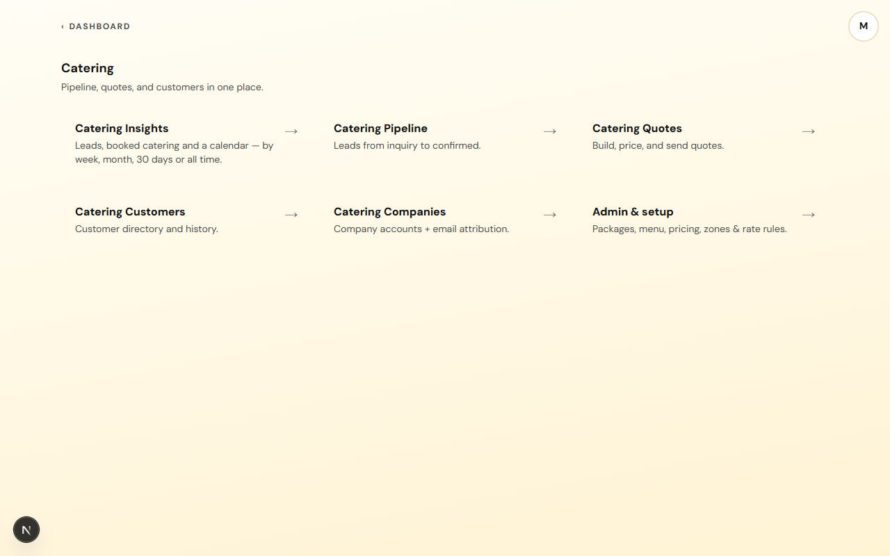

**What to do** — Pick the card you need. **Catering Pipeline** is the one you open most days.

**Worth knowing**

- Six cards, and they are the whole module: **Catering Insights**, **Catering Pipeline**, **Catering Quotes**, **Catering Customers**, **Catering Companies**, and **Admin & setup**.
- **Admin & setup** only appears from AGM up. A shift lead sees the first five and can read all of them.
- Nothing on this page is one shop's answer. The pages behind it cover every shop you are assigned to, and a lead or a quote always names its shop.

---

## The pipeline

This is the board you work. One card per lead, one column per stage, left to right in the order an event actually happens.

### 1. Read the board

**What you see**

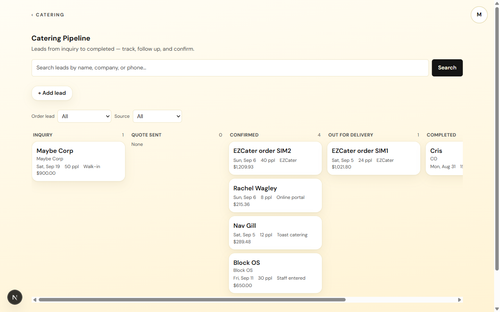

**What to do** — Read the column counts first, then work right to left: what is going out today, then what is confirmed, then what is still waiting on you.

**Worth knowing**

- The six stages, in order, are **Inquiry**, **Quote sent**, **Confirmed**, **Out for delivery**, **Completed** and **Lost**. An empty column says *"None"*.
- Each card carries the contact, the company, the event date, the headcount, where the lead came from, and the person it is assigned to — shown as **@** and their name.
- The **Source** dropdown filters by where a lead came from: **Online portal**, **Staff entered**, **Phone**, **Walk-in**, **Toast catering**, **EZCater**, **Direct invoice**, **Other**. **Order lead** filters by who owns it.
- **A dollar figure on a card is the lead's own Est. revenue — never a quote total.** Quoting, sending or accepting a quote never writes it. A lead you type in has no Est. revenue box, so it carries no figure before or after you quote it — by design, nothing to fix. The cards that do carry one arrived with an order total: platform orders and catering rung up in the store.
- **To see the money on a lead, search for it.** The search box — *"Search leads by name, company, or phone…"* — searches wider than the board does: it also matches the customer's email and the company account name, and every result tells you the current quote's **status and amount**. It is the fastest way to answer *"what did we quote them?"*
- Insights counts a quote's money too — but only once the quote is marked **accepted**.

### 2. Open a lead

**What you see**

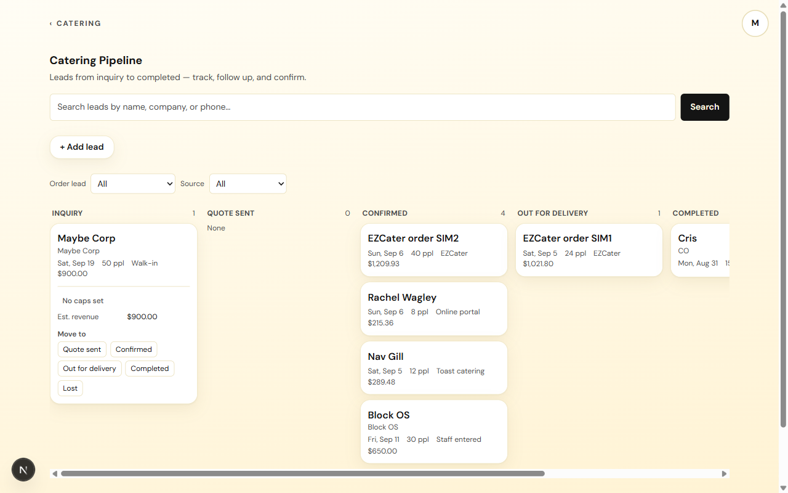

**What to do** — Tap the card. It opens in place, underneath itself. Tap it again to close it.

**Worth knowing**

- **There is no separate lead page.** The card is the lead.
- The badge at the top is the date check: **Date available**, **Limited availability**, **Over capacity**, **Blackout date**, **Below lead time**, or **No caps set** when nobody has set booking limits for that shop yet. **No caps set** means unknown, not clear — check the calendar in Insights before you promise a date.
- Underneath you get **Notes**, **Follow-up date** and **Est. revenue**, and only the ones that have something in them.

### 3. Move a lead

**What you see**

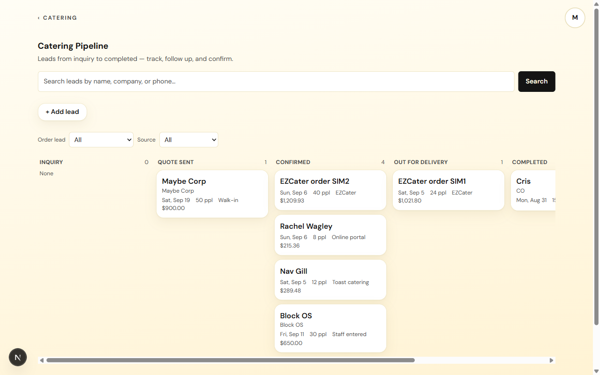

**What to do** — Open the card and tap the stage you want under **Move to**. The lead jumps columns straight away.

**Worth knowing**

- **There is no "are you sure".** One tap moves it, and every other stage is offered — including the ones behind you.
- **Confirmed is the stage that tells the kitchen.** Moving a lead into Confirmed puts that event's food onto the catering prep list, worked out from the lead's newest live quote. Moving it on to **Out for delivery** or **Completed** takes it off again as used. Moving it back to **Inquiry**, **Quote sent** or **Lost** releases it.
- **Treat Out for delivery and Completed as one-way.** Moving a lead back out of either and then forward again can put that event's food on the prep list twice. If you moved one by mistake, tell your GM rather than tapping your way back and forth.
- Confirming a lead with **no quote on it, or a quote with no event date, puts nothing on the prep list.** Build the quote first, then confirm.
- **Overnight the app finishes events for you.** Anything still in Confirmed or Out for delivery whose event date has passed is moved to Completed. A lead sitting in Inquiry or Quote sent with an old date is left alone on purpose — that is a stale lead, not a served event, and the board should keep saying so.

### 4. Add a lead

**What you see**

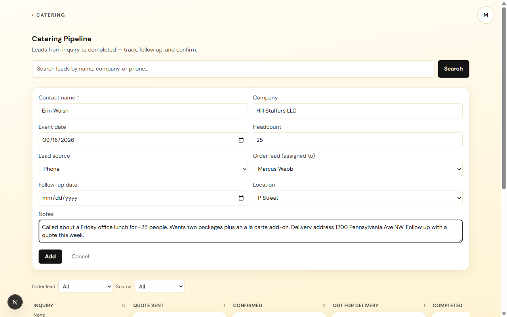

**What to do** — Tap **+ Add lead** and fill in what you know; only **Contact name** is required. Put the address, the packages they mentioned and what you promised to do next into **Notes** before you tap **Add**.

**Worth knowing**

- **The board cannot add or change a note after the lead exists.** The card shows the note back to you; this form is the only place to write it.
- **Order lead** is who owns the follow-up; their name shows on the card as **@name**. **Follow-up date** is what puts the lead on the follow-up list.
- Leave **Location** on the shop that will actually make the food. Delivery zones, capacity and pricing are all per shop, and a quote inherits none of them if the lead is on the wrong one.
- **A lead you add by hand is not tied to a customer record.** Adding it here does not create one, and it will not show on anybody's customer history. Typing the client's email into the quote builder is what does that — see [Quotes](#quotes).

### 5. Check the note landed

**What you see**

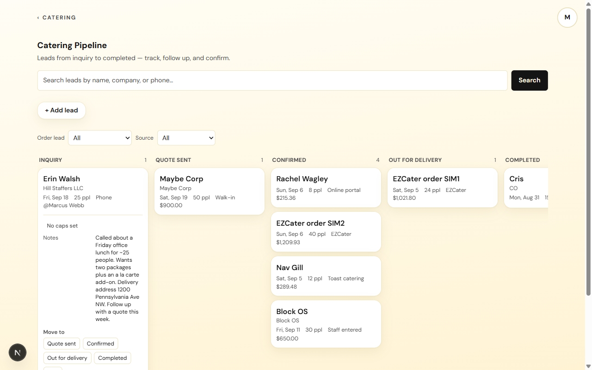

**What to do** — Open the new card and read the note back before you move on.

**Worth knowing**

- The card now carries the contact, the company, the date, the headcount, the source and the owner, with the note underneath. Everything you will need on the phone next week is on this one card — if it is not here, it is nowhere.
- **The note is read-only from here on.** It is shown back to you and nothing more; the form you have just left was the only place to write it.

### 6. Leads that arrive on their own

**What you see**

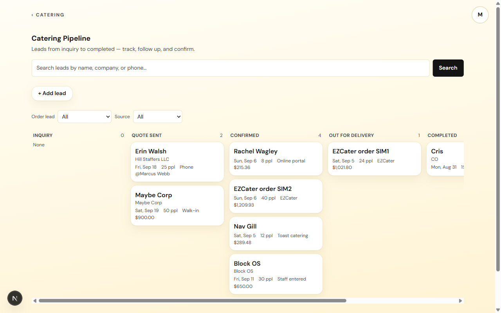

**What to do** — Check the **Inquiry** column for new cards at the start of your day.

**Worth knowing**

- An online order only becomes a lead **after the customer clicks the link we email them.** Somebody who fills the form in and never opens the email leaves no card on the board — there is nothing to chase, because you have no way of knowing they started.
- EZCater and in-store catering orders land on their own. An EZCater order sits in **Inquiry** until it is accepted on the platform, then moves to **Confirmed**; in-store catering arrives **Confirmed**. See [What arrives on its own](#what-arrives-on-its-own).

---

## Quotes

A quote is a priced document with a version number. You build it, you send it, and the customer accepts or declines it. This is the money surface — take your time on it.

### 1. The quotes list

**What you see**

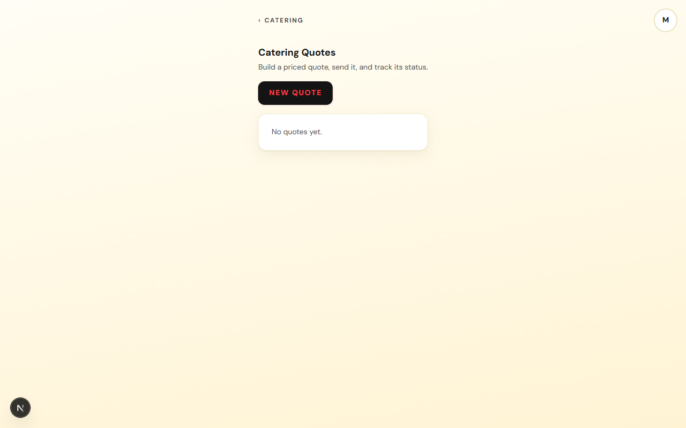

**What to do** — Tap **New quote** to start one, or tap a card to open one you already made.

**Worth knowing**

- *"Build a priced quote, send it, and track its status."*
- Quotes are grouped by status — **draft**, **sent**, **accepted**, **declined**, **expired** — with a count on each heading. Each card shows the total, the event date, the headcount and the status.
- Only the current version of a quote is listed. Revising one replaces it here rather than adding a second card.

### 2. Fill in the header

**What you see**

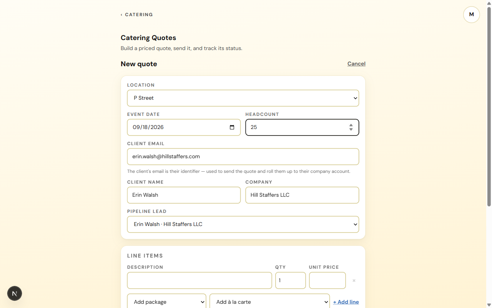

**What to do** — Set **Location** first, then the event date and headcount, then the client's details, then pick the lead under **Pipeline lead**.

**Worth knowing**

- **Set Location before anything else.** It decides the packages you can pick, the à la carte list, the delivery zones and the tax — and it locks once the quote is saved.
- **Type the client's email.** *"The client's email is their identifier — used to send the quote and roll them up to their company account."* It creates or matches their customer record and attaches it to the quote. **That record is the only thing the send step can email**, so an email left blank here means this quote will never email anybody. A revision does not offer these fields again — if you saved without one, the only fix is a new quote.
- The email box offers the addresses already on file. Pick one and the name and company fill themselves in.
- **Picking the pipeline lead fills in nothing.** Name, company and email still have to be typed. Pick the lead anyway — it is what ties the quote to the card on the board, and what puts the food on the prep list when you confirm.
- A red banner reading *"No pricing rule for this location — tax, gratuity, and service charge stay $0 until one is set in Admin."* means that shop has no pricing set up, and your totals will be the bare sum of the lines. Stop and ask your Manager of Operations to set it before you send anything.

### 3. Add the lines

**What you see**

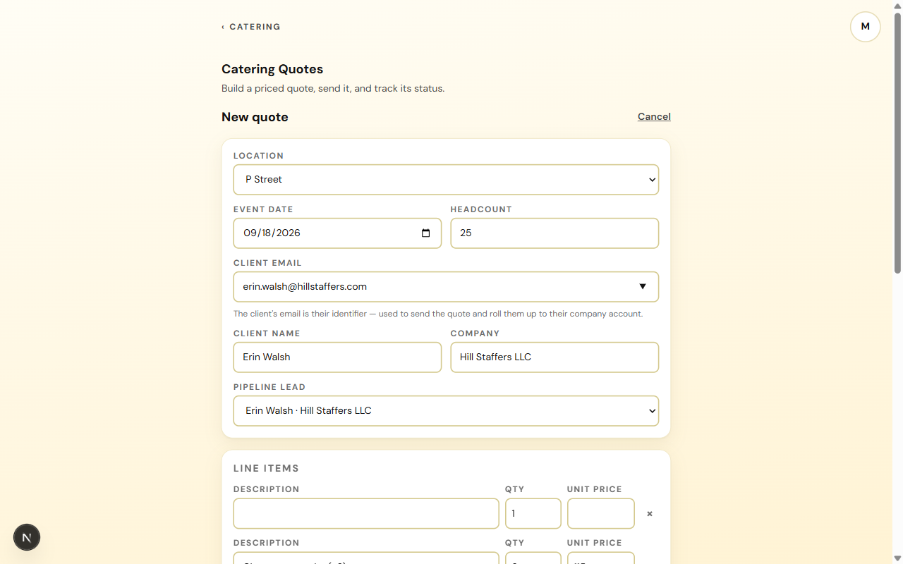

**What to do** — Use **Add package** and **Add à la carte** to drop lines in, then fix the description, **Qty** and **Unit price** on each one.

**Worth knowing**

- **Each line is Qty × Unit price, and Unit price is the price of ONE.** The lines add up to the subtotal; delivery, service charge, gratuity and tax go on top of that.
- **A package arrives as lines you can edit.** Its contents keep their quantities and any prices already set. If every content line is unpriced and the package has a price, the app adds one package line at Qty 1 carrying that price; the picks — *"Choose your subs (×8)"* — stay at **quantity filled in, Unit price blank**. A package with no contents arrives as one line at Qty 1 with its price.
- **Leave the pick lines blank and keep the package price on the package line only.** Typing $115 into a Qty 8 pick charges $920 — the mistake in the saved-quote picture at step 6.
- An **à la carte** item behaves differently — it arrives with its description and its price already filled in. Change the quantity and leave the price alone.
- The pickers offer active menu items and active packages. If an old draft or a package still points at a retired item, saving the quote is refused until you swap that line for an active item. The message says: *"One of the lines points at an item that is no longer on the menu. Remove that line and add it again from the picker."*
- **A line you type in yourself is money only.** Lines that came from the menu or from a package carry through to the kitchen's prep list and to the allergen labels. A hand-typed line does neither. Use the pickers whenever the thing exists on the menu.
- Ticking **Delivery** reveals **Delivery zone**, and the zone is what carries the delivery fee. If the only choice is **None**, no zones are set up for that shop and no delivery fee will be charged — see [Setting up catering](#setting-up-catering-admin).

### 4. Read the totals

**What you see**

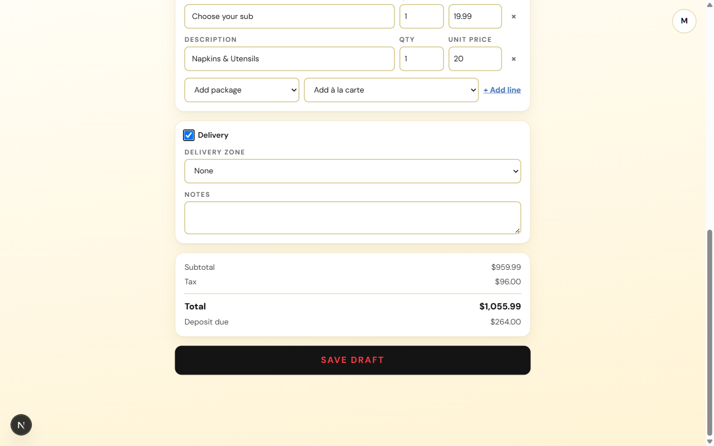

**What to do** — Scroll to the bottom and read the totals before you save. They update as you type.

**Worth knowing**

- The sum is done by the app, not by the page you are looking at, so what you are reading is the real answer and not a preview.
- The block shows **Subtotal**, then **Delivery**, **Service charge**, **Gratuity** and **Tax** — **each of those four only when it is not zero** — then **Total** in bold, then **Deposit due**.
- **Tax is charged on the subtotal plus the service charge**, plus the delivery fee and the gratuity if your shop's rule says to tax them. **Deposit due is a percentage of the total**, not of the subtotal.
- Zero amounts are hidden, so a missing Tax or Deposit due line does not by itself prove the shop has no pricing rule — the red **No pricing rule** banner from step 2 does. If you see that banner, do not send; ask your Manager of Operations to set pricing first.
- Every rate is frozen onto the quote when you save. Somebody changing the tax rate next month will not move the number you sent.

### 5. Save it

**What you see**

**What to do** — Tap **Save draft**. The builder is replaced by the quote's own page.

**Worth knowing**

- **Landing on this page is the confirmation.** There is no "saved" message and there is not meant to be.
- **Expires** is fourteen days out. A quote past that date cannot be sent and cannot be accepted — you revise it, which starts the fourteen days again.
- **Revise** makes a new version: the old one is kept, the new one goes back to **draft**, and you have to send it again. If the lead is already Confirmed, a revision with no package lines updates the kitchen's prep list; a revision that contains a package line leaves the existing prep list as it was — tell the kitchen what changed and have your GM check the prep list.

### 6. Check the lines came out right

**What you see**

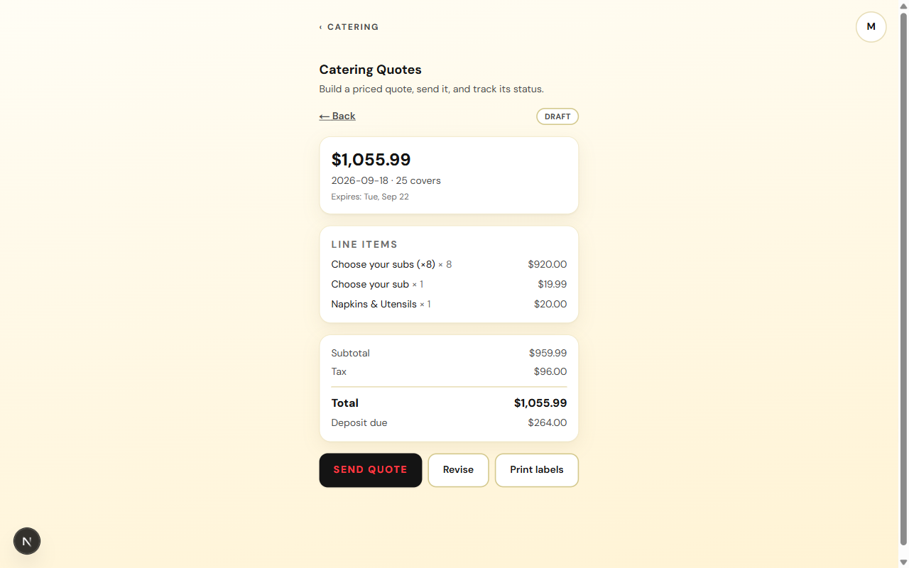

**What to do** — Read every line back against what you agreed. Fix it with **Revise** before you send, not after.

**Worth knowing**

- Each line shows the description, **× quantity**, and what that line comes to. This is the last easy place to catch a package priced eight times over.

### 7. Send it

**What you see**

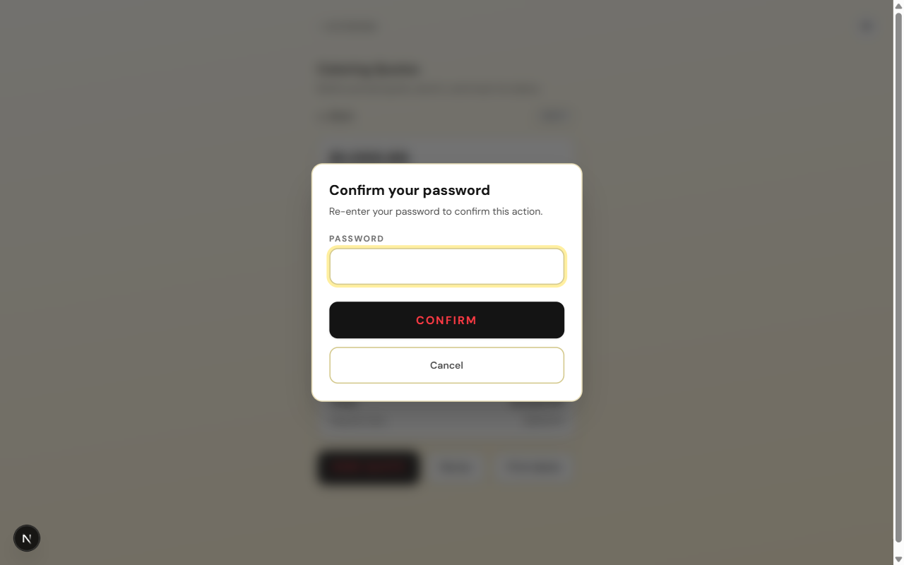

**What to do** — Tap **Send quote**, type your account password — not your PIN — and tap **Confirm**.

**Worth knowing**

- **Sending is the one thing in Catering that asks for your password.** It is a money action with your name on it.
- The confirmation only holds for a couple of minutes. Send two quotes back to back and the second may not ask; come back later and it will ask again.

### 8. What "sent" actually did

**What you see**

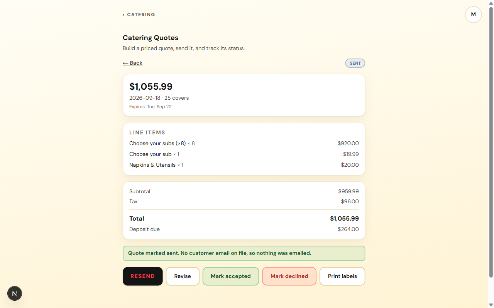

**What to do** — Read the line under the status. Then move the lead to **Quote sent** on the board — the quote does not move it for you.

**Worth knowing**

- **Sent means marked sent.** The status changes whether or not an email left the building.
- *"Quote marked sent. No customer email on file, so nothing was emailed."* means nothing went out. Either the quote has no customer attached — the **Client email** box was empty when you saved it — or a customer is attached and the mail itself did not go. **Open Customers and check the record actually carries their address.** If it does and you still get this line, tell your GM, and send the price to the client yourself in the meantime.
- When it does go, the line reads *"Quote sent — the customer was emailed."* instead.
- **Mark accepted** and **Mark declined** appear once a quote is sent, and neither asks for anything. **Marking a quote accepted does not confirm the lead** — you still move the card to Confirmed yourself. Accepting is also what makes the quote's money count in Insights.
- **Resend** goes through the same password step and sends the same quote again.

### 9. Print the labels

**What you see**

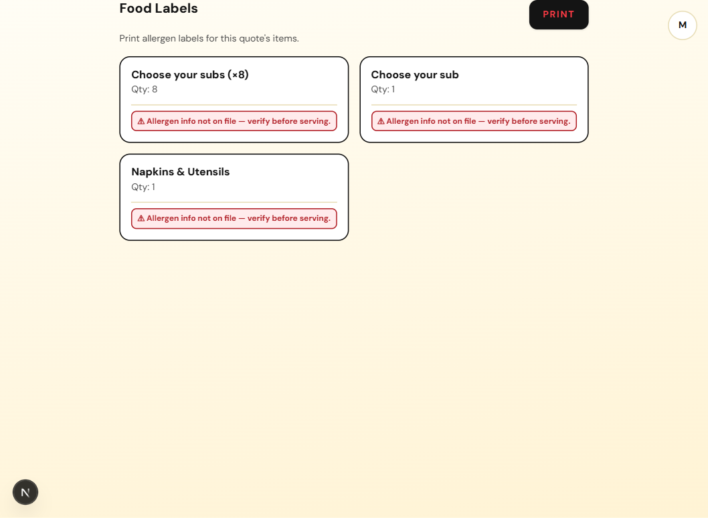

**What to do** — Tap **Print labels**. It opens in a new tab. Tap **Print**.

**Worth knowing**

- **Every line on the quote gets a label**, with its name and its quantity. Nothing is left out.
- A label shows **Contains** and **May contain** only for a line that points at a menu item **and** has allergens recorded against that item. Every other label prints *"⚠ Allergen info not on file — verify before serving."*
- **That warning is the normal state today**, and it is deliberate: the app will never print a label that looks safe when it does not know. Checking before the food goes out is your job.

### 10. Back on the board

**What you see**

**What to do** — Move the card to **Quote sent**, and put the follow-up in your own diary.

**Worth knowing**

- The card carries no dollar figure even though the quote behind it has a total. That is [what the dollar figure means](#the-pipeline) — it is the lead's own estimate, never the quote. Search the lead by name to see the quote's status and amount.

---

## Customers and companies

Two directories sitting under the board. **Customers** are people. **Companies** are the accounts those people belong to.

### 1. The customer directory

**What you see**

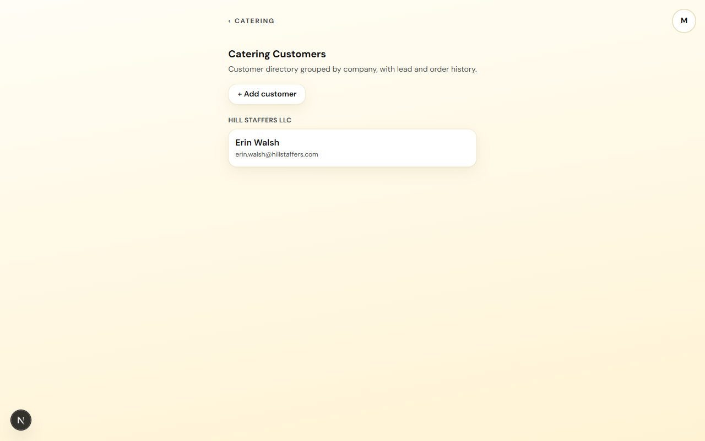

**What to do** — Read down the groups, or tap **+ Add customer** to create one by hand.

**Worth knowing**

- *"Customer directory grouped by company, with lead and order history."*
- **The group headings are just the Company box typed on each customer.** They are free text, not company accounts. A heading here proves nothing about the account in [Companies](#3-company-accounts).
- Most records make themselves: typing a client's email into the quote builder creates one, and so does a customer signing in to order online.
- **Reading is shift lead and up. Adding and editing is AGM and up.** Emails are stored lower-case with spaces trimmed from either end, so `Ana@Example.com` and `ana@example.com` identify the same customer.

### 2. One customer

**What you see**

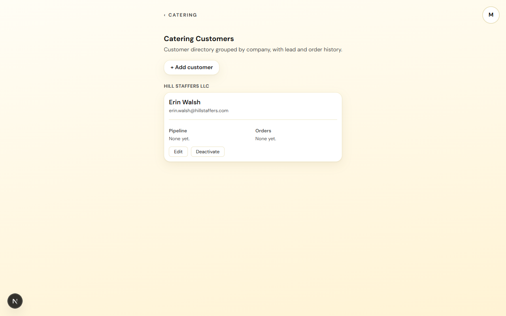

**What to do** — Tap the row to open it. **Edit** changes their details.

**Worth knowing**

- **Pipeline** lists the leads attached to this person. A lead only lands here if it was created **with** the customer attached — which is what happens when they order online, and is not what happens when you type a lead into the board. A person can have a live lead and still read *"None yet."* here. That is what it means.
- **Orders** is not filled in by anything yet. It reads *"None yet."* on every customer. Coming soon.
- **Deactivate** hides a customer without deleting them. If that same email comes back later the app brings the original record back rather than starting a second one, so their old quotes and payments stay attached to them.

### 3. Company accounts

**What you see**

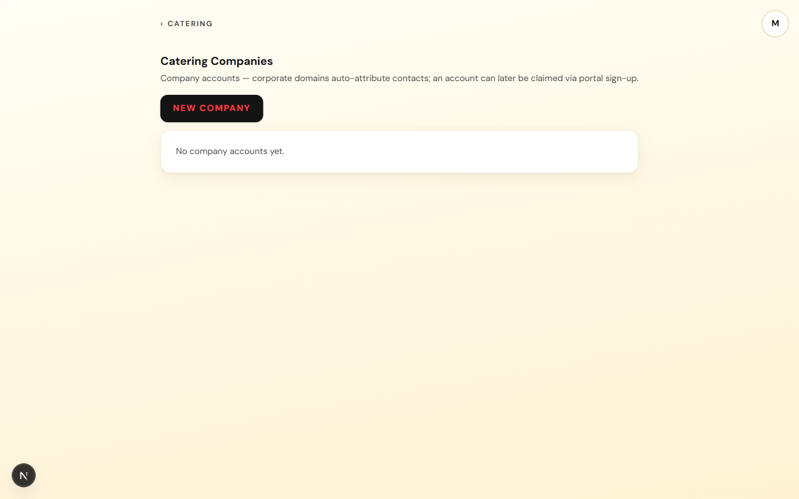

**What to do** — Tap **New company** for a firm you cater for more than once.

**Worth knowing**

- *"Company accounts — corporate domains auto-attribute contacts; an account can later be claimed via portal sign-up."*
- This list is **empty until you fill it**, even when the customer directory already shows company headings.

### 4. Create the account

**What you see**

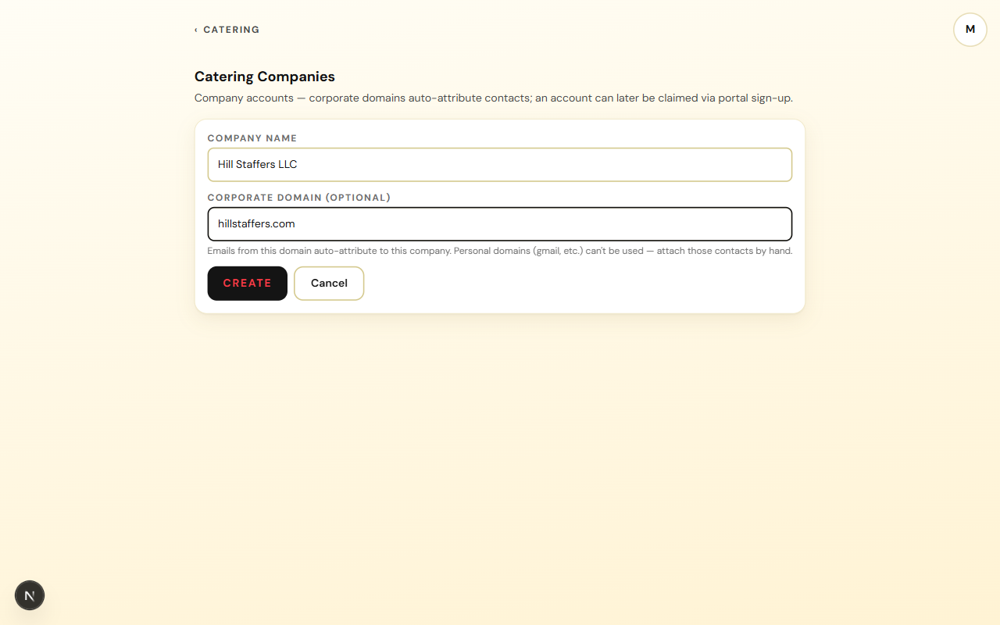

**What to do** — Type the firm's name and, if they have one, their email domain — `acme.com`, with no `@`.

**Worth knowing**

- *"Emails from this domain auto-attribute to this company. Personal domains (gmail, etc.) can't be used — attach those contacts by hand."* A personal domain is refused outright rather than quietly mis-filing people.
- A domain can only belong to one company account. A second attempt is refused as already registered.

### 5. Attribution

**What you see**

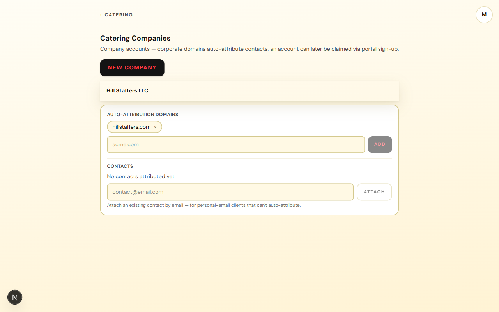

**What to do** — Add any other domains they use. Use the **Attach an existing contact by email** box for anyone already on file.

**Worth knowing**

- **Attribution runs when a contact is created, not afterwards.** Adding a domain today does nothing for the people already in the directory — the account will keep reading *"No contacts attributed yet."* Attach them by email, one at a time.
- From then on, anyone new from that domain files themselves under the account automatically.
- **Remove domain** stops future attribution. It does not detach the contacts already attached.

---

## Insights

Read this weekly, not daily. It answers *"how is catering doing"* — and it is careful about which money it says you have earned.

### 1. Read the numbers

**What you see**

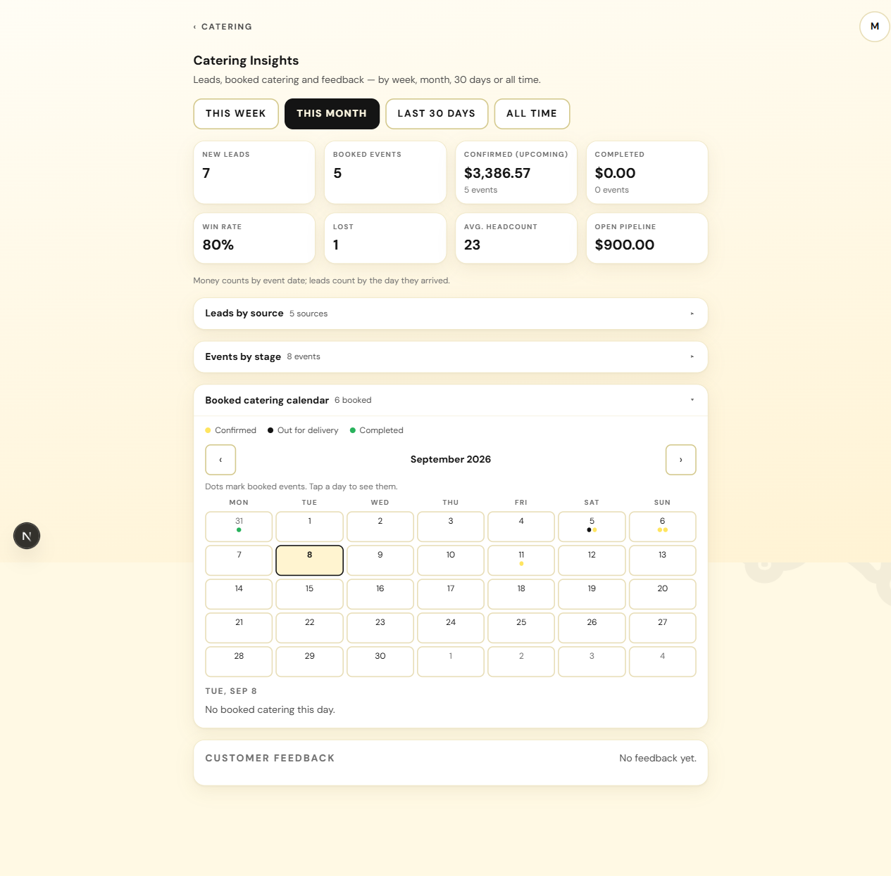

**What to do** — Pick a range — **This week**, **This month**, **Last 30 days**, **All time** — and read the tiles.

**Worth knowing**

- *"Money counts by event date; leads count by the day they arrived."* Two different clocks on one page, on purpose.
- **The money split is the point of this page.** **Booked events** is everything on the books. **Confirmed (upcoming)** is money you have not earned yet. **Completed** is money you have earned.
- **An event that is out for delivery still counts as not yet earned.** The food has left the building, but the event is not closed until it moves to Completed — which the app does overnight, once the date has passed. Counting it while it is still out would book the money a day early.
- A lead is valued at its **accepted quote**. With no accepted quote it falls back to the lead's **Est. revenue**, and with neither it is worth nothing here. That is why marking a quote **accepted** matters: until you do, a sale you actually made reads as zero.
- **Win rate** is worked out from the leads that arrived in this range and have since settled — confirmed, gone out, completed, or lost. It is the share of those that were not lost. Leads still sitting in Inquiry or Quote sent count neither way, so early in a month the rate moves about.
- **Open pipeline** is every lead still in Inquiry or Quote sent, **all time**. It ignores the range you picked.
- **Leads by source** counts by the day the lead arrived, which is how you tell whether the phone or the platform is feeding you.
- The **Booked catering calendar** dots every booked event. Tap a day to see what is on it. Use it before you promise a date.

---

## What the customer sees (the order funnel)

Your customers can price and place their own catering order. Know this path by heart, because it is what people ring you about.

### 1. The storefront

**What you see**

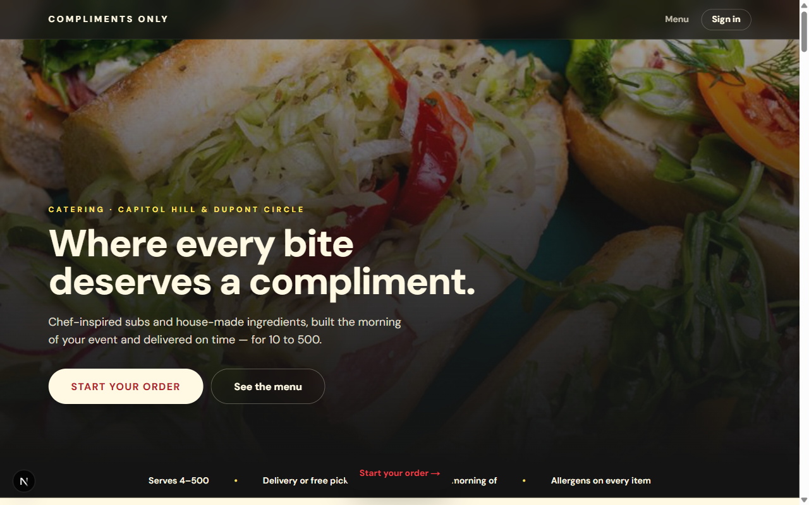

**What to do** — Send people here. It is the front door: the whole catering menu, then **Start your order**.

**Worth knowing**

- No sign-in to look. Anyone can read the menu.

### 2. The order form

**What you see**

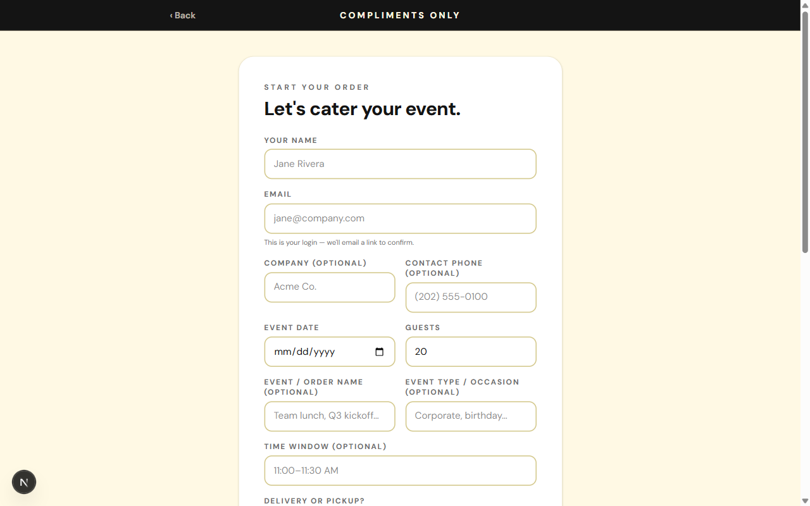

**What to do** — Nothing, on your side. This is what they fill in.

**Worth knowing**

- **Their email is their account.** *"No passwords to remember — your email is your account."* Nothing for them to forget, nothing for you to reset.
- **Guests** starts at 20, and the tip under the form tells them to guess: *"New here? Order for your best-guess headcount — we confirm the final count with you."* Expect the number to move. Confirming it is your job.
- **Nearest shop** is theirs to pick, and it decides everything downstream — the menu, the delivery zone, the tax, and which of your shops gets the lead.

### 3. They send it

**What you see**

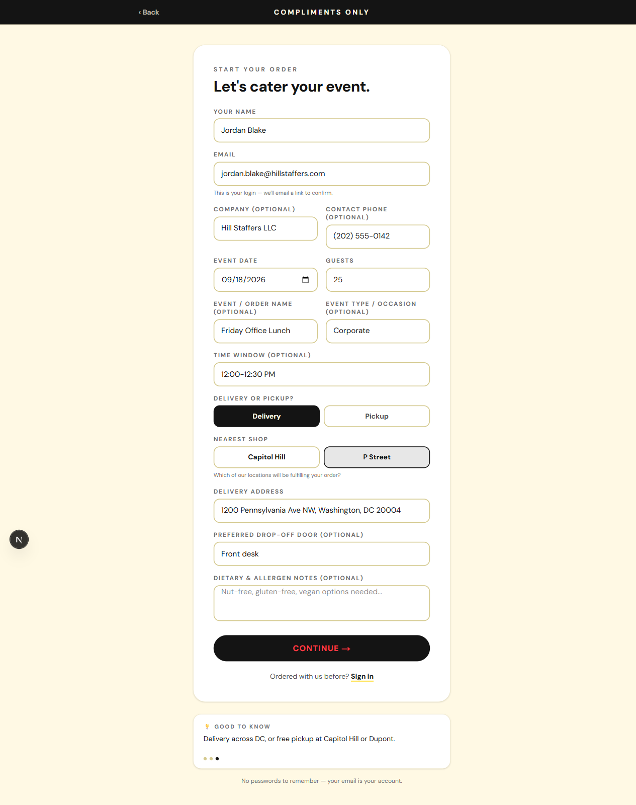

**What to do** — Nothing. **Continue →** turns on once the required fields are in.

### 4. Check your email

**What you see**

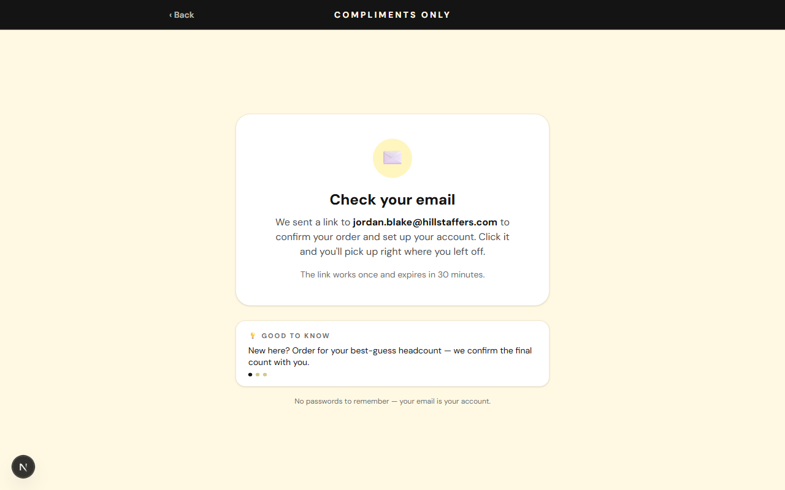

**What to do** — If somebody rings you stuck here, tell them to look for the email and to use **the newest one**.

**Worth knowing**

- **Nothing exists on your side yet.** No lead, no quote, no customer. The form is held with the emailed link and nothing else.
- *"The link works once and expires in 30 minutes."* Both halves are true: single use, and dead after thirty minutes.
- **Only their most recent link works.** Asking for a new one kills the older ones immediately. This is the most common call you will get — somebody digs an older message out of the thread and taps that. Tell them to use the newest one.
- Nothing on your side prompts you about a customer who stopped here.

### 5. The link, and everything after it — *not shown*

These screens could not be photographed, because reaching them needs the emailed link. This is what the app does:

**What to do** — They tap the link. It signs them in, and **that is the moment their order appears on your board**: a lead in **Inquiry**, source **Online portal**, with a draft quote already attached and their customer record created.

**Worth knowing**

- Then they **build** — packages first, then the à la carte sections — with a running cart and a coverage panel telling them whether they have enough food. Prices come from your shop's catering menu; there is nothing on that screen they can type a price into.
- Then they **review**: the whole order, the full totals, and the **Deposit to record**. **Record deposit & submit order →** turns their draft into a submitted order and records the deposit as **due**.
- **No money is taken online.** The deposit is a record, not a payment. It is marked paid on the quote's own page, under **Payments**, by an AGM or above, once you have actually collected it.
- The review names no payment provider. **How your deposit works** says no money is taken online; **We confirm the details with you** says your team will confirm the order, date and payment arrangements; the remainder is labelled **Balance — confirmed with you by our team**.
- Their account page — **Your orders** — keeps their orders and their saved details for next time.
- The lead stays in **Inquiry** until you move it. Nothing about placing an order confirms it.

### 6. If they skip ahead

**What you see**

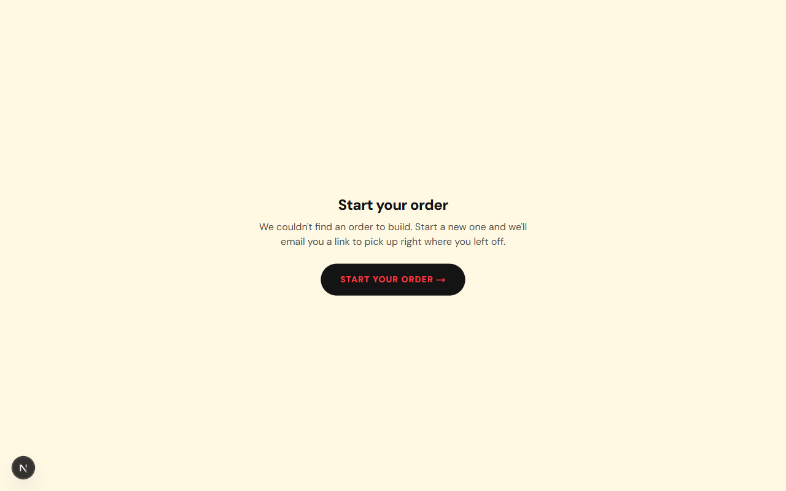

**What to do** — Tell them to start again from **Start your order**. There is nothing to recover.

**Worth knowing**

- The builder cannot be reached without the link: *"We couldn't find an order to build. Start a new one and we'll email you a link to pick up right where you left off."*

### 7. An old link

**What you see**

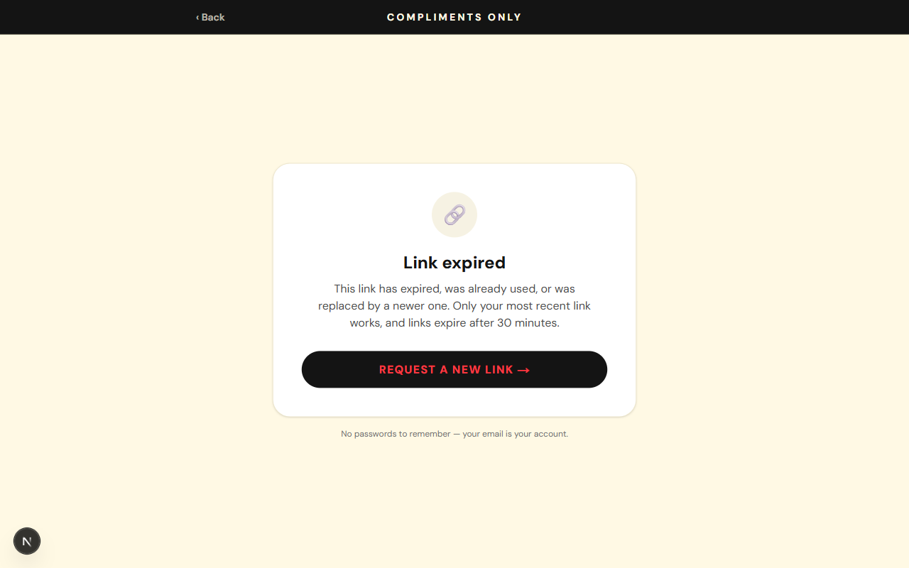

**What to do** — Tell them to tap **Request a new link →** and then use **that** email.

**Worth knowing**

- One message covers all three cases: *"This link has expired, was already used, or was replaced by a newer one."* You cannot tell which from the screen, and it does not matter — the fix is the same.
- There is nothing to type on this page. It only reads the link.

---

## Setting up catering (admin)

Do this once, then leave it alone. Changes here need your password — some reuse the confirmation you just gave, others ask again.

### 1. The setup hub

**What you see**

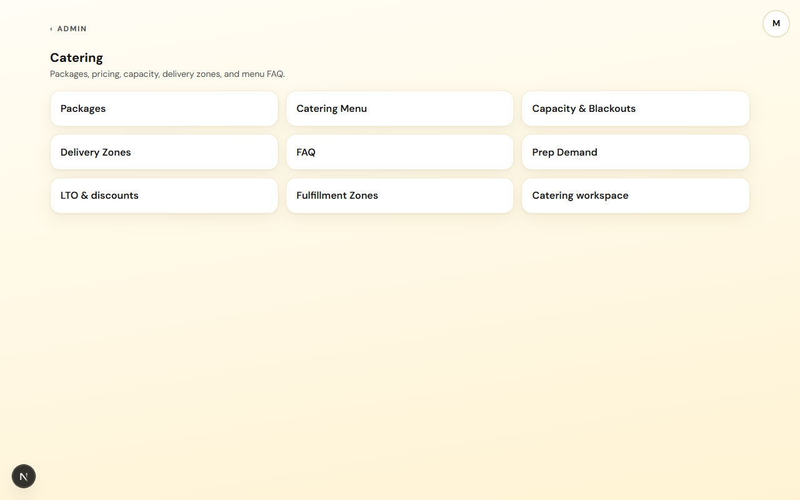

**What to do** — Pick a tile. **Catering workspace** takes you back to the board.

**Worth knowing**

- *"Packages, pricing, capacity, delivery zones, and menu FAQ."*
- **There is no Pricing or Rates tile, and that is correct** — tax, gratuity, service charge and the deposit percentage are **Manager of Operations and up**. A GM who types either address is returned to Admin with a line explaining why; it is not a bug. Ask your Manager of Operations.
- **Packages, FAQ, Prep Demand and LTO open at AGM. Catering Menu, Capacity, Delivery Zones and Fulfillment Zones open at GM.**

### 2. Catering Menu

**What you see**

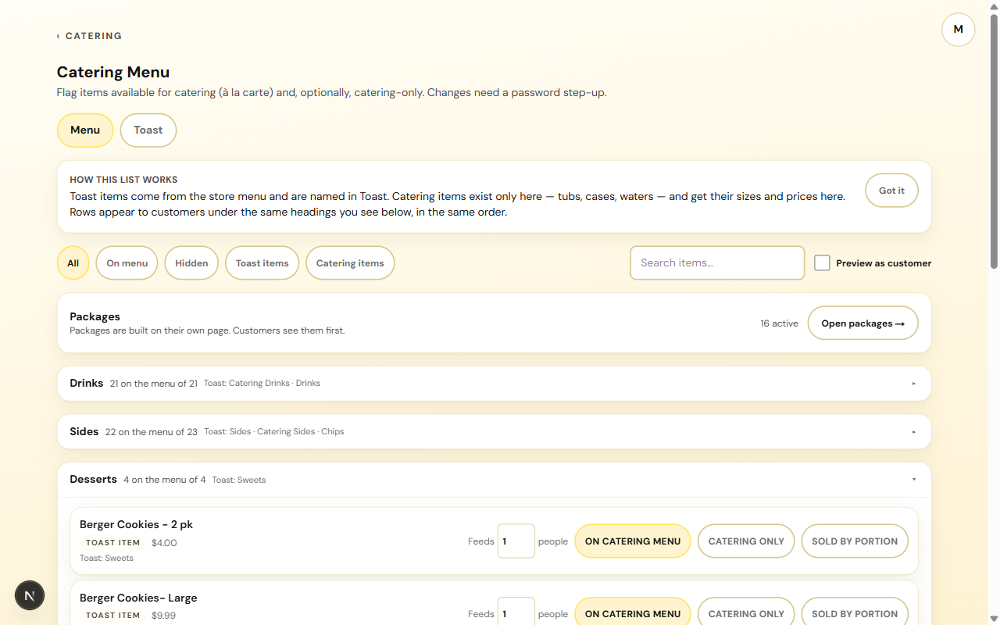

**What to do** — Find the item and use its switches: **On catering menu**, **Catering only**, **Sold by portion**.

**Worth knowing**

- *"Toast items come from the store menu and are named in Toast. Catering items exist only here — tubs, cases, waters — and get their sizes and prices here."* You cannot rename a store item from this page. You can only decide whether it is sold for catering.
- **On catering menu** puts it in front of customers and into your à la carte picker. **Catering only** means it is not sold in the shop at all — and turning it on turns **On catering menu** on with it.
- **Sold by portion** lets a customer order a quarter, a half or a whole. It applies to subs, not to cases and tubs.
- **Feeds** is how many people one unit covers — a 24-bag case feeds 24, and blank counts as 1. It drives the coverage panel the customer reads while ordering, so a wrong number here sells somebody too little food.
- **Preview as customer** shows only what customers can order, in the order they see it. Use it before you finish.

### 3. Packages

**What you see**

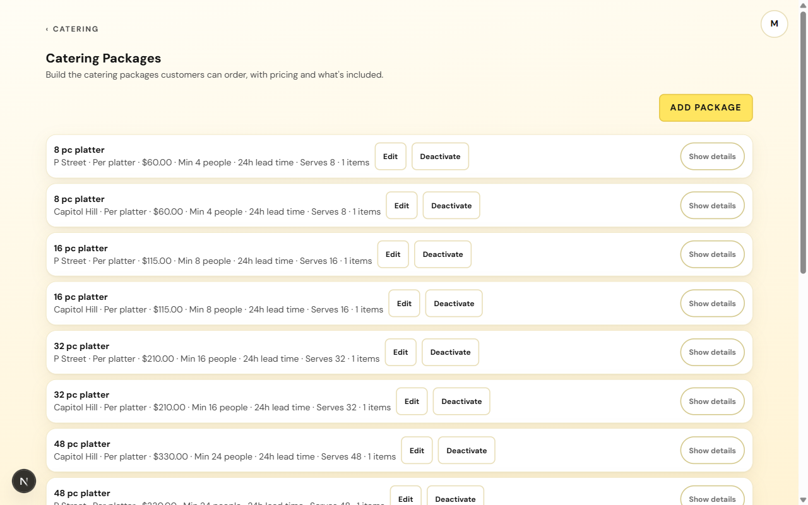

**What to do** — **ADD PACKAGE** to build one, **Edit** to change one, **Deactivate** to retire one.

**Worth knowing**

- **Packages can belong to one shop or be Global.** Editing a shop's package does not change a separate copy at another shop; editing a Global package changes the shared package. Check the shop name or **Global** label before you edit.
- What you set here — the price, the minimum headcount, the lead time, what is inside — is what customers order from online. On a staff-built quote the contents come across as editable lines; [Quotes, step 3](#quotes) says where the price lands.

### 4. Delivery Zones

**What you see**

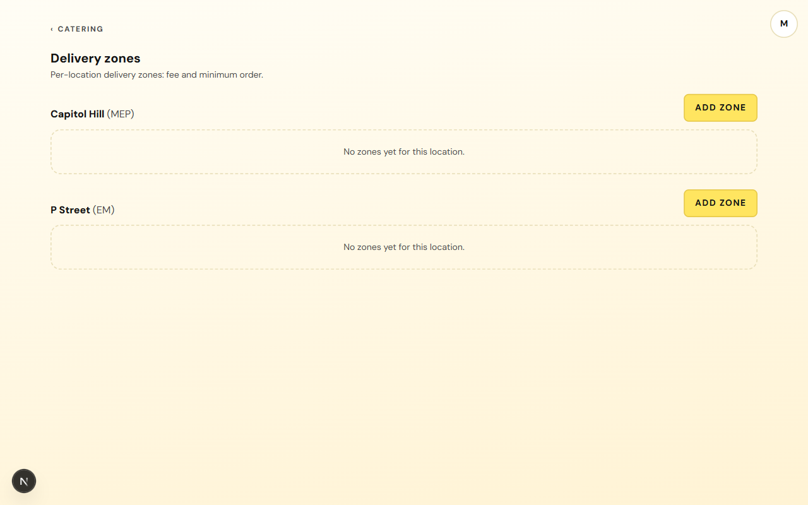

**What to do** — **ADD ZONE** for each shop, with its fee and its minimum order.

**Worth knowing**

- *"Per-location delivery zones: fee and minimum order."*
- **No zones means no delivery fee, ever.** The quote builder's **Delivery zone** dropdown will only offer **None**, and every delivery goes out with the delivery charged at nothing. If you deliver, this page is not optional.

### 5. Fulfillment Zones

**What you see**

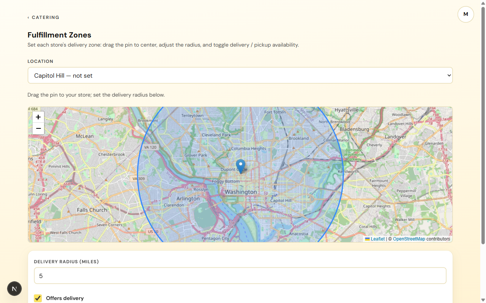

**What to do** — Pick the shop, drag the pin onto it, set the **Delivery radius (miles)**, and tick **Offers delivery**.

**Worth knowing**

- *"Set each store's delivery zone: drag the pin to center, adjust the radius, and toggle delivery / pickup availability."*
- **This is not the same page as Delivery Zones.** This one is how far you go, and which shop an address belongs to. The other is what you charge. You need both.

### 6. Capacity & Blackouts

**What you see**

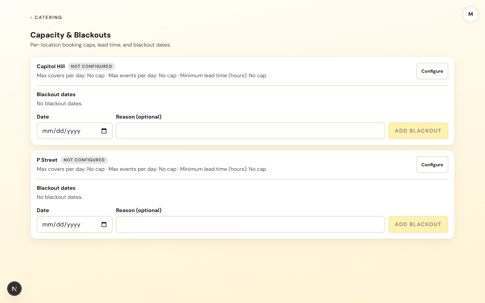

**What to do** — **Configure** the caps per shop — covers per day, events per day, minimum lead time — and add blackout dates with a reason.

**Worth knowing**

- **NOT CONFIGURED** is why a lead card says **No caps set**. Until this is filled in, the app cannot warn anybody that a date is full: the date check on every lead comes back blank, and the only thing between you and a double-booked Saturday is the calendar in Insights.

### 7. FAQ

**What you see**

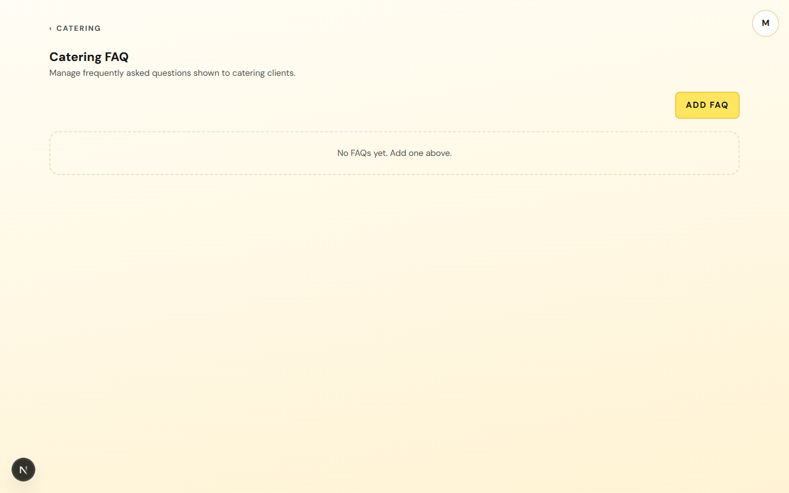

**What to do** — **ADD FAQ** for the questions you answer on the phone every week.

**Worth knowing**

- *"Manage frequently asked questions shown to catering clients."* Customers read these, so write them the way you would say them.

### 8. LTO & discounts

**What you see**

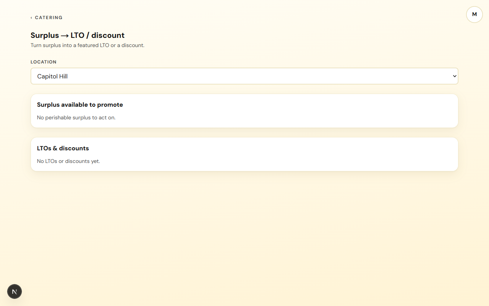

**What to do** — Check it when you are long on something perishable. *"Turn surplus into a featured LTO or a discount."*

**Worth knowing**

- The panel fills itself from what the shop is actually holding. *"No perishable surplus to act on."* means there is nothing to promote, not that the page is broken.

### 9. Prep Demand

**What you see**

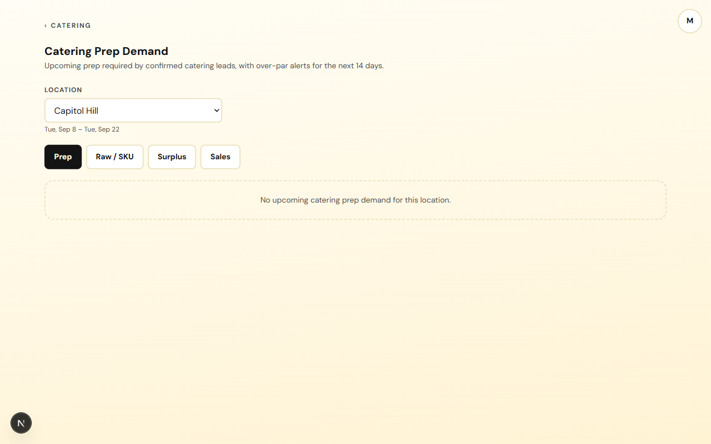

**What to do** — Read it before you order and before you write a prep list. It is the next fortnight of catering the kitchen owes.

**Worth knowing**

- *"Upcoming prep required by confirmed catering leads, with over-par alerts for the next 14 days."*
- **It only counts leads at Confirmed** that carry a live quote **with an event date**, and only the quote lines that name a real menu item. A confirmed lead with no quote, an undated quote, or a quote made of hand-typed lines shows here as nothing.
- **An empty page is a claim, not a blank.** If you know there is catering on Saturday and this page is empty, the lead is not confirmed or the quote is not built. Go and fix that.

---

## What arrives on its own

Some leads you never type. Know which, so you do not chase an order that is already handled — or assume one is.

### 1. Read the source badge

**What you see**

**What to do** — Check the badge before you touch a card. **EZCater** and **Toast catering** cards are not yours to price.

**Worth knowing**

- **EZCater orders become leads by themselves.** One arrives as **Inquiry** when the order is submitted, and moves to **Confirmed** when somebody accepts it on the platform — accepting there is the human act, so the board follows it rather than leading it. A cancelled or rejected order moves to **Lost**. When the customer changes the order, the card refreshes in place, and **any note you typed on that lead survives** it word for word.
- **Catering orders rung up in the store become leads too**, and they arrive already **Confirmed**, because they were paid when they were placed. If one is voided later, the lead moves to **Lost** on its own.
- Both kinds arrive **assigned to the catering manager**, and both carry the order's total — which is where the dollar figure on those cards comes from.
- **They carry no quote.** Do not build one to "match" the order; the money is already on the card.
- Once a day, early afternoon Eastern, the app checks that its five background jobs — the Toast catering scan, the same-day sales pull, the overnight sales pull, session cleanup and receipt parsing — are still reporting. For each job that has gone quiet it sends at most one email that day to the operations address, naming the job, when it last reported (or that it never has), and whether to check the store computer or the hosting schedule. Nothing for you to do; it exists so silence is never mistaken for *"nothing happened."*
- **Catering enquiries arriving by email are not collected anywhere.** There is no inbox digest. Coming soon.

---

## Logging out

### 1. Sign out

**What you see**

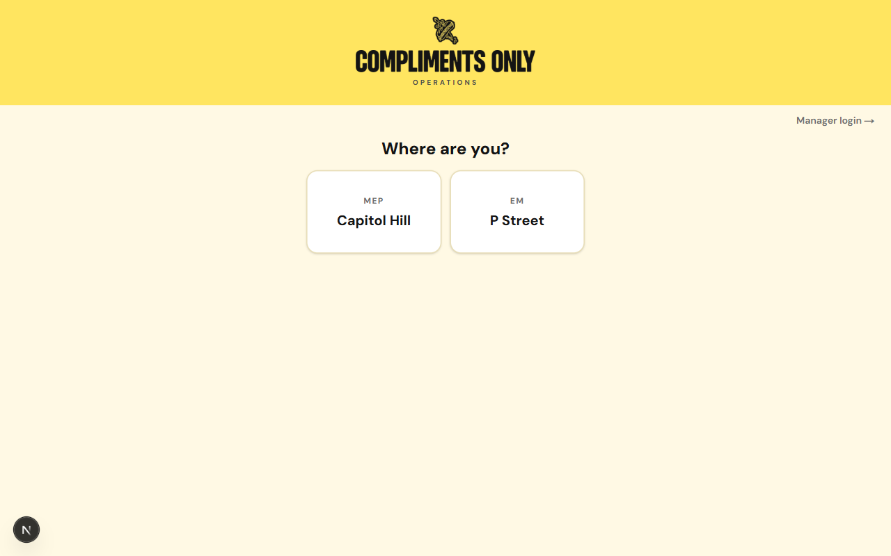

**What to do** — Open the user menu and tap **Sign out**.

**Worth knowing**

- Sign out every time you walk away. A quote sent from your account was sent by you, and the record says so.
- A quote you were building and never saved **is not kept**. Save the draft before you go — a draft costs nothing and can always be revised.
