# Manager guide

For key holders, shift leads, AGMs and the GM. It covers the jobs that only you can finish: confirming the day's reports, prep, receiving, counts, ordering, cash, the end-of-shift report, and the admin console.

You do not need to read it front to back. Find your section, do the steps.

If you also work the line, the [staff guide](staff-guide.md) covers the parts of the app everyone uses.

---

## Your day at a glance

You sign in like everyone else, but your dashboard carries the jobs nobody below you can finish.

Morning: the **opening report**. Staff walk the stations and fill it in; **Submit Opening** is yours — key holder and up. Then the prep half of that same report, then **AM prep**. Around 6 AM, before the vendor cutoffs, walk **Ordering**: say what is on each shelf, review it, record the walk. That creates or updates today's draft order per vendor, which you confirm and send; an order already confirmed or placed is left alone.

Through the day: log every delivery as it lands, log what you cook down from raw stock, and read **Mid-Shift Pulse** to see what the shop still owes.

Evening: the **PM report** — grade the crew, name an MVP. Then the **cash deposit**. Then the closing checklist's final confirm, which needs the walk-out items done and the deposit already filed. Any required line still unfinished needs a written reason first.

Two ceremonies ask you to prove it is you:

- **Your PIN** — signing the cash deposit, and confirming the closing.
- **Your password** — recording an inventory audit, and changes you save in Admin.

Inventory audits and the team pages start at AGM. User management is not a GM page at all.

---

## Logging in as a manager

Two ways in. Which one you get depends on your role, not on your preference.

### 1. Pick a way in

**What you see**

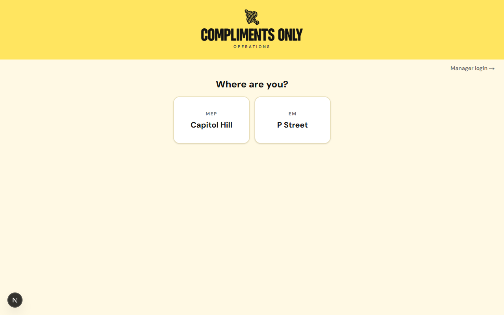

**What to do** — For the tile route, tap your shop. For the email route, tap **Manager login →** at the top of the card.

**Worth knowing**

- The tiles and a four-digit PIN work for every role, yours included. It is the faster route on a shared tablet.
- The email-and-password route only works for **AGM and above**. A key holder or a shift lead has no email login — the tiles are your way in.

### 2. The manager login form

**What you see**

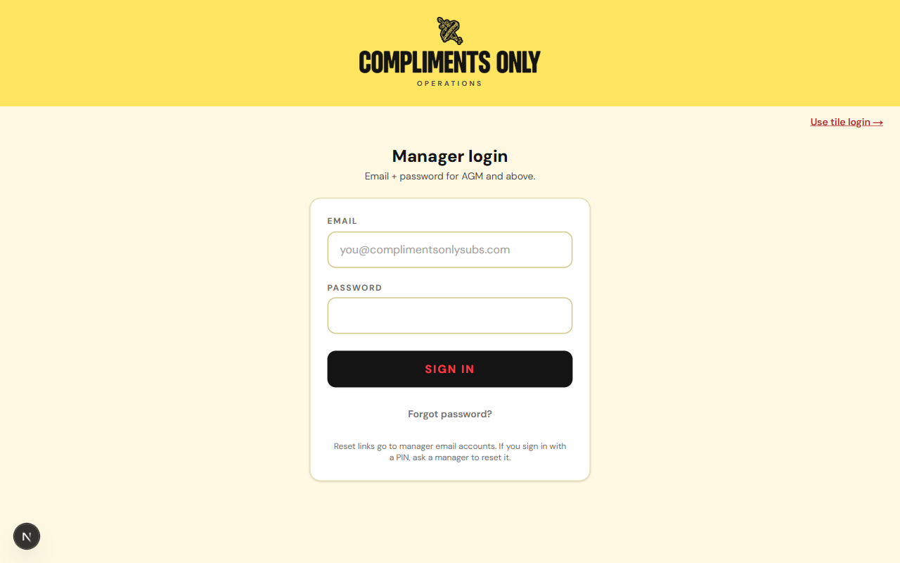

**What to do** — Type your work email and password, then **Sign in**. **Use tile login →** takes you back.

**Worth knowing**

- **Forgot password?** sends a reset link to a manager email account. If you sign in with a PIN, there is nothing to email — ask a manager to reset the PIN instead.

### 3. What's your role?

**What you see**

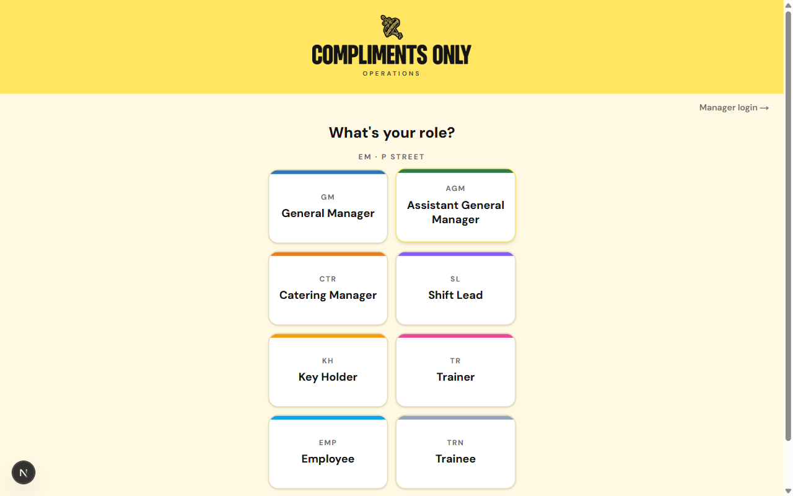

**What to do** — Tap your real role.

**Worth knowing**

- The line above the tiles shows what you have picked so far. **Back** undoes one step.
- What you can finish later — submit the opening, lock up, record an audit, open Admin — follows from your role. Picking the wrong tile just means your name is not on the next list.

### 4. Who are you?

**What you see**

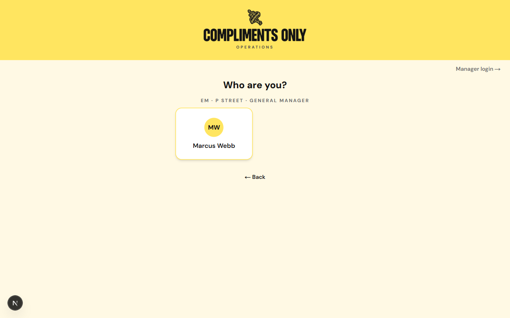

**What to do** — Tap your name.

**Worth knowing**

- Only people assigned to this shop, in that role, appear. If you are missing, you are not assigned to this location yet.

### 5. Enter your PIN

**What you see**

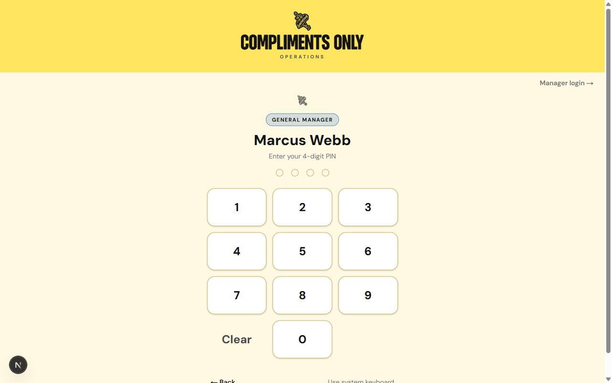

**What to do** — Tap your four digits.

**Worth knowing**

- The fourth digit signs you in. There is no Submit button.
- PINs are four digits for every role, GM included. Five wrong tries locks the account for fifteen minutes.

### 6. The manager dashboard

**What you see**

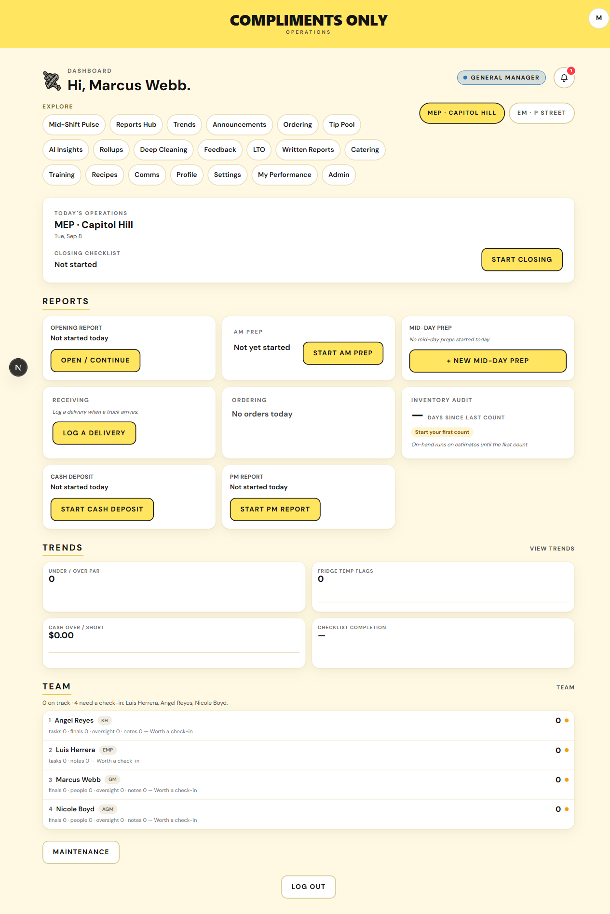

**What to do** — Read the shop name in the heading first, then work down the page.

**Worth knowing**

- **Check which shop you are on before you touch anything.** The dashboard opens on one of your shops, and it is not always the one you are standing in.
- The location switcher lists the shops **you are assigned to**. A GM assigned to both sees both; being a GM does not by itself give you every shop.
- Tiles staff never see: **Cash Deposit**, **PM Report** and **Mid-day Prep** (key holder and up), **Inventory Audit** (AGM and up).
- The **Explore** list adds **Mid-Shift Pulse**, **Ordering**, **Trends** and **Admin** to the staff list. **Tip Pool**, **AI Insights**, **Rollups**, **Deep Cleaning**, **Feedback**, **LTO**, **Training**, **Recipes**, **Announcements** and **Comms** are placeholder pages today.

### 7. Switch shops

**What you see**

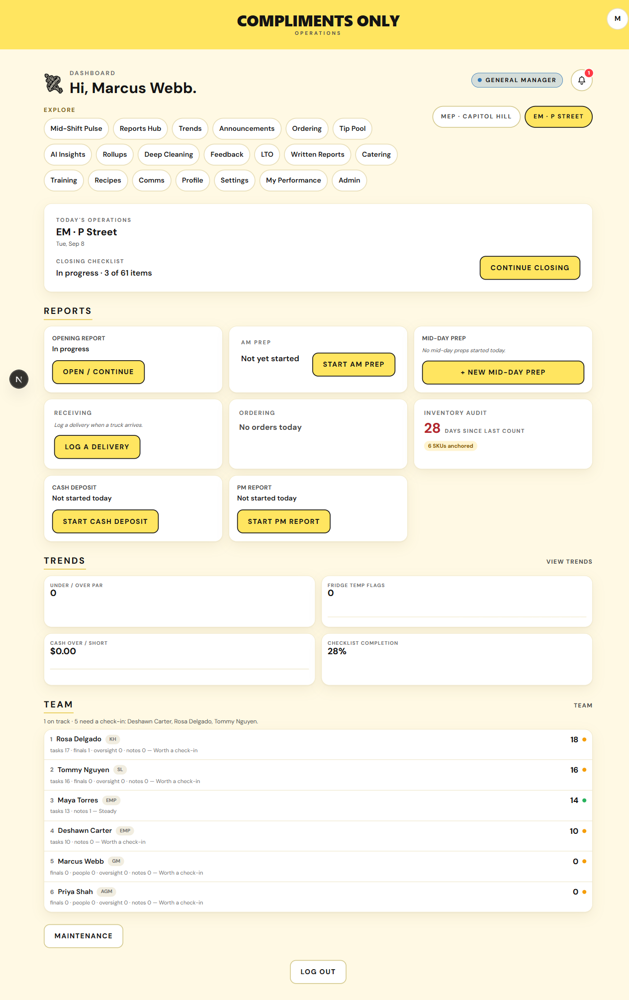

**What to do** — Tap the other shop in the switcher. Everything on the page reloads for that shop.

**Worth knowing**

- Every card is one shop's answer: the closing checklist, the reports, the counts, the team panel. Nothing on this page adds the two shops together.
- The **Team** panel's *"needs a check-in"* list is about activity recorded in the app over the last stretch, not about the grades you have given anyone. See [Reports and trends](#reports-and-trends).

---

## The opening report

You do this once a day, before the doors open. The crew can fill the whole thing in; finishing it is yours.

### 1. Phase 1 — verification

**What you see**

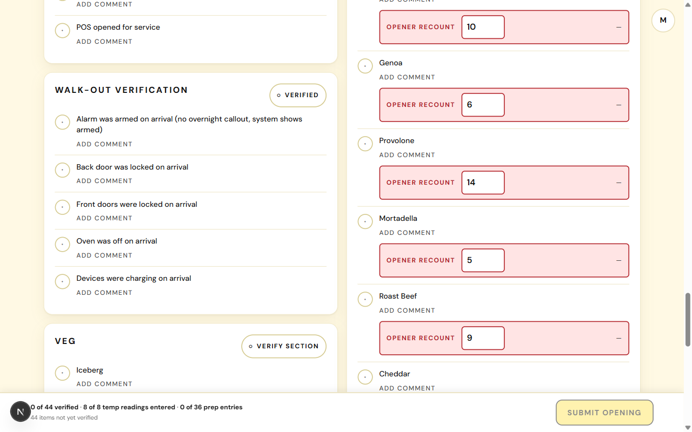

**What to do** — Walk the stations, type the fridge temperatures, and type an **Opener recount** for every prep item last night's closer left no count for.

**Worth knowing**

- As a manager you usually arrive at a half-done page and finish it. Read the footer counter — *"44 of 44 verified · 8 of 8 temp readings entered"* — rather than assuming the opener got there.
- **Nothing on this screen saves until Submit Opening goes through.** Ticks, temperatures and comments live on the tablet until then. Do not close the page halfway.
- A prep section's **Verify section** button stays greyed out with *"Recount items without closer data first"* until every item with no closer count has a recount typed in.
- The *"prep entries"* number in the footer belongs to Phase 2, not to these recounts. It stays at zero all the way through Phase 1. That is normal.

### 2. Submit the verification

**What you see**

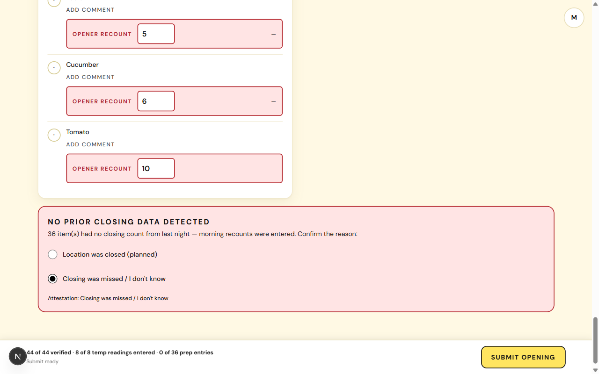

**What to do** — Tick every station, verify every section, answer the reason prompt if it appears, then tap **Submit Opening**.

**Worth knowing**

- **Submit Opening is key holder and up.** For an employee the button reads **Hand to a key holder** and stays off. They fill it in; you finish it.
- The button turns on only when all three counters are full: every line ticked, every temperature box filled, every count section verified. There is no partial submit.
- **"No prior closing data detected"** appears when items had no closing count last night and the opener recounted them instead. Pick the true one: **"Location was closed (planned)"** or **"Closing was missed / I don't know"**.
- Both options do the same thing to the numbers — the recount becomes the day's count either way — and both send the same urgent notice to key holders and up. What differs is the sentence printed on the saved report, which is how tomorrow's reader knows whether a closing was skipped or the shop was shut. Answer it honestly.
- Once submitted, the verification half is read-only for everybody, comments included.

### 3. Phase 2 — prep entry

**What you see**

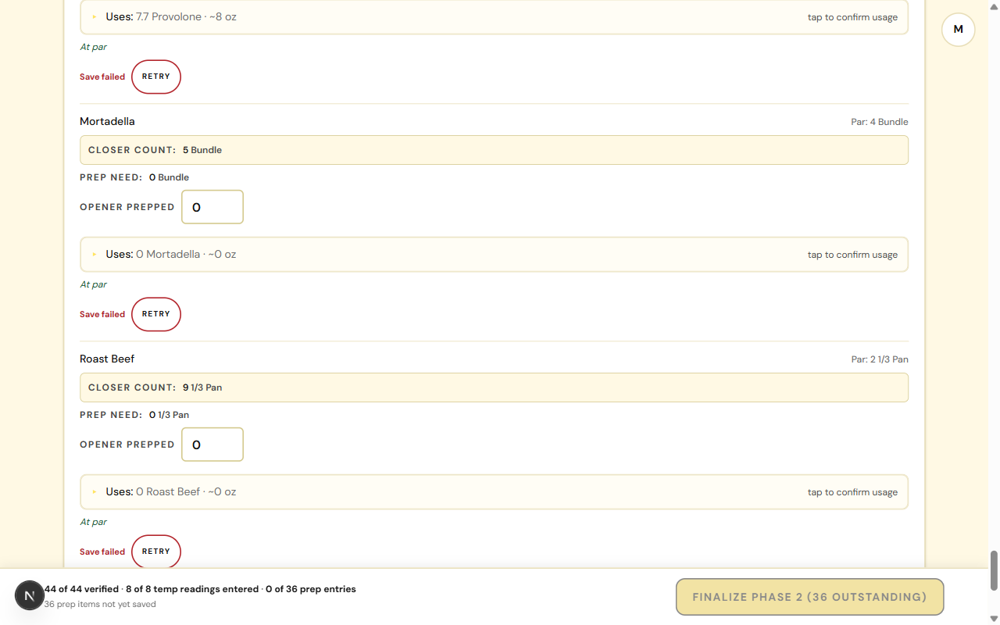

**What to do** — For each item, type how much you actually prepped into **Opener prepped**, then tap out of the box.

**Worth knowing**

- Each row asks for **one number**. **Par**, **Closer count** and **Prep need** are shown to you, not entered by you — prep need is par minus what was on hand, never below zero.
- **Rows save one at a time, when you leave the box.** There is no page-wide save in this half.
- If your number differs from **Prep need** at all — by one, in either direction — the row asks why before it will save. Over par offers a short list of reasons and wants a name if you picked *management directive*; under par always wants a sentence in your own words.
- **"Prep need: verify section first"** means the app cannot work the number out. Usually the section is not verified yet. It also shows on an item that has no par set at all — that item takes your number with no reason needed.
- The **"Uses:"** row is the raw stock the app thinks that batch consumed. Open it and correct it if you used something else; it is what gets deducted from stock.

### 4. If a row will not save

**What you see**

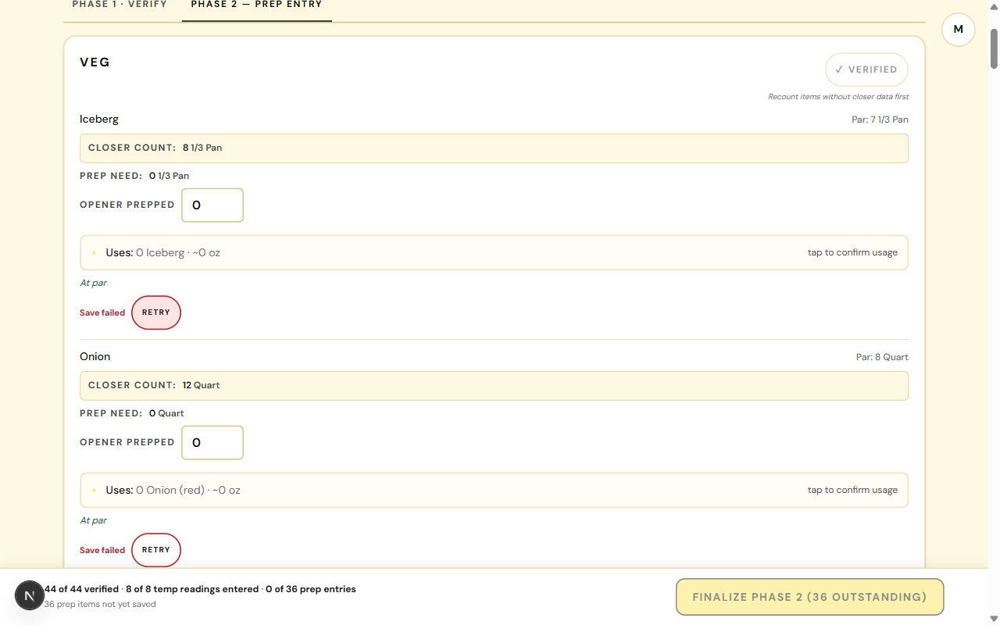

**What to do** — Tap **Retry** on the row. If it fails again, tell your GM — the opening cannot be finished until rows save.

**Worth knowing**

- A row that has not saved shows **Save failed** with **Retry** right there, and the bottom bar counts it as outstanding. Nothing is lost from the screen; it just has not landed.
- **Finalize Phase 2** stays disabled while any row is outstanding, and it names how many.
- Saving a row again replaces its earlier number. The picture shows the failure that stopped every row on the first walk; that bug is fixed. If **Retry** still fails, tell your GM.

### 5. Finalize Phase 2 — *not shown*

This step was not photographed on the walk. What the button does is written into the app, and it is this:

**What to do** — When every prep row has saved, tap **Finalize Phase 2**.

**Worth knowing**

- It refuses until **every** prep item on the list has a saved row. If one is missing it tells you how many.
- It closes the opening report and stamps your name and the time on it. The report becomes read-only.
- For every item you prepped **under** its prep need, it sends an urgent notice to key holders and up at your shop.
- It writes a production record for each item — what you made, and the raw stock it used — from the numbers you entered. That is how prep shows up in stock.
- **It does not touch last night's closing.** Nothing in the opening ticks a closing line; the closing is confirmed on its own, by hand.
- There is **no PIN and no password** on this step. One tap finishes it.

---

## Confirming the closing

The last thing that happens at night. The crew ticks the list as they go; the confirm at the end is yours, and it is a signature.

### 1. See where the closing stands

**What you see**

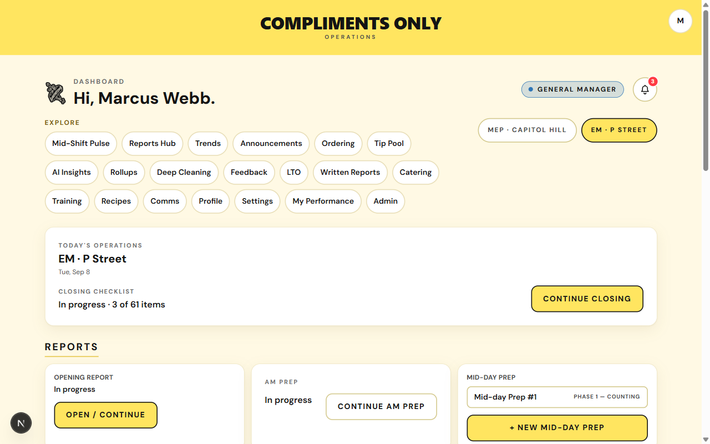

**What to do** — Read the tile, then tap **Continue closing**.

**Worth knowing**

- Unlike the opening, **the closing saves every tap as it happens**. Whatever the crew has ticked is already on the record before you arrive.
- Check the **Cash Deposit** and **PM Report** tiles on the same screen first. Both feed the closing, and one of them can stop it dead — see step 5.

### 2. Open the checklist

**What you see**

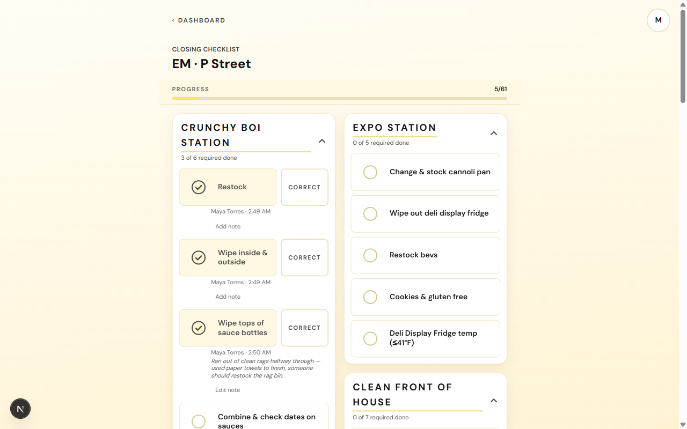

**What to do** — Work down the stations, finishing whatever the crew left.

**Worth knowing**

- Lines somebody else ticked carry **their** name and time, and any note they left shows on the row. Read the notes on your way down — that is where "we ran out of rags" lives.
- **Progress** counts required items across the whole list. Each station header carries its own count.
- Some lines are greyed out as waiting on a higher role. Those are the ones the crew could not tap; they are yours.

### 3. The Walk-Out Verification station

**What you see**

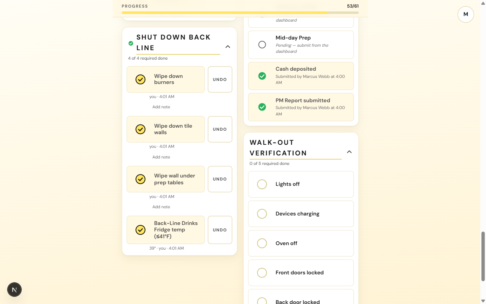

**What to do** — Leave this station until you are genuinely the last one out. Then tick all five.

**Worth knowing**

- **Walk-Out Verification is the gate.** Every line in this station has to be ticked before the confirm control appears at all. There is no reason path and no override here — while it is short you get *"Walk-Out Verification not complete — finalize unlocks once all 5 walk-out items are checked off."*
- **Only a key holder or above can confirm the closing.** Below that the page says *"Only Key Holder or higher can finalize the closing."* Both of these are enforced on the server as well as on screen, so there is no way around them.
- The **Closing Manager** card's *"Cash deposited"* and *"PM Report submitted"* rows tick themselves when those reports are filed, with the filer's name and time. You do not tap them.

### 4. Everything you can tick, ticked

**What you see**

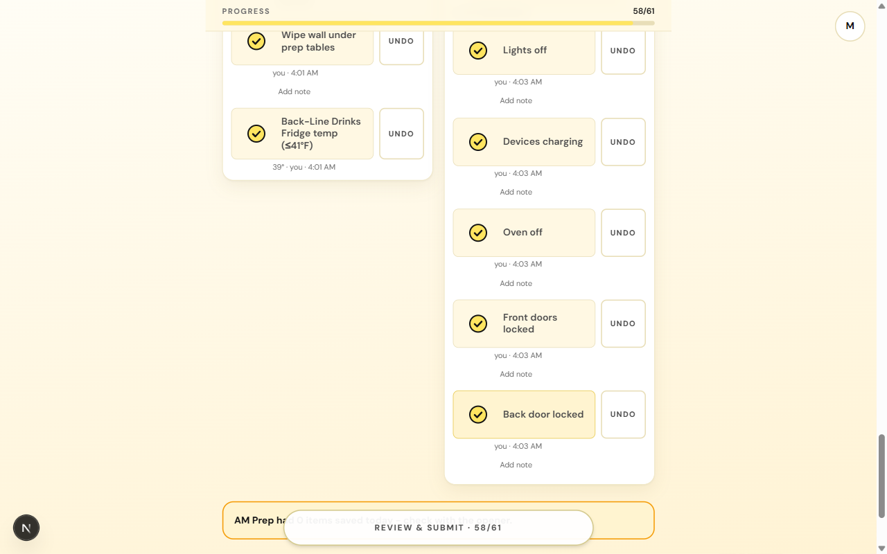

**What to do** — Check every station card reads its full count, then tap the **Review & submit** bar.

**Worth knowing**

- **Three Closing Manager lines cannot be ticked from this page: AM Prep List, Opening verified, and Mid-day Prep.** They read *"Pending — submit from the dashboard"* and each one is a link out to that report's own page. They tick themselves when their report is submitted.
- So **61 of 61 is not reachable from the closing checklist alone.** If you want a clean close, finish those three reports first. If you cannot, the next step is where you say why.

### 5. If the cash deposit is missing — *not shown*

This did not come up on the walk, because the deposit and the PM report were already filed. It is worth knowing before it happens to you at 11 PM.

**What to do** — File the cash deposit, then come back.

**Worth knowing**

- **With the walk-out done but no cash deposit on file, the confirm control never appears.** In its place you get a banner reading *"Cash deposit required before you can finalize the closing."* and a **Do the cash deposit** button that takes you there.
- **This is a hard gate. There is no explain-why path for it**, and the server refuses it too — the deposit has to exist.
- A template can mark any other line the same way. A hard-gated line that is not done blocks the whole submission and the app names the line; no reason will get you past it. Everything else that is required takes a written reason instead.

### 6. Review and explain

**What you see**

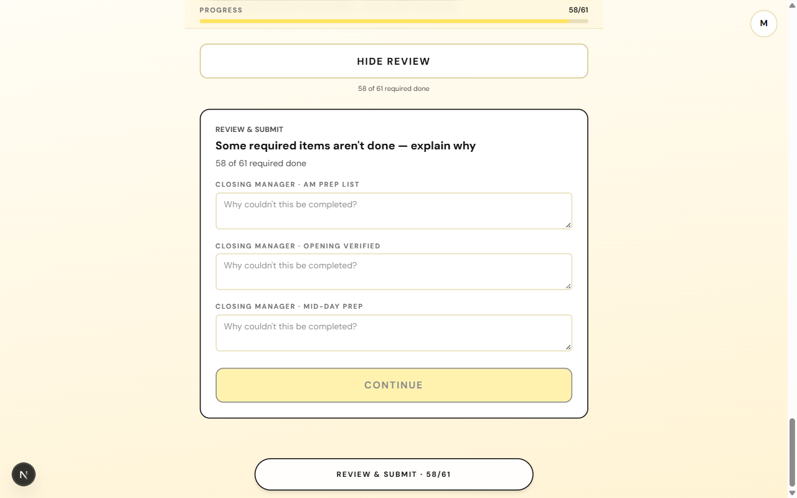

**What to do** — Write a real sentence in each box, then tap **Continue**.

**Worth knowing**

- Each box is labelled with the station and the line — *"Closing Manager · AM Prep List"* — so you know what you are explaining. The placeholder asks the question plainly: *"Why couldn't this be completed?"*
- **Continue stays disabled until every box has something in it.** A space does not count.
- If nothing is outstanding, this same panel just reads **All required items complete** and there is nothing to write.
- **The reason is stored against that line — but nothing in the app reads it back to you.** It is not on the saved report and it is not on the checklist afterwards. If tomorrow morning needs to know, tell the opener as well.

### 7. Confirm with your PIN

**What you see**

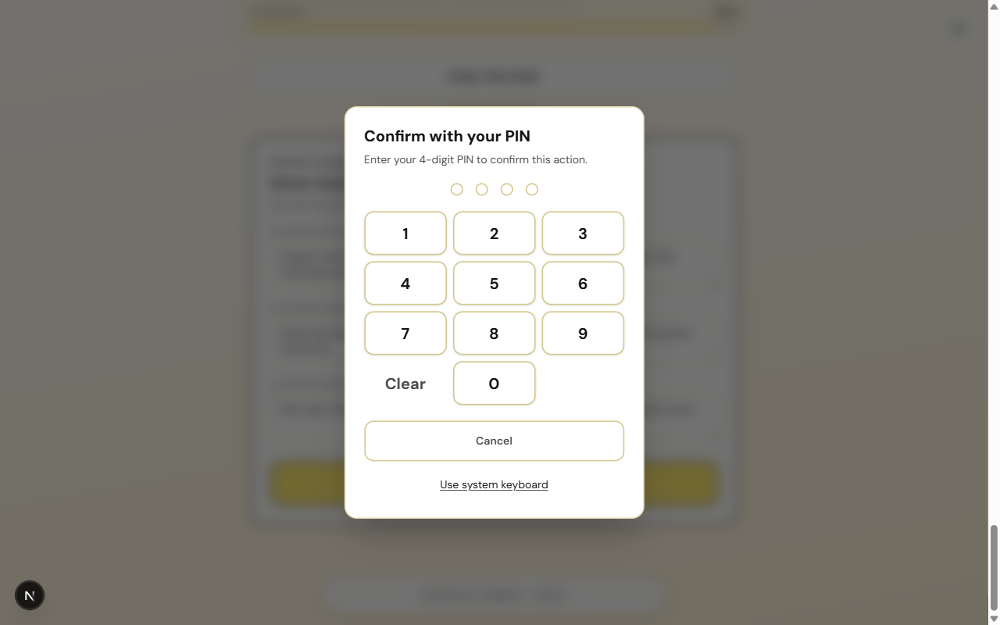

**What to do** — Enter your four digits. The fourth one submits.

**Worth knowing**

- **The closing is confirmed with your PIN, not your password.** The cash deposit and the closing are the two PIN ceremonies in the app; the inventory audit and Admin use your password instead.
- Your name goes on the confirmation and on every reason you just wrote. Do not let somebody else tap it in for you.

### 8. The confirmed closing

**What you see**

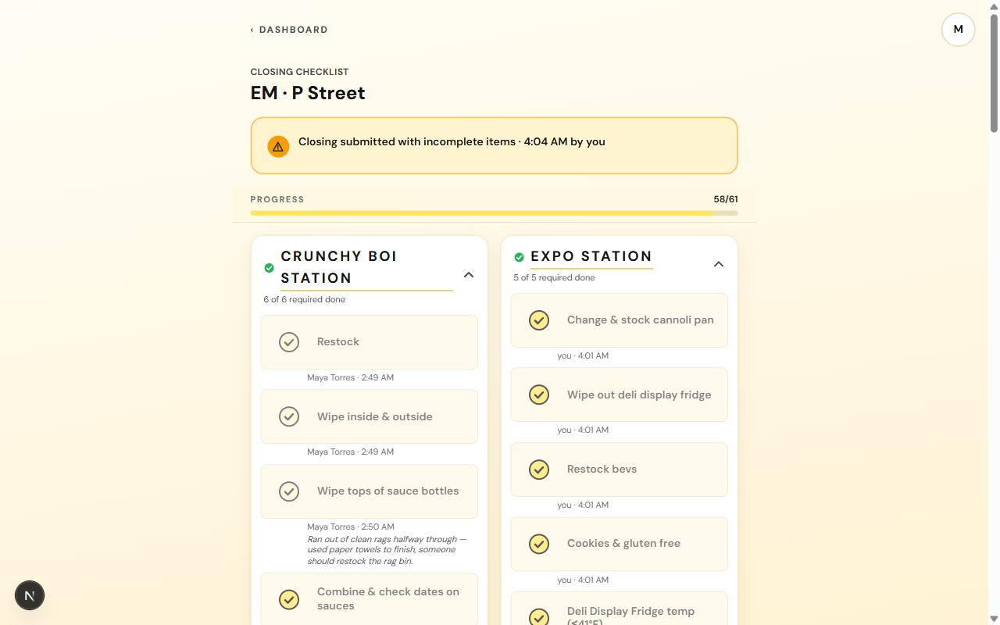

**What to do** — Read the banner, then leave.

**Worth knowing**

- The banner reads **"Closing submitted with incomplete items"** when you explained your way past something, and **"Closing confirmed"** when the list was clean. The difference is on the record.
- **Every line locks for everybody.** No more ticking, no more notes, no undo — and the cash deposit for that night can no longer be corrected either.
- Confirming happens once. There is no reopening it.

### 9. Back on the dashboard

**What you see**

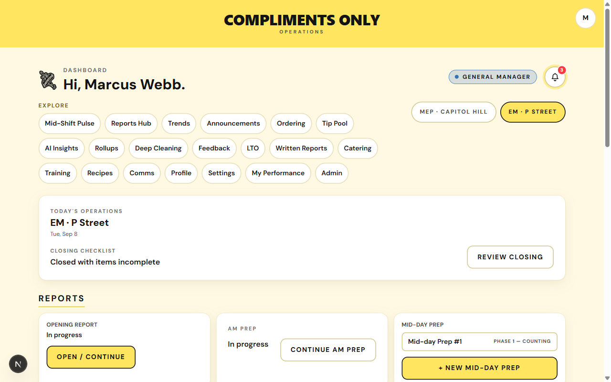

**What to do** — Check the tile flipped. **Review closing** is now read-only.

**Worth knowing**

- The tile reads **"Closed with items incomplete"**, or just **"Closed"** when nothing was outstanding.
- **A closing left unconfirmed blocks tomorrow morning's opening.** The opener cannot start until last night's closing is finished. So confirm it with honest reasons rather than walking out on an open list — an explained close costs the shop nothing; an open one costs the opener their morning.
- Lines you could not finish count against **Checklist Completion** on the Trends page. That is the point: the number is supposed to move when the night was short.

---

## AM prep and mid-day prep

Two separate lists, both yours. A manager can assign an employee a specific day's AM prep; mid-day prep stays a key-holder job.

### 1. The AM prep sheet

**What you see**

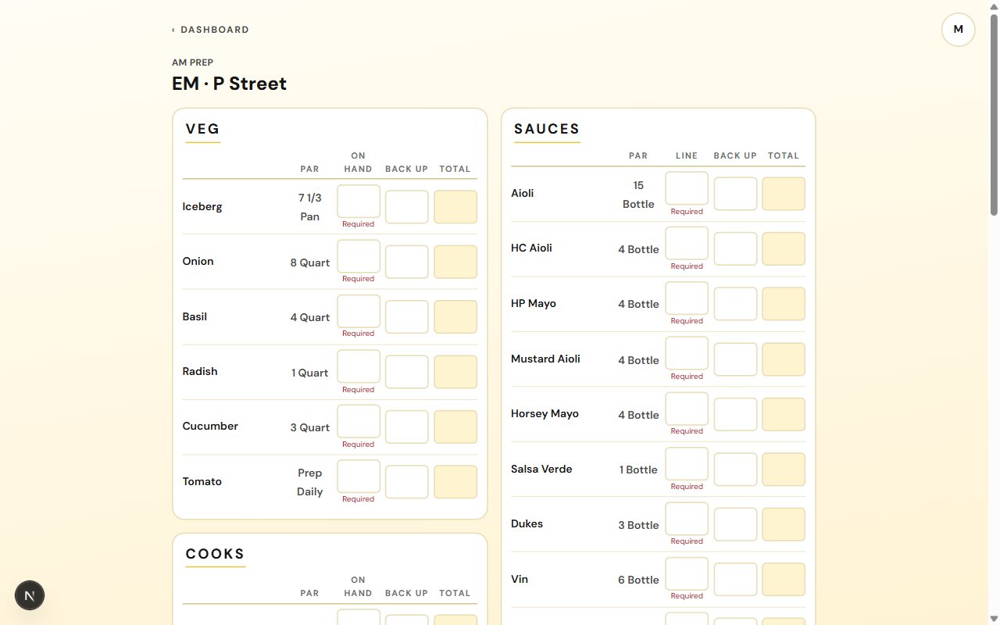

**What to do** — Work down the sheet filling the editable column for each item, then answer the **Misc** yes/no questions at the bottom.

**Worth knowing**

- **AM prep and mid-day prep are key holder and up.** The staff guide sends employees here for their own information; the page will bounce them. A manager can assign a specific day's AM prep to an employee, and then it opens for them.
- The editable column is named for the section — **ON HAND**, **PORTIONED** or **LINE**. **BACK UP** is what is behind it. **TOTAL** adds the two for you.
- Every input carries a red **Required** flag until it has a number. Zero is a number; blank is not.

### 2. Fill a row

**What you see**

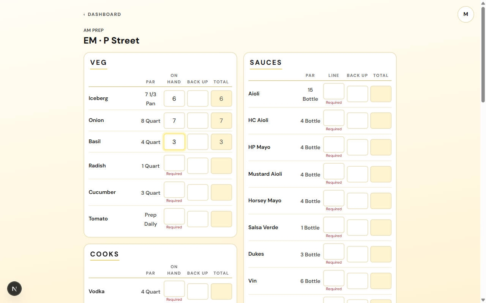

**What to do** — Type the count. The total fills itself.

**Worth knowing**

- The footer counts what is still blocking you — *"Fix 37 issues before submitting"*. The submit button carries the same words while it is disabled, so a button reading **Fix issues before submitting** is not broken; it is a to-do list.

### 3. Start a mid-day prep

**What you see**

**What to do** — From the dashboard, tap **+ New mid-day prep**. Count each item against its par and type it into **On hand**.

**Worth knowing**

- Mid-day prep is a **two-phase list**: count to par first, then prep against what the count says you are short.
- You can run **at most two mid-day preps in a day**. The dashboard numbers them.

### 4. Fill the count

**What you see**

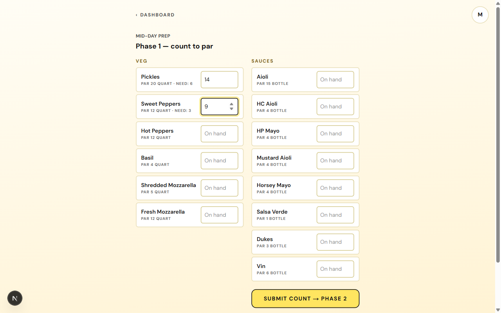

**What to do** — Fill every item, then **Submit count → Phase 2**.

**Worth knowing**

- This screen shows no per-field save state — the count goes in when you submit the phase, not as you type.
- **Finishing a mid-day prep ticks the closing checklist's Mid-day Prep line for you**, and carries a count of how many you have finished today. You do not tick it by hand.

---

## Receiving a delivery

Do this at the door, while the driver is still there. Key holder and up.

### 1. Pick the vendor

**What you see**

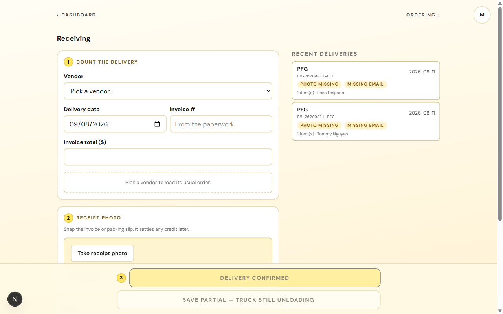

**What to do** — Pick the vendor, check the delivery date, and copy the invoice number and total off the paperwork.

**Worth knowing**

- **Pick the vendor first.** The page loads that vendor's usual order once you do, and the item picker is limited to what that vendor sells.
- The invoice number is the duplicate guard: the same vendor, the same day and the same invoice number is refused as already received. That is what stops a driver's second copy of the paperwork being filed twice.
- **Recent deliveries** on the right flags older drops that are still missing a photo or an invoice email.

### 2. The line list

**What you see**

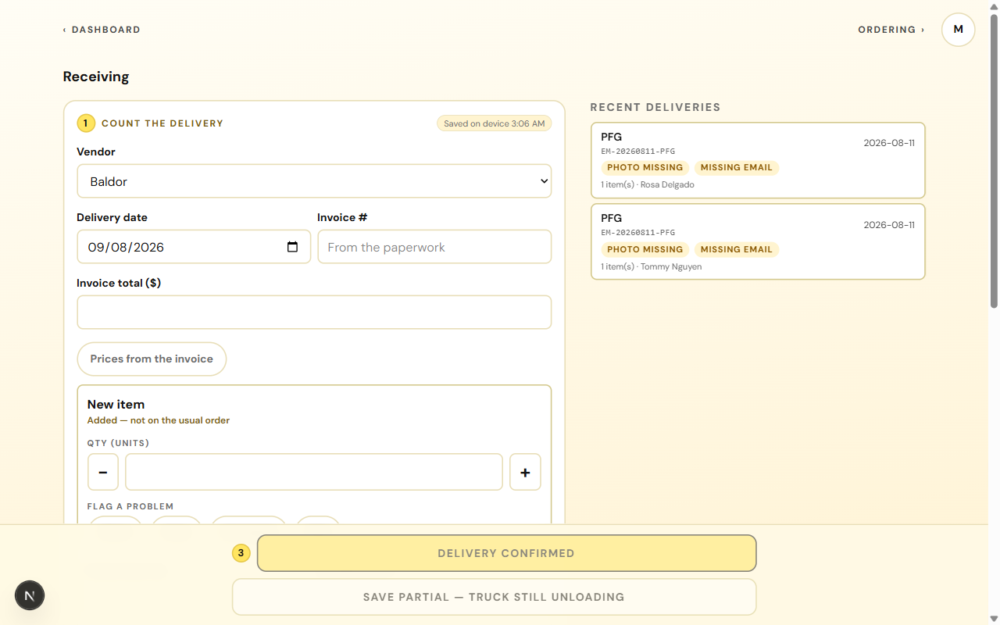

**What to do** — Use **Pick a SKU…** and **+ Add item** to add a line for each thing on the truck.

**Worth knowing**

- **The blank "New item" card at the top is a placeholder, not a line.** It has no product attached, and it is thrown away on submit — see step 5.
- "SKU" here means one exact thing from one vendor: their pack, their size, their item number. Two vendors' mozzarella are two different lines.
- A line only survives submit if it names an item **and** has a quantity above zero — see step 5 before you type into the blank card.

### 3. Enter the line

**What you see**

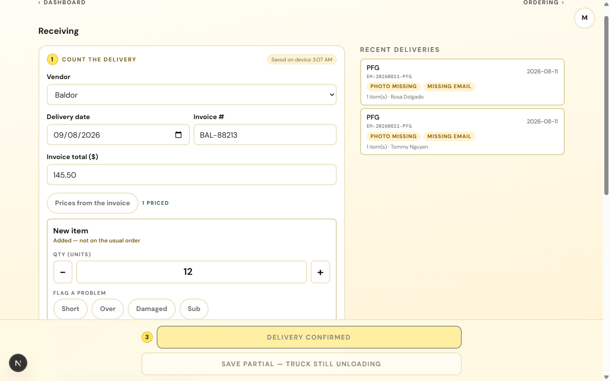

**What to do** — Type the quantity you counted off the truck, and the price per pack from the invoice.

**Worth knowing**

- The header badge counts how many lines carry a price — *"1 priced"*. Prices you enter here become the price the app believes for that item.
- A line note travels with that one item. The **Notes** box at the bottom of the page is about the whole delivery.

### 4. Flag a problem

**What you see**

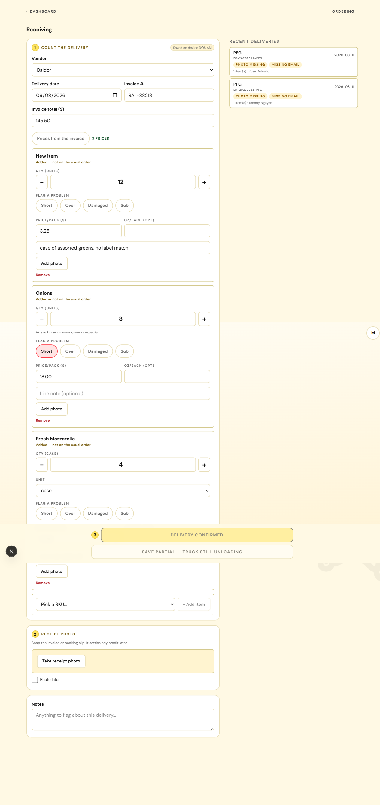

**What to do** — Enter what actually arrived, then tap **Short**, **Over**, **Damaged** or **Sub** on that line.

**Worth knowing**

- **The quantity you type is what arrived, not what was ordered.** The flag is the story; the number is the count.
- Nothing happens on screen when you tap the flag. The vendor credit is filed when you tap **Delivery confirmed**, and it shows up on the delivery afterwards.
- **Delivery confirmed** stays off until there is a receipt photo or **Photo later** is ticked. If expected items are still unconfirmed, the first tap opens a review notice. Check those items, then tap again to file the delivery.

### 5. Read the finished delivery

**What you see**

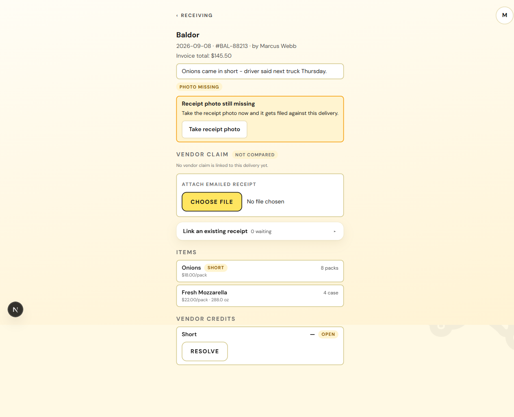

**What to do** — Open the delivery from **Recent deliveries** and check the item list against your paperwork before the driver leaves.

**Worth knowing**

- **Lines without a catalog item are not saved.** Only lines that name an item *and* carry a quantity above zero are submitted. Expected items you never touched show up in the review notice first; a blank card with no item never saves at all. If something came off the truck that is not in the picker, put it in the delivery **Notes** box and get it added to the catalog.
- A **Short** flag on a line that was not on a purchase order records the problem but no quantity and no dollar amount, because there is no ordered quantity to subtract from. That is the *"Short — — —"* row you are looking at. Flag shorts against a purchase order when there is one, and the amount fills itself in.
- **Vendor claim — "Not compared"** means no vendor invoice has been matched to this delivery yet.

### 6. Resolve a vendor credit

**What you see**

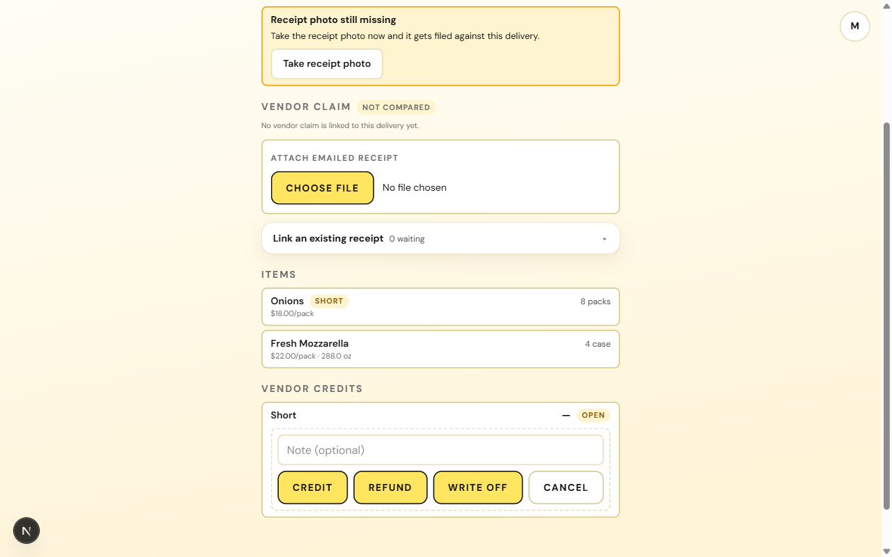

**What to do** — Tap **Resolve**, type what was agreed into **Note (optional)**, then pick the outcome.

**Worth knowing**

- **Credit**, **Refund** and **Write off** are **AGM and up**. **Cancel** just closes the panel and changes nothing.
- All three close the credit and none of them moves money on their own. What you are choosing is the record of what the vendor agreed to: money off the next invoice, money back, or we ate it. Pick the one that is true — somebody checks these against the vendor's statement later.
- **If the vendor makes the short up on a later truck, do not resolve it here.** Tick it off on that delivery's intake instead. A key holder can do that — the second delivery is the proof, so no manager judgment is needed.

### 7. The closed credit

**What you see**

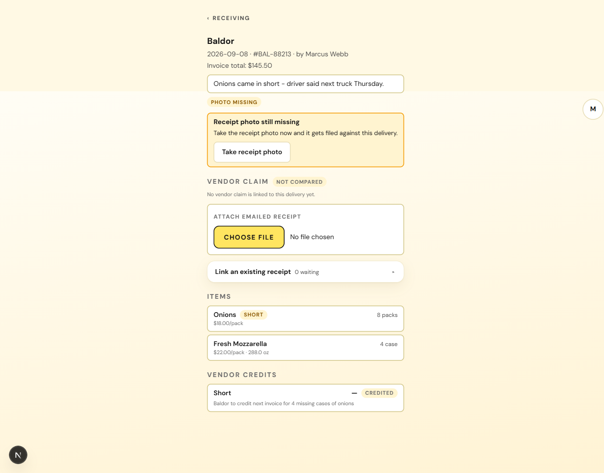

**What to do** — Check the status and the note read the way you meant them.

**Worth knowing**

- Your note is **added to** anything already on the credit, never written over it.
- A resolved credit cannot be resolved again. If you picked the wrong outcome, say so in a note on the delivery — there is no undo.

---

## Counts (Inventory Audit)

Run this when the owner calls for a full audit. Day to day the app works on-hand out from deliveries, production and sales — the audit is what re-anchors it to reality.

### 1. Start a new audit

**What you see**

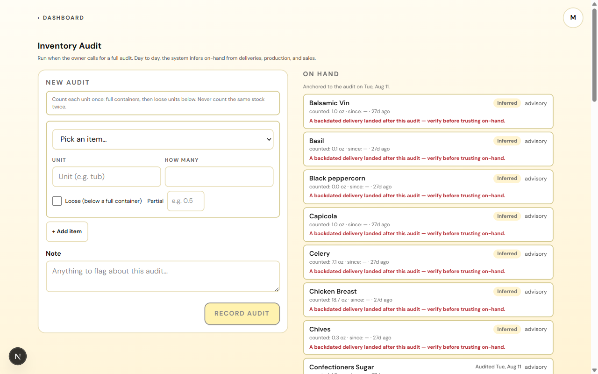

**What to do** — Read the instruction under the heading, then start adding items.

**Worth knowing**

- **Counts are AGM and up.** A key holder or shift lead cannot open this page.
- *"Count each unit once: full containers, then loose units below. Never count the same stock twice."* The whole number only means something if nothing is counted twice.
- The **On hand** list on the right is anchored to the last audit. Items marked **Inferred / advisory** have never been counted here; the app is guessing them from paperwork.

### 2. Add your lines

**What you see**

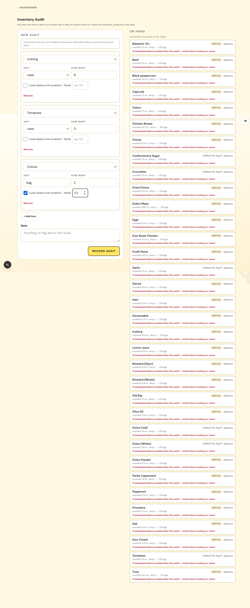

**What to do** — Pick the item, set the unit, type how many. Tick **Loose (below a full container)** and give a **Partial** — *0.5* for a half — for the open container.

**Worth knowing**

- **The Unit field comes in two kinds.** For an item with its pack units on file it is a dropdown reading **Pick a unit…** — pick from it and you are safe. For an item with no pack-unit list it is a plain text box reading *"Unit (e.g. tub)"* — whatever you type still has to be a unit the app can convert. See step 4.
- A line you start and do not finish is dropped, with a warning above the button telling you how many.

### 3. Confirm your password

**What you see**

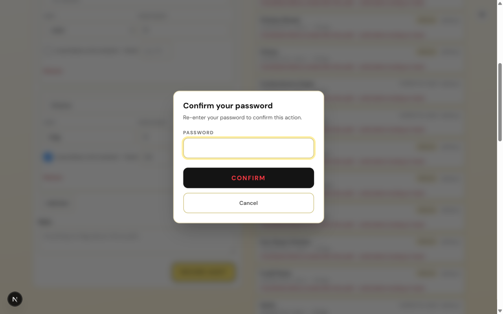

**What to do** — Type your account password — not your PIN — and tap **Confirm**.

**Worth knowing**

- **Recording an audit needs your password.** It is the one job outside Admin that does. A count re-anchors every number downstream of it, so the app wants to know it is you.
- One confirmation covers the rest of the session's audits. It clears when you leave the admin area or sign out.

### 4. The unit error

**What you see**

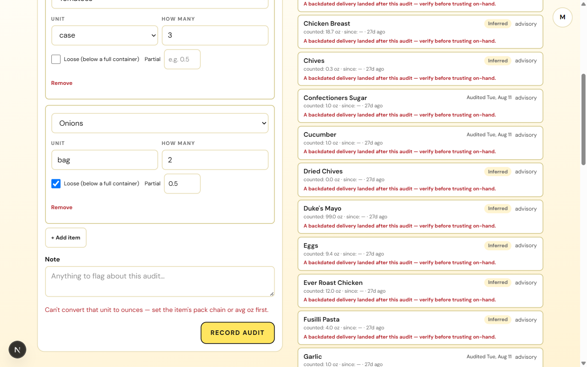

**What to do** — Remove the line the app cannot read, and record the rest.

**Worth knowing**

- **One unreadable line fails the whole audit.** Nothing is saved — not even the lines that were fine. The message does not name the line, so look for the one where you typed the unit yourself.
- **Avoid it by picking a listed unit whenever there is one.** If the app refuses a unit you typed, that item's pack information or average weight is missing in the SKU catalog — fix it there, or leave the item off this audit and record the rest.

### 5. The recorded audit

**What you see**

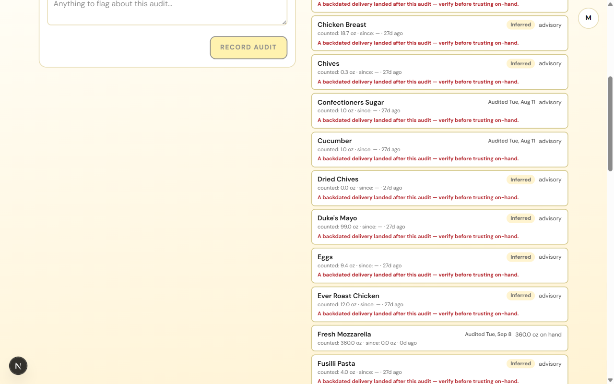

**What to do** — Check the items you counted now read **Audited** with today's date.

**Worth knowing**

- Only the items you actually counted get a new anchor. Everything else keeps the date it had — a partial audit does not stale out the rest.
- **"since"** on a row is what the app thinks has been used since you counted. It grows through the day.
- An audit is never edited. If you got a number wrong, count that item again — the newest count wins.

---

## Ordering and purchase orders

The 6 AM job. Walk the shelves, say what is there, and the app works out the order. Key holder and up.

### 1. The ordering walk

**What you see**

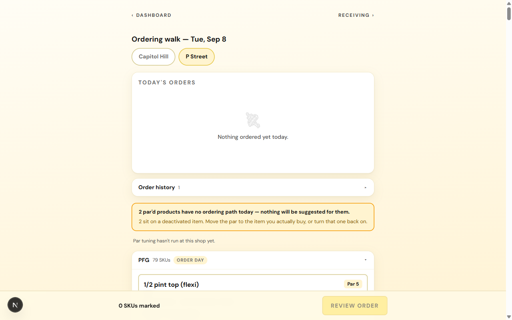

**What to do** — Open the vendor whose cutoff is next and work down its list, shelf by shelf.

**Worth knowing**

- Vendors whose **order day** is today sort to the top and carry an **ORDER DAY** badge. The header also shows that vendor's cutoff time.
- The warning banner — *"N par'd products have no ordering path today"* — means somebody set a par on something the app cannot order: usually the par sits on a **deactivated item** while the one you actually buy carries none. Nothing will be suggested for those until you move the par or turn the item back on. They are silent, not broken, and that silence is expensive.
- *"Par tuning hasn't run at this shop yet"* means the nightly par engine has never written anything here. Even where it has, **nothing changes a par by itself** — it only ever suggests, and only a GM can accept a suggestion.

### 2. Say what is on the shelf

**What you see**

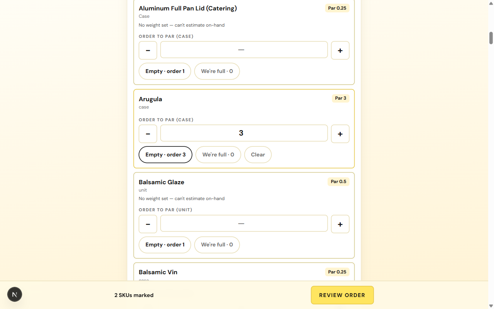

**What to do** — For each item either use the stepper, or tap one of the two quick buttons.

**Worth knowing**

- **A blank box is not an answer.** A line you never touch is not submitted at all. **We're full · 0** is a real answer — it says the shelf is at par, orders nothing, and records that you looked.
- **Empty · order N** orders the full par. It is the other extreme: the shelf is bare.
- **Suggest N** appears only where the app has an on-hand estimate to work from. It is the par minus that estimate, rounded up to whole order units. No estimate, no chip — it will not invent a number.
- The footer counts marked items. That number is what gets recorded, zeros included.

### 3. Review before you commit

**What you see**

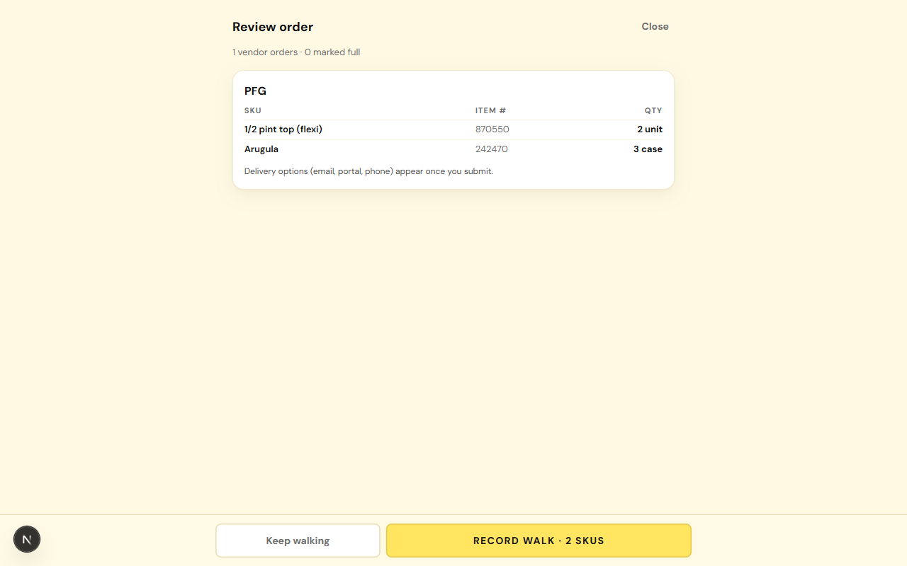

**What to do** — Read the table against your walk. **Keep walking** goes back; **Record walk** commits.

**Worth knowing**

- **Nothing is sent to any vendor at this point.** The note says so: delivery options appear after you submit.
- **Generate draft**, the cutoff shortcut beside the list, drafts from the app's suggestions, not the quantities you typed on the walk. Your typed walk quantities only become an order through **Record walk**.

### 4. The draft order

**What you see**

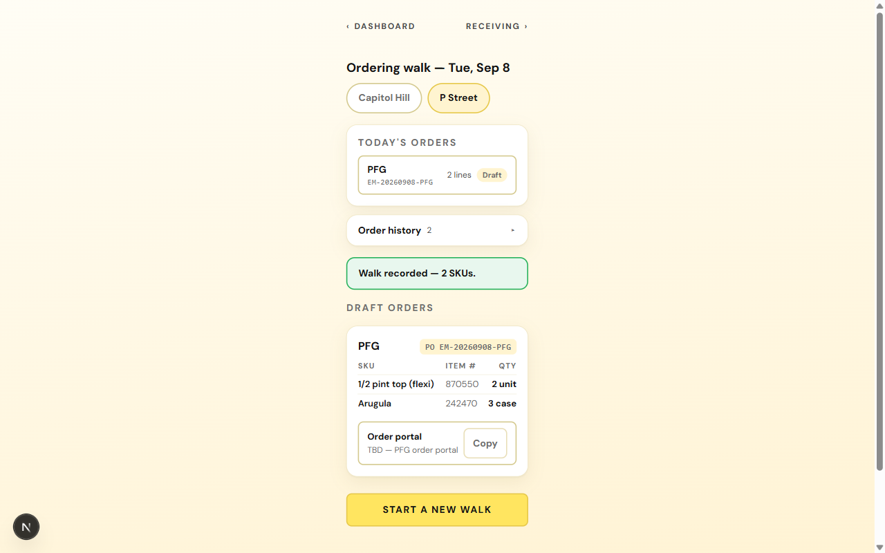

**What to do** — Open the draft, check it, then confirm it and send it.

**Worth knowing**

- **One draft order per vendor**, covering only the lines above zero. The zeros stay on the walk record as evidence you checked.
- **Recording a walk never creates a second order for the same vendor at the same shop that day.** If a draft exists, your positive quantities update it: a line you typed takes your number, a new item is added, everything else stays. Nothing is summed, and a zero on the walk does not remove a draft line. The screen says **added to today's draft**. For a deliberate extra order after placing, use **Add-on order** (step 7).
- If today's order is already confirmed or placed, the walk still records what you saw but changes nothing on the order, and says so. **Generate draft** refuses outright while any order exists for that vendor today.
- The order's code is your shop's code, today's date, and the vendor — so `EM-20260908-PFG` reads at a glance.
- **Confirm** freezes the prices and the line list; it does not send anything. Confirming twice is refused. To change a confirmed order before it is placed, unlock it first, as in step 6.
- **Sending is a separate tap**, and the email is rebuilt on the server from the confirmed order — not from anything on your screen. If the vendor has no ordering email on file, the app says so and leaves the order alone; use the phone or portal link instead and mark it placed.

### 5. Edit the draft

**What you see**

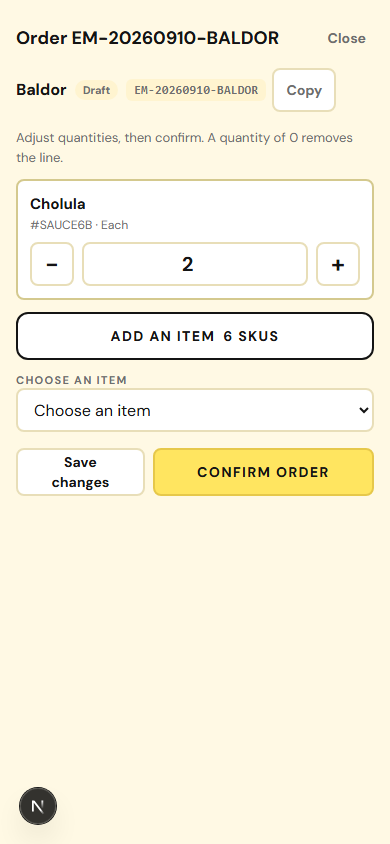

**What to do** — Change quantities in the boxes or with the steppers. Tap **Add an item**, choose what you need, set its quantity, then tap **Save changes**.

**Worth knowing**

- **Add an item** offers any of this vendor's active SKUs that are not already on the order, including ones that were not on your walk. An item already on the order is edited on its existing row.
- Set a draft line to **0** to remove it from what you will order. The row stays, struck through, because it is part of the history.
- Typing does not save. **Save changes** writes your edits and keeps the order as a draft. **Confirm** takes two taps and also saves pending edits before freezing the order.

### 6. Unlock a confirmed order

**What you see**

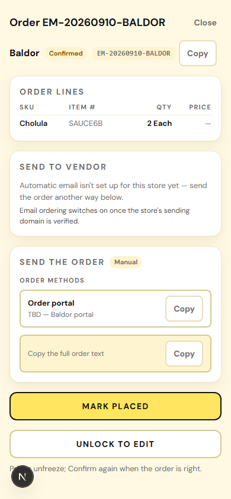

**What to do** — If you need to change an order that has not been placed, tap **Unlock to edit**, then **Tap again to unlock**. Edit the draft, save your changes and **Confirm** again when it is right.

**Worth knowing**

- Unlocking unfreezes prices. Confirming again takes the current prices and lines; the earlier confirmation remains in the history.
- **Mark placed** records that you ordered through the phone, portal or another channel. Sending the order with the app's email send button also marks it placed.
- Once it is placed, you cannot unlock it. Use **Add-on order** if you need more.

### 7. Make an add-on order

**What you see**

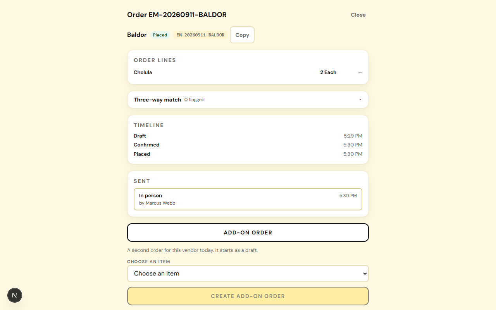

**What to do** — Open the placed order, tap **Add-on order**, choose the extra items and enter their quantities. Tap **Create add-on order**, then open the new draft to check, confirm and send it.

**Worth knowing**

- This is a deliberate second order for the same vendor at this shop today. It starts as a draft with a **-2** at the end of today's order code; another add-on takes the next free number.
- Enter only the extra quantities you need. The placed order stays as it was, and creating the add-on does not send it.
- The picker offers any of this vendor's active items, including more of something already on the placed order.
- A later walk can update this new draft. The cutoff **Generate draft** shortcut still refuses another order for that vendor today.

---

## Production capture

Log it whenever you turn raw stock into something else — a case of mozzarella into portions, a bag of onions into caramelised onion. It is how the app knows stock went down.

### 1. The production form

**What you see**

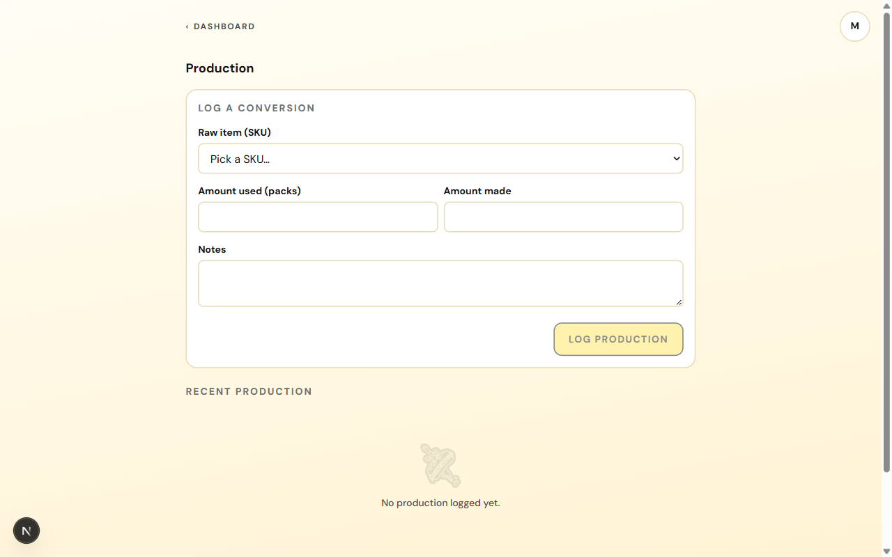

**What to do** — Pick the raw item you used.

**Worth knowing**

- Key holder and up.
- **"in stock" here is packs received at this shop minus packs used in production.** It is not the Inventory Audit's on-hand, and the two will not agree — an audit re-anchors ounces, this counts packs off the paperwork. Do not read it as a shelf count.

### 2. Fill it in

**What you see**

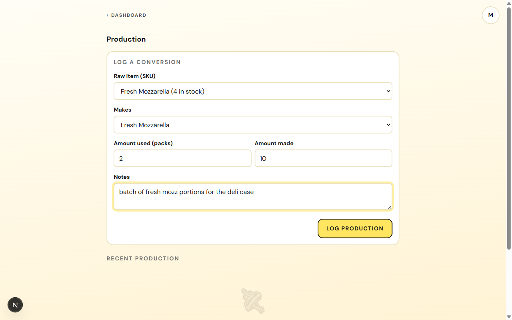

**What to do** — Set **Makes**, then the amount used and the amount made.

**Worth knowing**

- **The "Makes" dropdown only appears after you pick a raw item, and Log production stays disabled until you set it.** That is the usual reason the button looks stuck.
- Only combinations the app has a recipe for are offered. If what you made is not in the list, the recipe is missing — tell whoever keeps the recipes.

### 3. Log it

**What you see**

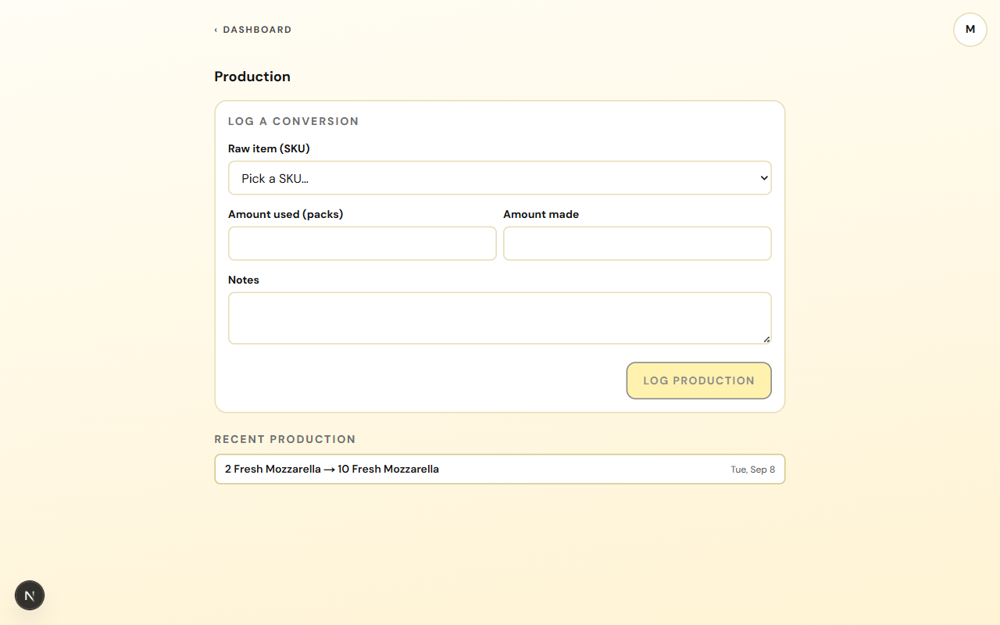

**What to do** — Tap **Log production** and check the entry appears under **Recent production**.

**Worth knowing**

- The raw item's in-stock count drops by what you used, straight away.
- Prep entered on the opening report's Phase 2 lands here too. You do not log the same batch twice.

---

## Mid-Shift Pulse

A read-only picture of where the shop is right now. Open it once mid-shift instead of chasing five pages. Key holder and up.

### 1. Read the pulse

**What you see**

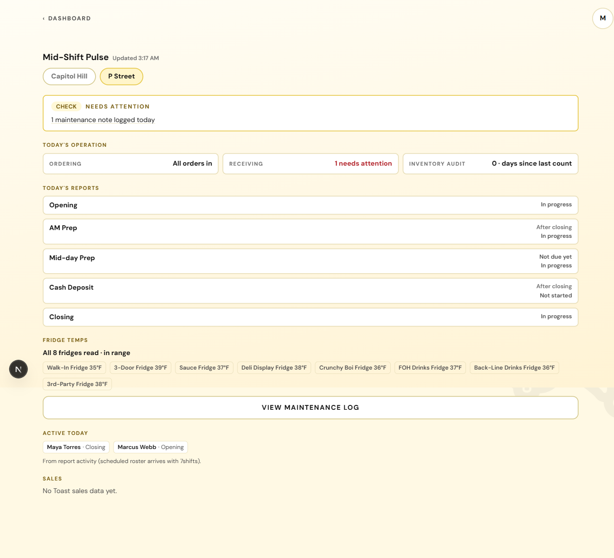

**What to do** — Read the top alert first, then the report list, then the fridge board.

**Worth knowing**

- **Nothing on this page is a form.** Every tile links to the page where the work actually happens.
- The report list judges against a clock: the opening is late after **10:30 AM**, mid-day prep is due from **2:00 PM** and late after **3:30 PM**, the closing is late after **9:00 PM**.
- **Fridge temps** are the readings typed on this morning's opening and tonight's closing — nobody enters them here.
- **Active today** is worked out from who has touched a report today, not from a schedule. Someone on shift who has not tapped anything yet will not be listed.
- The **Inventory Audit** tile only appears for AGM and above, because the audit itself starts there.

---

## Maintenance log as a manager

Same form the crew uses — the [staff guide](staff-guide.md#maintenance-log) covers filling it in. What is worth knowing is where the note ends up.

### 1. Log a note

**What you see**

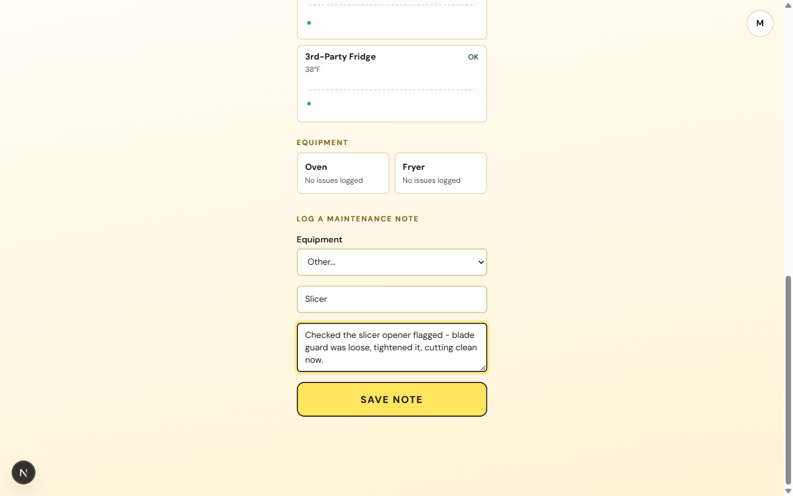

**What to do** — Pick the equipment from the dropdown when you can. Only use **Other…** when the thing is genuinely not listed.

**Worth knowing**

- The dropdown holds the eight fridges plus the Oven and the Fryer. Those are the only pieces of equipment with a tile of their own.
- **A note filed under "Other…" is saved, but it has nowhere to be read.** It does not appear on any tile, and it does not appear on the day's maintenance report either. That is why you cannot find yesterday's slicer note.

### 2. Save it

**What you see**

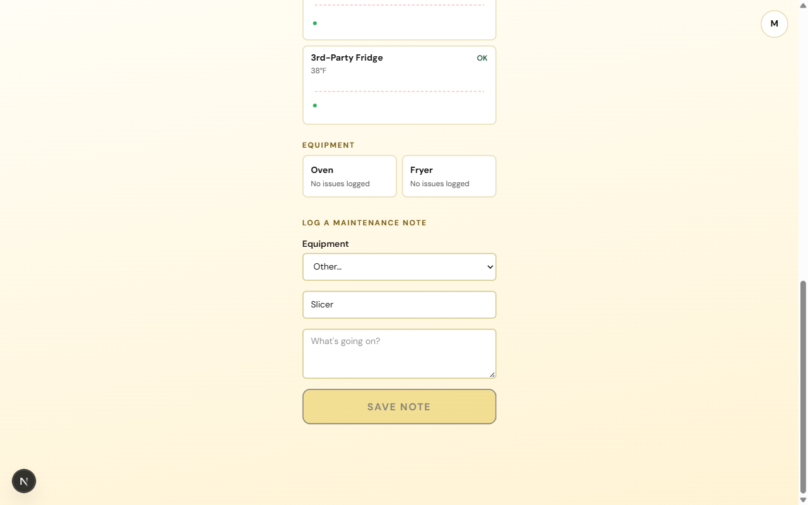

**What to do** — Tap **Save note**. The note box clearing is the only confirmation you get.

**Worth knowing**

- If something matters today, **say it out loud as well as logging it**. The log is a record, not an alarm.
- To read back what was logged against a named fridge, the Oven or the Fryer, open that item's tile, or open the day's **Maintenance** report from the Reports Hub.

---

## PM report and evaluations

The end-of-shift report. Key holder and up. It is the only place the crew's ratings come from.

### 1. Open the report

**What you see**

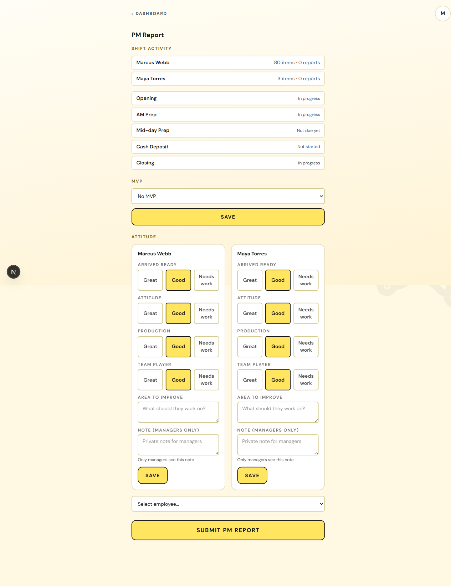

**What to do** — Read the shift activity at the top, then work down the crew.

**Worth knowing**

- The people already listed are the ones the app saw working today. Use **Select employee…** to add anyone it missed.
- **Note (managers only)** is exactly that. The person you are writing about never sees it — not on their performance page, not anywhere.

### 2. Grade the shift

**What you see**

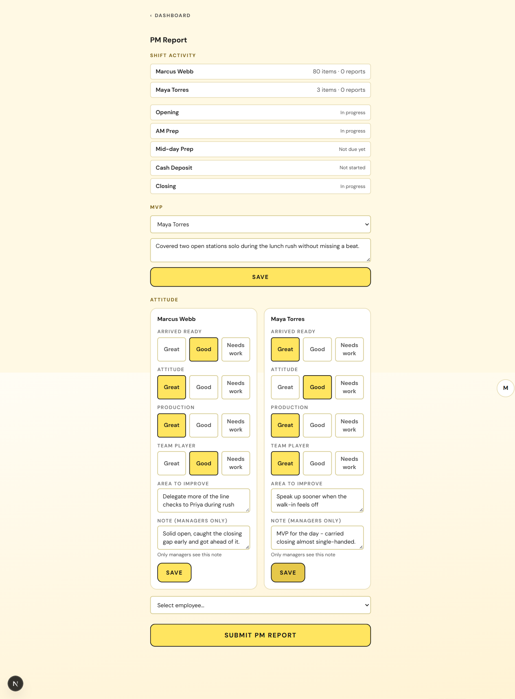

**What to do** — Name an MVP and say why, then grade each person on the four rows and **Save** their card.

**Worth knowing**

- **Each person's Save is its own action**, separate from the page's Submit. Saving a card again replaces what was there.
- **Area to improve** is the half the person will read. Write it to them, not about them.
- Grades add up on that person's card in **Team** trends as a running Great / Good / Needs work tally, alongside MVP wins and how often an area to improve was flagged. One rough shift does not define anyone; a pattern shows.

### 3. Submit it

**What you see**

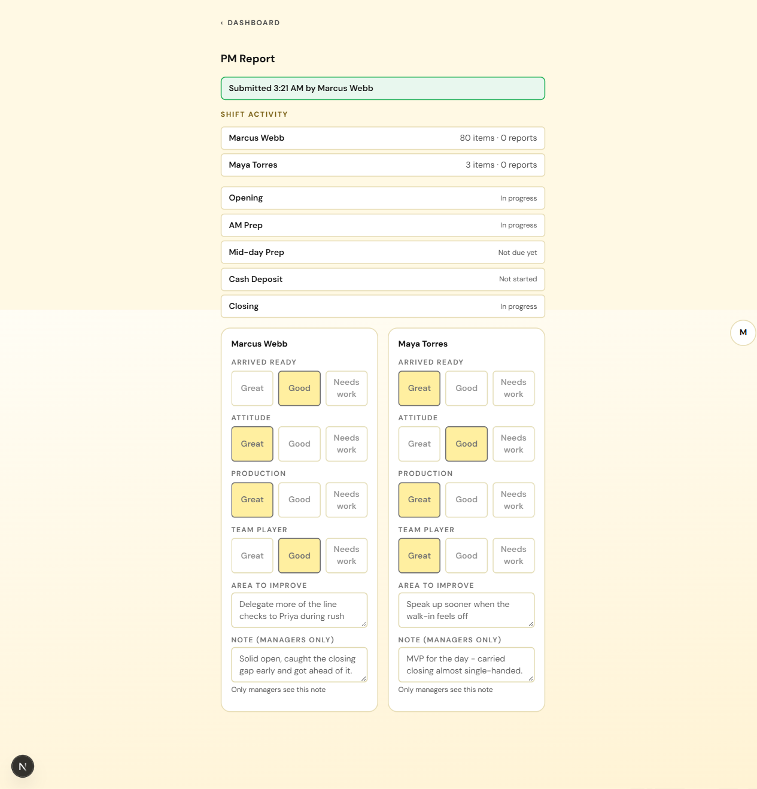

**What to do** — Tap **Submit PM Report** once you have graded everyone you meant to.

**Worth knowing**

- **Submitting notifies every person you graded.** Until you submit, nobody sees anything — their performance page only shows ratings from submitted reports.
- **There is no reopening it.** Every field goes read-only and the MVP picker disappears. Grade first, submit last.

---

## Cash deposit

End of night, before the closing can be confirmed. Key holder and up.

### 1. Open the form

**What you see**

**What to do** — Put the Toast figure in **Projected**, then count the drawer.

**Worth knowing**

- **Enter total** takes one number. **Count by denomination** adds them up for you — use it when the drawer is off and you want a second pair of eyes on the count.
- **$200 stays in the register.** The app subtracts the float for you; do not subtract it yourself.

### 2. Fill it in

**What you see**

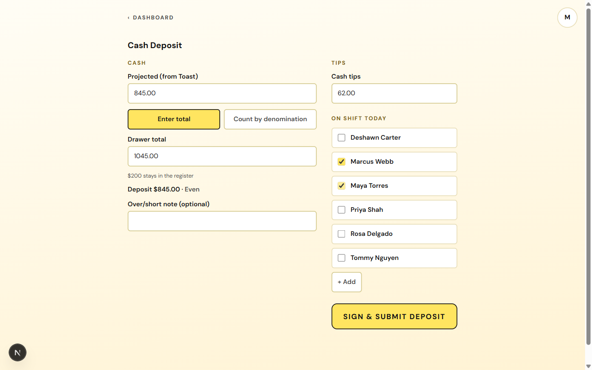

**What to do** — Add the cash tips, tick who was on shift, and read the live line before you sign.

**Worth knowing**

- **Deposit is the drawer total minus the float. Over or short is the deposit minus the projected figure.** The live line does that sum as you type, and the server does it again when you submit — the numbers you send are never taken on trust.
- If it is off, write down why in **Over/short note** while you still remember. That note is what somebody reads tomorrow.

### 3. Sign it

**What you see**

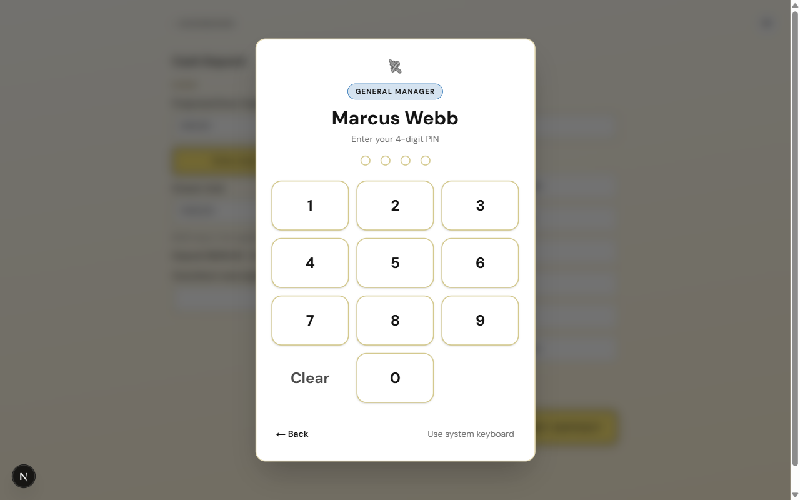

**What to do** — Tap **Sign & submit deposit** and enter your PIN.

**Worth knowing**

- **The deposit is signed with your PIN.** Your name goes on it, so count it yourself.

### 4. The filed deposit

**What you see**

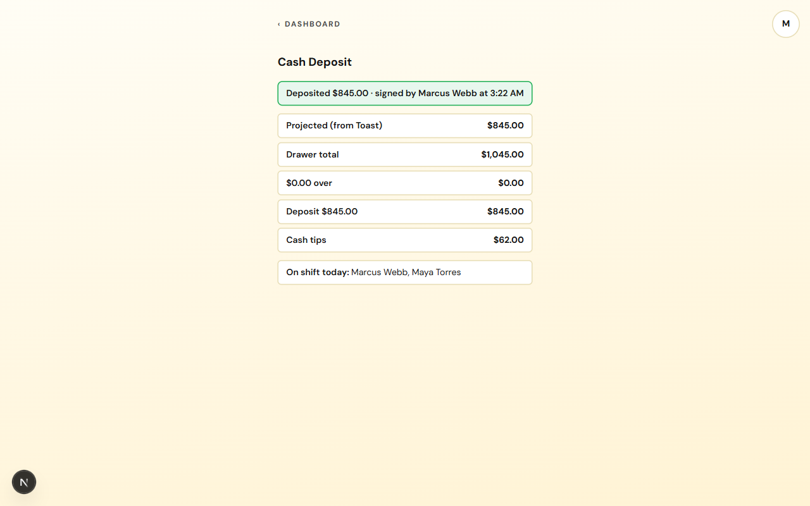

**What to do** — Check the summary, then go and confirm the closing.

**Worth knowing**

- **The closing cannot be confirmed until a deposit is filed.** That is deliberate — the deposit is part of locking up.
- You can correct a deposit by filing it again, and the newer one replaces it. **Once the closing is confirmed, that window shuts** and the deposit is fixed for the night.

---

## Reports and trends

Everything filed at your shop, and the shape it makes over time.

### 1. The Reports Hub

**What you see**

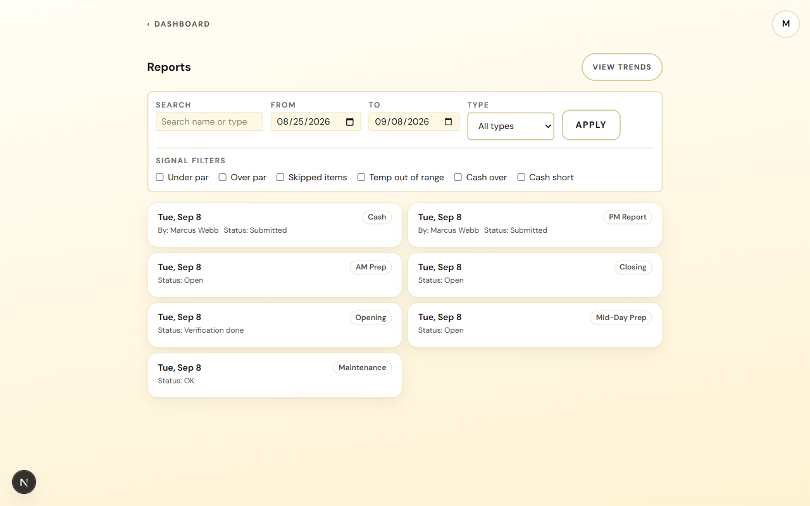

**What to do** — Set the dates and the type, then **Apply**.

**Worth knowing**

- **Signal filters** find the days worth reading instead of all of them:
  - **Under par** — a prep item whose total came in below its par.
  - **Temp out of range** — a fridge reading above 41°F.
  - **Skipped items** — a required line with nobody's name on it.
  - **Cash over / Cash short** — a deposit that did not match the projected figure.
- **Cash reports are visible from key holder up. The notes people wrote on checklist lines are visible from shift lead up.** A report can look emptier to a key holder than it does to you.

### 2. Read a saved report

**What you see**

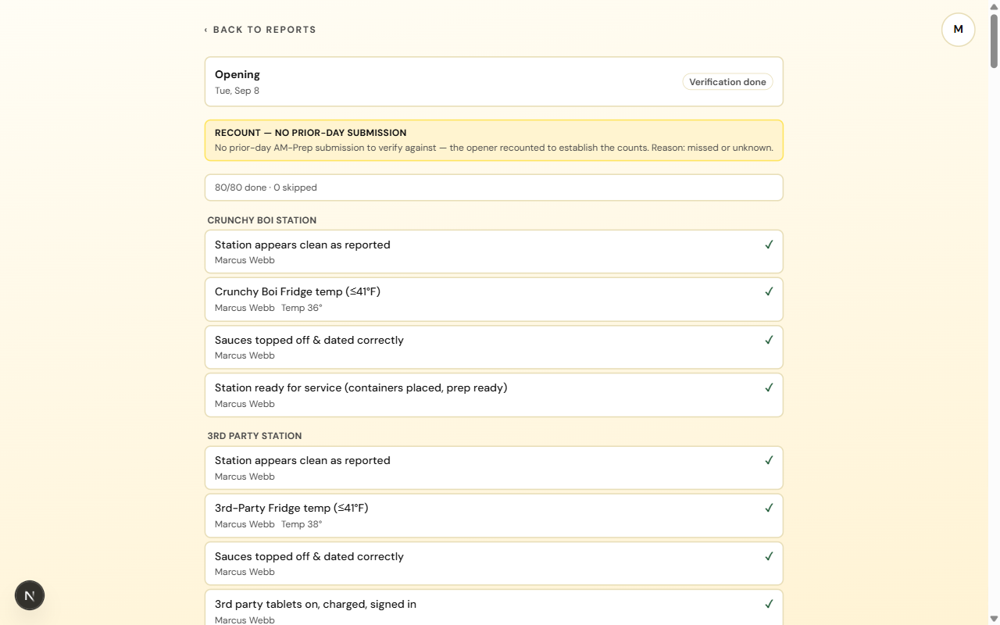

**What to do** — Open a report from the list to read the whole thing back, line by line.

**Worth knowing**

- Every line carries the name of whoever ticked it and the temperature or count they entered. This is the accountability record — it is what "who changed the kitchen" means.
- On an opening, the prep rows read *"Recount"*, *"Ground truth"* and *"prep need"* so you can see where the day's numbers came from — and the note at the top says whether there was a prior closing to check against.

### 3. Trends

**What you see**

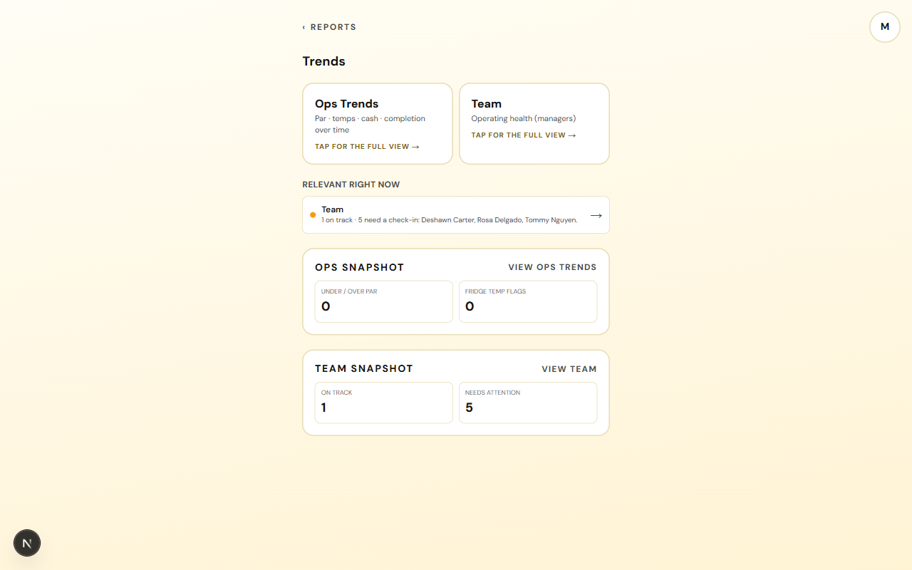

**What to do** — Pick **Ops Trends** for par, temps, cash and completion over time, or **Team** for people.

**Worth knowing**

- Every chart runs by day, week or month, and a period with no report is drawn as a **gap, not a zero**. A flat line at nothing means nobody filed; it does not mean nothing happened.
- Cash is only in these charts for viewers who can see cash.

### 4. Team

**What you see**

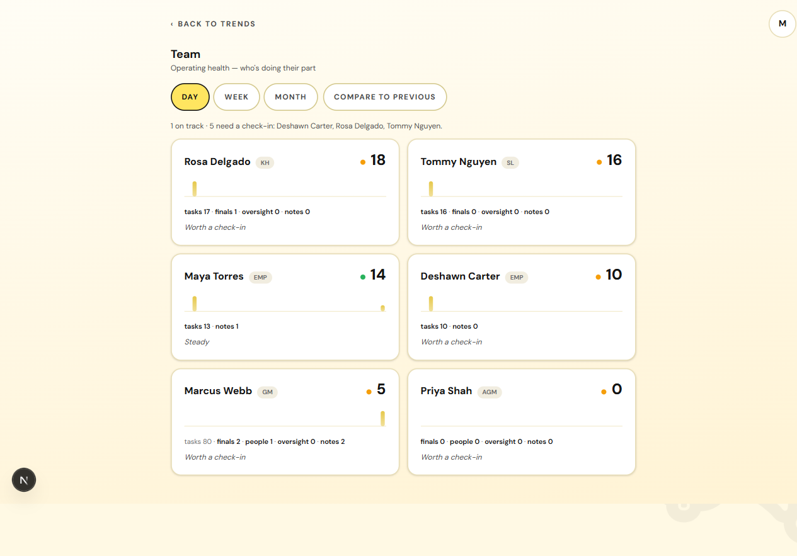

**What to do** — Read the banner, then open anyone it names.

**Worth knowing**

- **Team is AGM and up.**
- *"Needs a check-in"* is not a rating and not a warning. It fires when somebody did **none** of a kind of work their role is expected to do in the window, or when their activity fell to 60% or less of the period before. It is a prompt to go and ask, and a quiet person who is genuinely off rota will land there.
- What counts differs by role — an employee is measured on tasks and notes, a key holder or shift lead adds finishing reports and oversight, an AGM or GM on finishing, people management, oversight and notes.
- Their card carries the grades you gave them, their MVP wins, their streaks and their busiest day.

---

## Admin console

Business configuration: who you buy from, what you buy, what the lists say. **Admin opens at AGM.** Changes need your password — some reuse the confirmation you just gave, others ask again.

### 1. The admin home

**What you see**

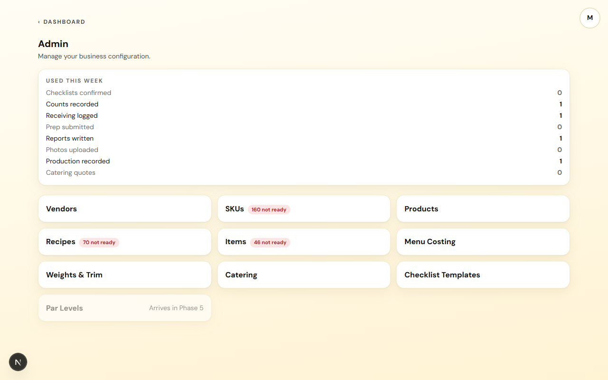

**What to do** — Pick a section. The **Used this week** tally at the top is a quick read of whether the shop is actually using the app.

**Worth knowing**

- **There is no Users tile, and there is no way to add a person from here.** User management starts at **Manager of Operations**. A GM who types the address in is returned to Admin with a line explaining why — it is not a bug, it is not a GM page. Ask the Manager of Operations or the owner to add, deactivate or re-role somebody.
- **Checklist Templates and the Par Levels placeholder are GM and up.** Every other section on this page opens at AGM.
- Counts on the tiles — *"SKUs — 160 not ready"*, *"Items — 46 not ready"* — are how much setup is still missing, not how much is broken.

### 2. Checklist templates

**What you see**

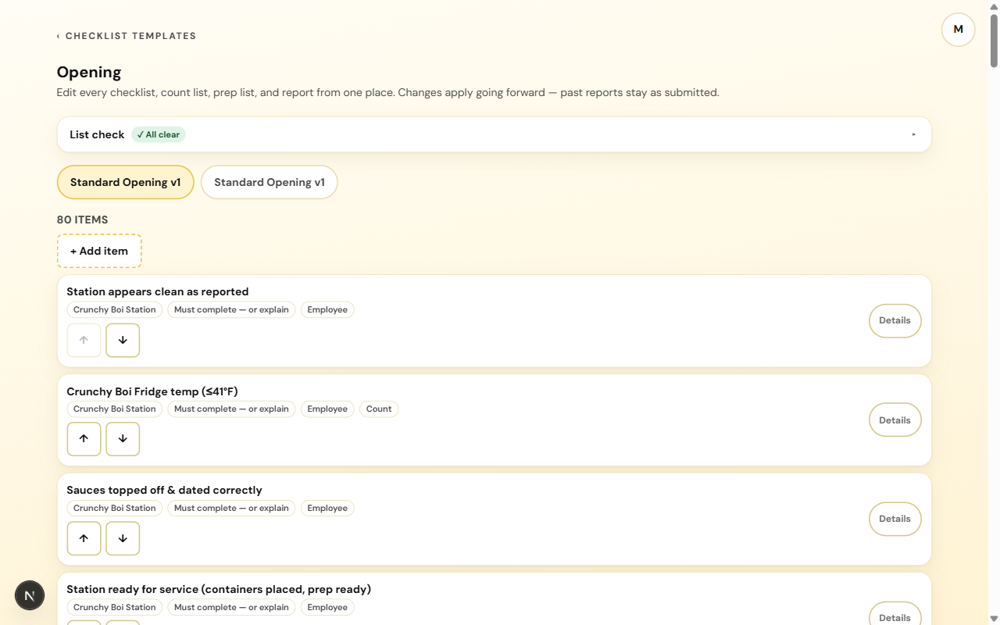

**What to do** — Pick the list you want to change, and use **Preview (what staff see)** before you save anything.

**Worth knowing**

- *"Changes apply going forward — past reports stay as submitted."* Editing a list never rewrites history.
- Prep lists are shown here **read-only** — they are edited in the prep editor.

### 3. A checklist line

**What you see**

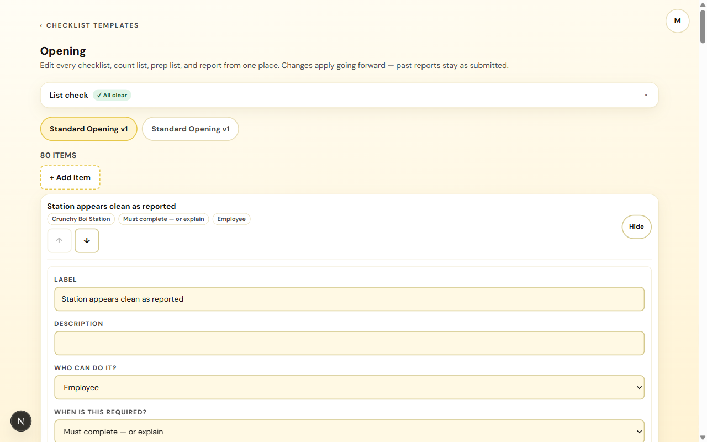

**What to do** — Tap **Details** on a line to open it. Read before you change.

**Worth knowing**

- **Who can do it?** sets the lowest role that may tick that line. People below it still see the line, locked and marked with the role it needs.
- **When is this required?** has three settings: **Optional**, **Must complete — or explain**, and **Hard gate — can't submit until done**. A hard gate stops the whole list being confirmed, so use it sparingly.
- **Connections** ticks the line automatically when a named report is finished.
- Every line has a **Spanish** field. Fill it in when you add a line, or half your crew reads English.

### 4. Par levels

**What you see**

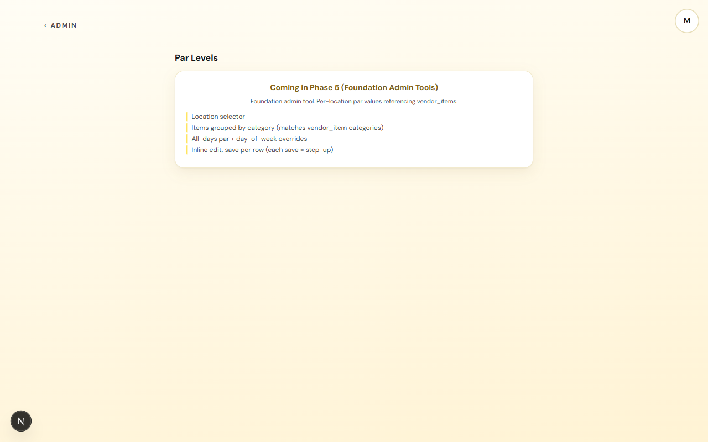

**What to do** — Nothing. Coming soon.

**Worth knowing**

- Pars are set today on each item in the **SKU** catalog. A GM can also accept a suggested par on the ordering walk; the app never changes a par on its own.

### 5. Vendors

**What you see**

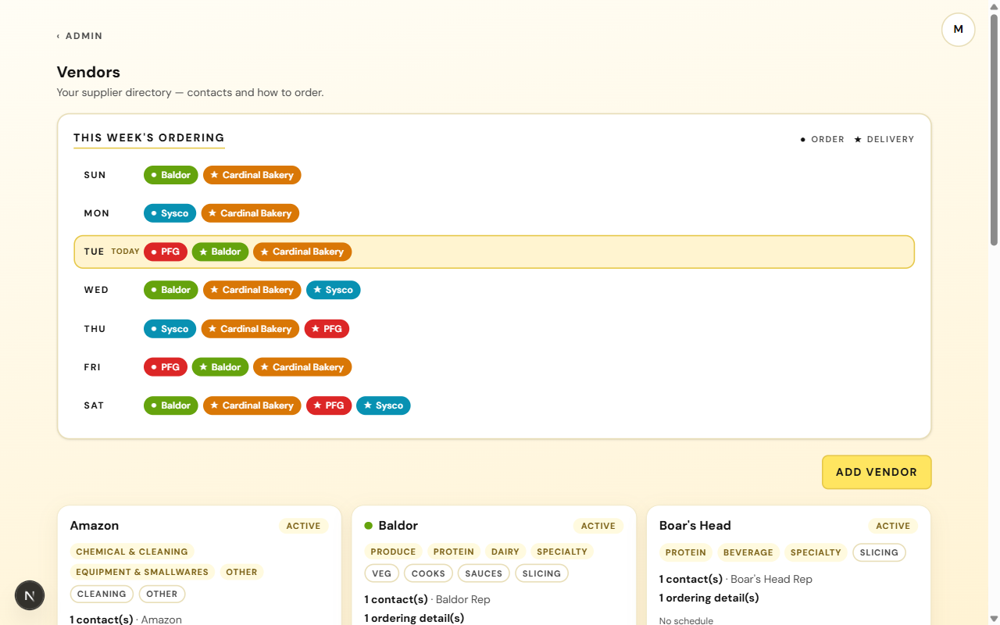

**What to do** — Read a vendor's order and delivery days here when you are planning a walk.

**Worth knowing**

- The order and delivery days on each row are what the ordering walk uses to decide whose cutoff is today.
- A vendor is never deleted — it is switched off. Its history stays.

### 6. A vendor record

**What you see**

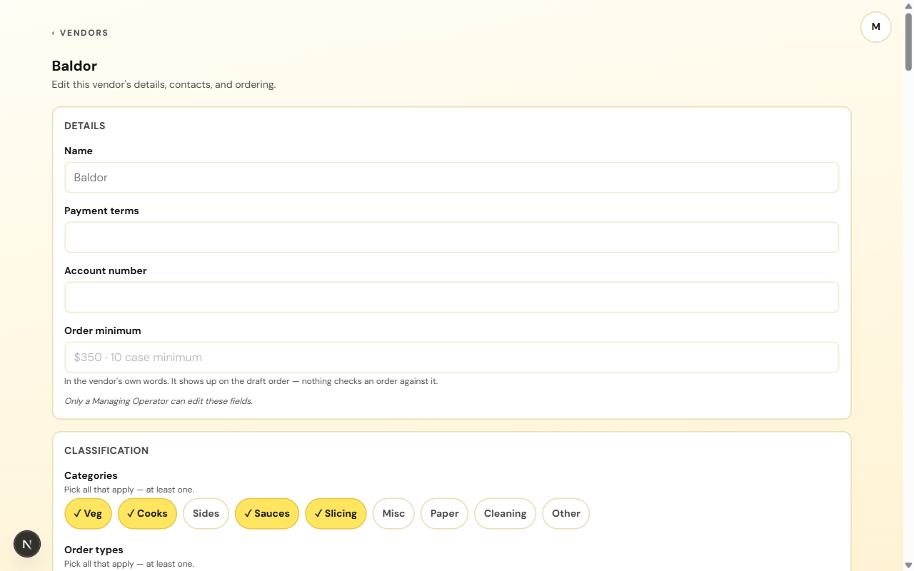

**What to do** — Update contacts, categories and the ordering schedule as they change.

**Worth knowing**

- Some fields carry the note *"Only a Managing Operator can edit these fields"* — payment terms, account number, order minimum. You can read them; you cannot change them.
- **Order minimum is a note in the vendor's own words.** Nothing checks an order against it.

### 7. The SKU catalog

**What you see**

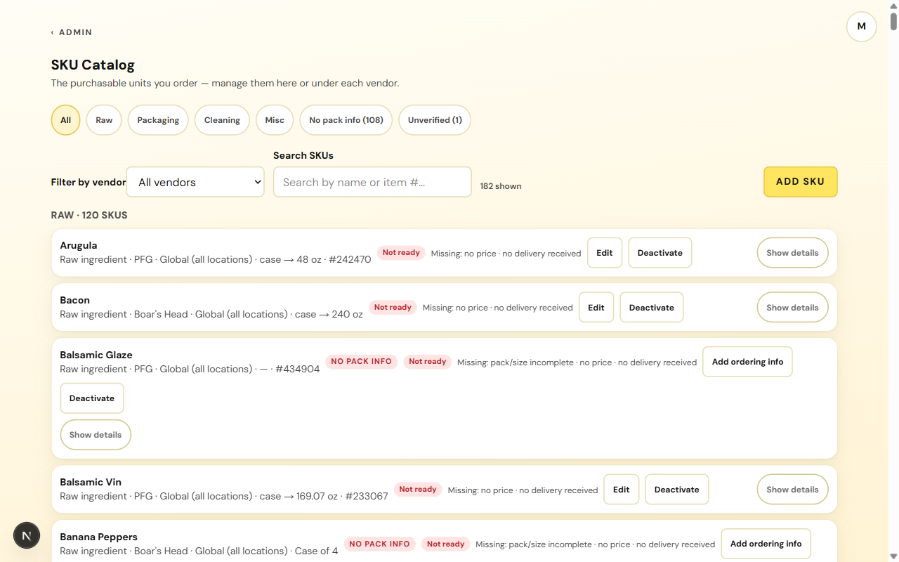

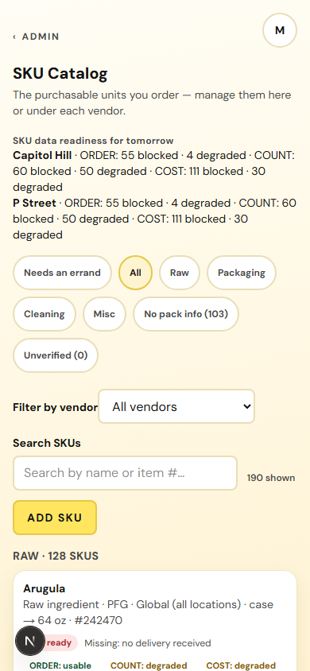

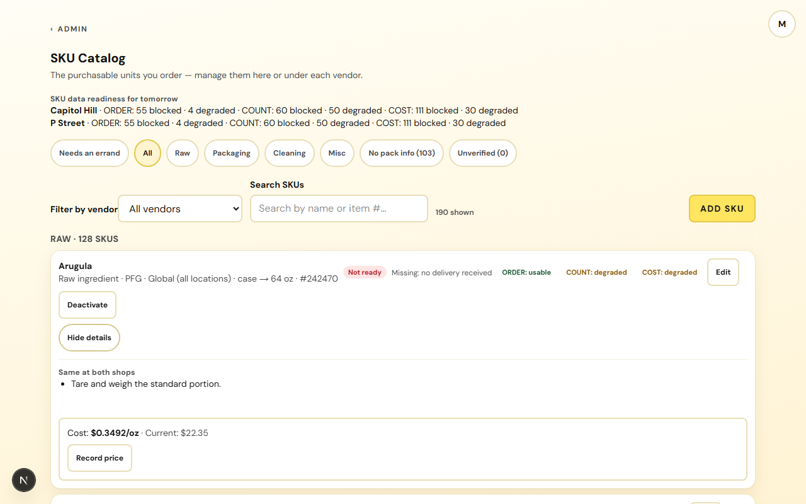

**What to do** — Read **SKU data readiness for tomorrow**, then use **Needs an errand** to find the items that need attention and open a row to see what to do. **No pack info** still narrows the list to missing pack information.

**Worth knowing**

- **ORDER · COUNT · COST** show whether each job has the data it needs for that SKU: **usable** needs nothing, **degraded** needs attention, **blocked** is missing something required. The three can differ for one SKU. Pack sizes are edited here.
- The header gives blocked and degraded counts for each job at each shop you can see. The row chips show the worst state across those shops; the drawer explains any differences. **Same at both shops** means the results agree.
- The drawer gives you the errand in plain words: *"Enter the invoice price in this SKU's order unit."*, *"Read the package label and enter the case → piece chain."*, *"Tare and weigh the standard portion."* or *"Count the shelf and enter the standing par."* Follow the errand for that item rather than guessing from a general readiness badge.
- **Not included in this shop's daily operations.** means the SKU is outside the set being checked for that shop, not broken. If readiness cannot load, the page says so; refresh rather than treating it as no errands.
- Prices come from invoices, entered at receiving or with **Record price** in the SKU's drawer — always the price of one order unit. The latest invoice date wins; on the same date, the latest entry. The September 2026 purchase-history import filled in prices and pack sizes for about 20 items and says so on each; do not type those again.

### 8. Items

**What you see**

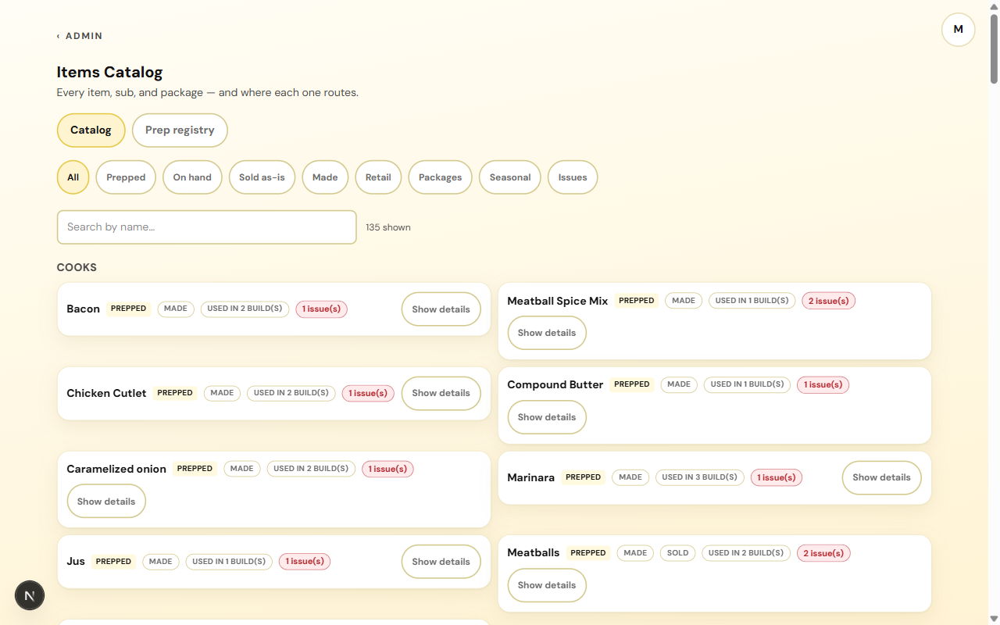

**What to do** — Read it to see what the shop makes, and what each thing is built from.

**Worth knowing**

- Items are the things you **prep and sell**; SKUs are the things you **buy**. Recipes join the two.
- **Issues** on an item means its recipe cannot be fully priced or converted yet — usually a SKU underneath it is missing a weight or a price.

### 9. Weights & Trim

**What you see**

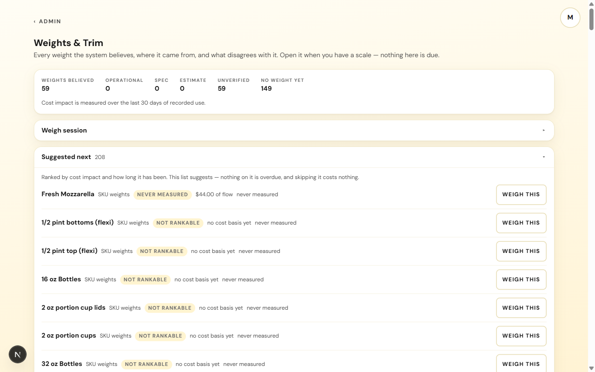

**What to do** — Open it when you have a scale and a spare ten minutes. **Weigh this** records one item.

**Worth knowing**

- *"Open it when you have a scale — nothing here is due."* This list suggests; it never nags, and skipping it costs nothing today.
- The list is ranked by what the weight is worth: an item you use a lot, never weighed, sits at the top. **Never measured** means the app is working off an estimate — which is what makes a cost number soft.

---

## Settings and logging out

### 1. Settings

**What you see**

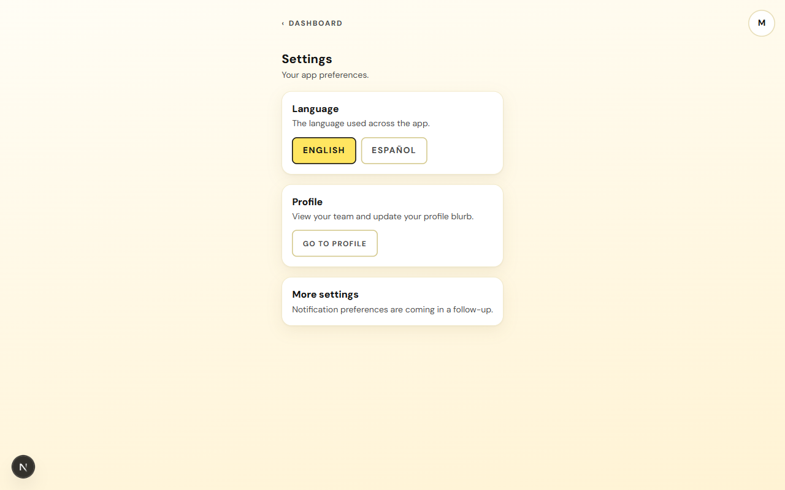

**What to do** — Pick **English** or **Español**. It switches straight away.

**Worth knowing**

- The choice is saved to your account, so it follows you to any tablet.
- Notification preferences are not built yet. Language is the only setting here today.

### 2. Log out

**What you see**

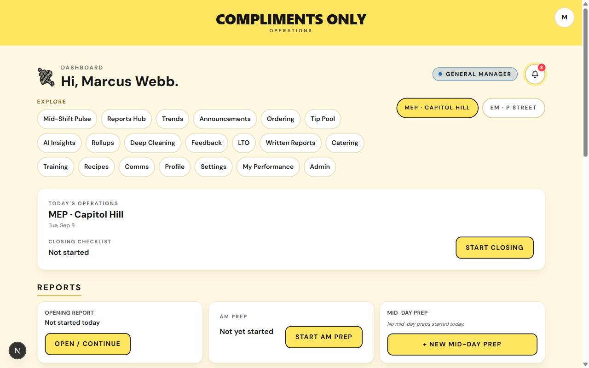

**What to do** — Scroll to the bottom of the dashboard and tap **Log out**.

**Worth knowing**

- The app signs you out on its own after about ten minutes of no touching, and warns you first.
- Log out anyway, every time you walk away. Anything tapped while you are signed in is recorded under your name — including a cash deposit and a closing confirmation.
- **Log out** ends only this sign-in. Deactivation, a role change, a password reset or setting your first password ends your old sign-ins on every device at once. A deactivated account has to be reactivated before you can sign in; otherwise you just sign in again, and setting your first password does that for you on the device you used.

### 3. You are out

**What you see**

**What to do** — Hand the tablet over. It is ready for the next person.

**Worth knowing**

- An opening report you had open but never submitted **is not saved**. If you are mid-walk, finish it before you go.
