# Staff guide

For anyone working the line. It covers everything you touch on a normal shift: logging in, the opening report, the closing checklist, the maintenance log, notes, and your own performance page.

You do not need to read it front to back. Find your section, do the steps.

---

## Your day at a glance

You sign in on the tablet with a four-digit PIN. Your dashboard tells you what the shop still owes today.

In the morning, the job is the **opening report**: walk each station, check that last night's closing matches what you are actually looking at, type the fridge temperatures, and tap **Verified**. A key holder or above is the one who taps **Submit Opening** — you can fill the whole thing in, they finish it.

**AM prep and mid-day prep are key-holder jobs.** Those pages will not open for you unless a manager has assigned you the prep for that day.

At night, the **closing checklist** is a list of lines. Tap each one as you finish it. A key holder locks up at the end, and that final confirmation is theirs — it needs the walk-out items done and the cash deposit filed.

Write a note or a comment any time the checklist and reality disagree.

Tap **Log out** when you leave. The app also signs you out on its own after about ten minutes of no touching.

---

## Logging in

Four taps and a PIN. You do this at the start of every shift, and again any time the tablet has signed you out.

### 1. Where are you?

**What you see**

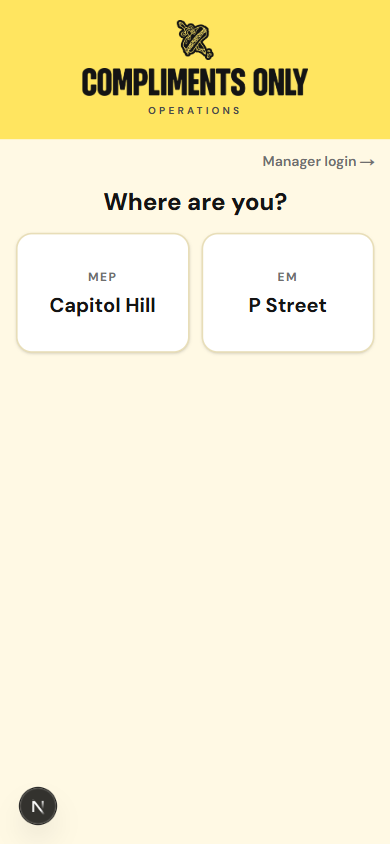

**What to do** — Tap the shop you are working at today.

**Worth knowing**

- The **Manager login →** button in the top right is for managers who sign in with an email and password. It is not your route in — use the tiles.

### 2. What's your role?

**What you see**

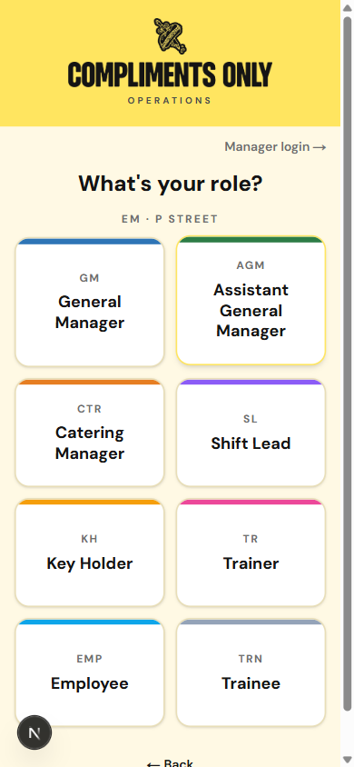

**What to do** — Tap **EMP / Employee** (or **TRN / Trainee** if that is you).

**Worth knowing**

- The line above the tiles is a breadcrumb of what you have picked so far. **← Back** undoes one step.
- Pick your real role. What you can do later — finish the opening, lock up, open prep — follows from it, and picking the wrong tile just means your name is not on the next list.

### 3. Who are you?

**What you see**

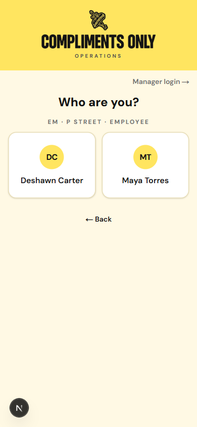

**What to do** — Tap your name.

**Worth knowing**

- Only people who work at this shop, in this role, show up here. If your name is missing, tell a manager — you are probably not assigned to this location yet.

### 4. Enter your PIN

**What you see**

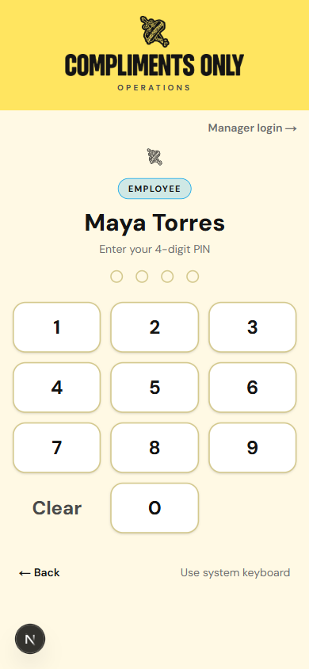

**What to do** — Tap your four digits.

**Worth knowing**

- There is no Submit button. The fourth digit signs you in on its own — that is normal, not a glitch.
- **Clear** wipes what you have typed. **Use system keyboard** swaps the keypad for the tablet's own keyboard.
- Five wrong PINs locks the account for fifteen minutes. If you have forgotten yours, get a manager rather than guessing.
- Everyone's PIN is four digits, whatever their role. Never let someone else tap in as you — every checklist line records the name of whoever was signed in.

### 5. You land on the dashboard

**What you see**

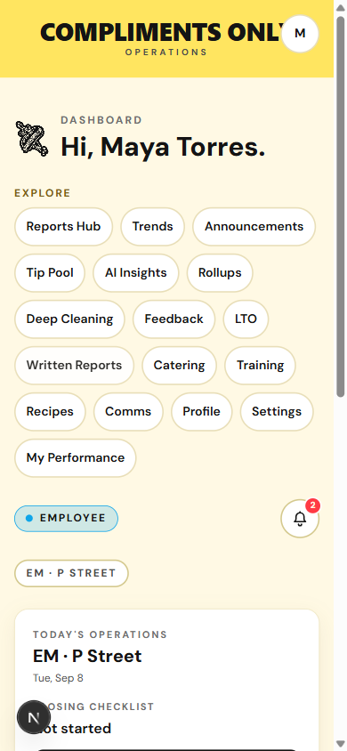

**What to do** — Nothing yet. Read what the shop still owes today.

**Worth knowing**

- The bell in the header shows messages sent to you specifically, with a count of the unread ones.
- After about ten minutes without a tap, the app warns you and then signs you out. Tap **Stay signed in** on that warning if you are still working.

---

## Your dashboard

This is your home screen. Everything you actually need on a shift is either on it or one tap away.

### 1. Read today's status

**What you see**

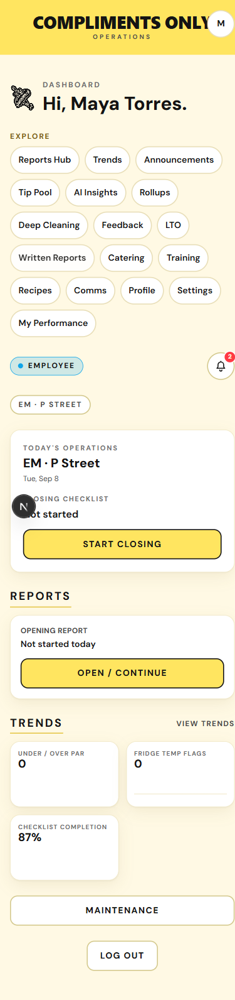

**What to do** — Scroll the page once. Work from the top down.

**Worth knowing**

- **Today's operations** is the live work: the closing checklist and its **Start closing** / **Continue closing** link.
- **Reports** holds the **Opening Report** card with **Open / continue**. It is called a report, not a checklist — that is the opening checklist you are looking for.
- **Trends** is three small charts for this shop, not for you personally:
  - **Under / Over Par** — how many prep items came in below par. Lower is better.
  - **Fridge Temp Flags** — how many fridge readings came in above 41°F on the opening and closing checks. Zero is the goal.
  - **Checklist Completion** — the share of required checklist lines that got done. Higher is better.
- **Maintenance** near the bottom is the fridge-temperature board and the place to log equipment problems.
- **Log out** sits at the very bottom of the page.

### 2. Use the Explore list

**What to do** — Tap an entry to jump to it. The ones worth your time as an employee:

- **Profile** — the team directory, and your own highlights.
- **Settings** — your language.
- **My Performance** — your tasks, streaks and manager ratings.
- **Written Reports** — free-text posts about a shift. You can write one.
- **Reports Hub** and **Trends** — the shop's saved reports and charts.

**Worth knowing**

- The list mixes your tools and manager tools with no divider. **Catering** will bounce you straight back to the dashboard — it is a manager surface.
- **Tip Pool**, **AI Insights**, **Rollups**, **Deep Cleaning**, **Feedback**, **Training**, **Recipes**, **Announcements** and **Comms** are placeholder pages today. They open, but there is nothing to do on them yet.
- On saved reports in the Reports Hub, the notes people wrote on checklist lines are hidden below shift lead. You will see the reports; you will not see everyone's notes on them.

---

## The opening report (Phase 1 — Verification)

You do this once a day, before the doors open. The question it asks is not "did you clean it?" — it is **"does last night's closing match what you are looking at right now?"**

### 1. Open it

**What you see**

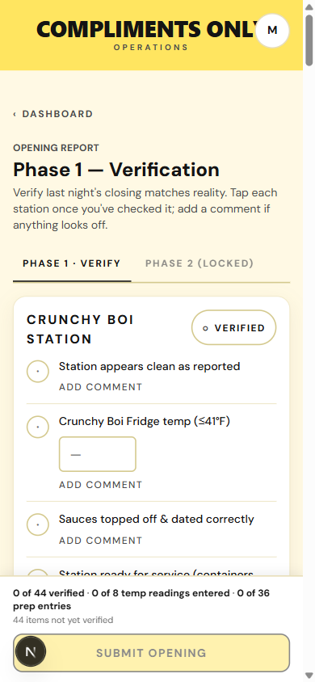

**What to do** — From the dashboard, tap **Open / continue** on the **Opening Report** card. Read the line under the heading: *"Verify last night's closing matches reality. Tap each station once you've checked it; add a comment if anything looks off."*

**Worth knowing**

- **Phase 2 (locked)** stays greyed out until verification is submitted. That is the prep half, and it is not your beat.
- Tapping the words of a line does nothing. The only thing that marks work here is the whole-station **Verified** button.
- **Nothing on this screen saves as you go.** Ticks, temperatures and comments all live on the tablet until **Submit Opening** goes through. If you close the page halfway, you start again — so finish the walk in one pass.
- If the page says it is waiting on last night's closing, the opening is blocked until a key holder finishes or releases that closing. Go get one.

### 2. Type the fridge temperatures

**What you see**

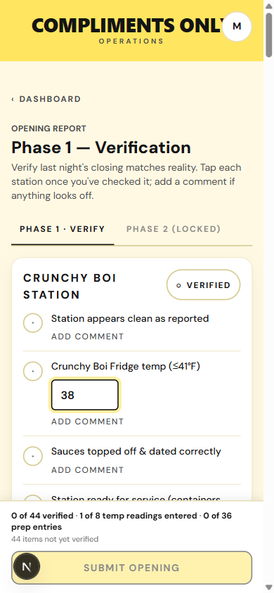

**What to do** — Read the thermometer and type the number you actually see into the temperature box on that line.

**Worth knowing**

- The target printed on the line (**≤41°F**) is guidance. Nothing on the screen turns red if you type a higher number, and the app will still let you submit.
- Type the true reading anyway. Anything above 41°F is counted as a **Fridge Temp Flag** on the shop's trends, and that is exactly the signal that gets a fridge fixed. Then add a comment on that line and tell your key holder before you put product in it.
- Every temperature box has to have a number in it before the opening can be submitted.

### 3. Verify a station

**What you see**

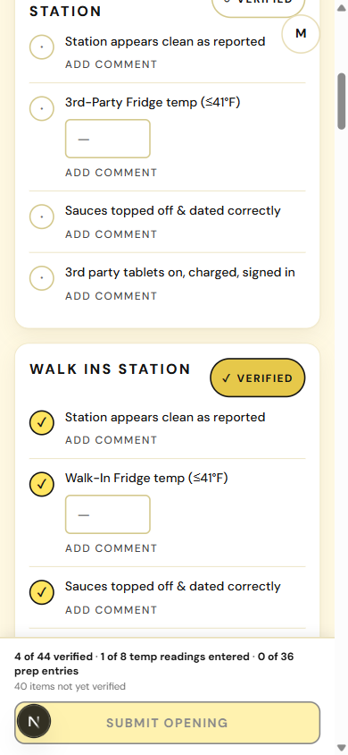

**What to do** — Check every bullet on the station with your own eyes, then tap **Mark [Station] as verified** once.

**Worth knowing**

- **One tap marks the whole station.** Every bullet under that heading flips to a checkmark together. There is no per-line yes/no.
- So only tap it when the whole station is genuinely right. If one bullet out of four is wrong, do not tap it — use the comment in the next step.
- Tapping the button again (**Untick**) takes the whole station back off. Anything you typed — temperatures, comments — survives ticking and unticking.
- The five count sections at the bottom (Veg, Cooks, Sides, Sauces, Slicing) work differently: their **Verify section** button stays greyed out with *"Recount items without closer data first"* until you type an **Opener recount** for each item last night's closer left no count for.

### 4. Flag something that is wrong

**What you see**

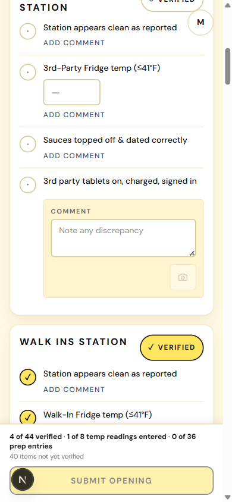

**What to do** — Tap **Add comment** on the line that is wrong. A **Comment** box opens with the placeholder *"Note any discrepancy."*

**Worth knowing**

- **Add comment** is on every line, verified or not. It is how you say "this one is off" without pretending it is fine.
- The camera button is greyed out — photos are not wired up yet. Describe it in words.

### 5. Write what you found

**What you see**

**What to do** — Say what was wrong and what you did about it. Leave that station unverified.

**Worth knowing**

- A comment on an unverified line is the whole point: the record shows the station was not right, and it shows why.
- Once the opening is submitted, comments are locked. The next person to open the report can read yours but cannot change it, and you cannot edit your own.

### 6. Read the counter at the bottom

**What you see**

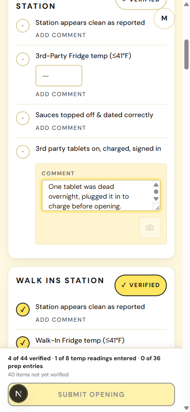

**What to do** — Use the sticky footer as your progress bar. It reads like *"4 of 44 verified · 1 of 8 temp readings entered · 0 of 36 prep entries."*

**Worth knowing**

- The line underneath tells you exactly what is still blocking the button — *"40 items not yet verified"*, or a named fridge that still needs a temperature, or *"Verify all sections before submitting."*
- **Submit Opening** turns on only when all three are true: every line ticked, every temperature box filled, and every count section verified. There is no partial submit.
- **You cannot submit the opening yourself unless you are a key holder or above.** If you tap it as an employee you get *"Your role can't submit Opening — contact a manager."* Fill it in, then hand the tablet to your key holder.
- The submit is once per day. After it lands, the verification half is read-only for everybody.

### Prep is a key-holder job

**What you see**

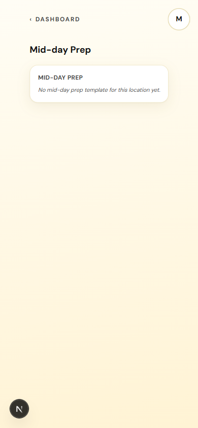

**What to do** — Nothing. If you land here as an employee, back out to the dashboard.

**Worth knowing**

- **AM prep** bounces you straight back to the dashboard, even from the link inside the closing checklist. That is the role gate, not a broken link. A manager can assign you the AM prep for a specific day, and then it opens.
- **Mid-day prep** loads but shows this empty message for an employee, whether or not the shop has a mid-day list. Same gate, different wording.
- If you have been told to do prep, ask the manager to assign it to you for the day, or to open it on their own login.

---

## The closing checklist

You do this through the back half of your shift, ticking things off as you finish them. It is a completely different rhythm from the opening: here **every single line is its own tap.**

### 1. Open it

**What you see**

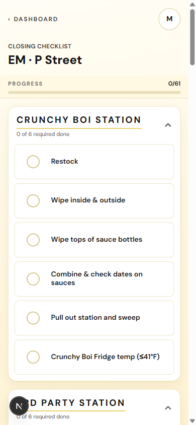

**What to do** — From the dashboard, tap **Start closing** or **Continue closing**.

**Worth knowing**

- **Progress** at the top counts required items across the whole night — *"0 of 61 required items complete."* Each station header carries its own count too.
- Some lines are greyed out and marked as waiting on a higher role. Those are not yours to tap; leave them for the key holder.
- The footer note about AM prep (*"AM Prep had 0 items saved today - check with the opener"*) is telling you the opener saved nothing. Mention it to your closing manager.

### 2. Tap a line as you finish it

**What you see**

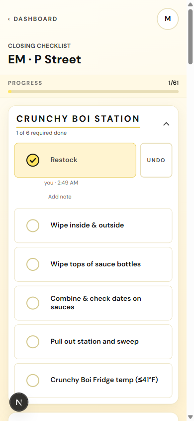

**What to do** — Do the task, then tap the row.

**Worth knowing**

- **Each tap saves immediately** with your name and the time. There is no submit for your own lines.
- Tick it when it is done, not when you are about to do it. The row is a record of a finished task.
- **Undo** is right there. Within a minute it just undoes. After that the app asks you to pick a reason, because by then it is a correction to the record rather than a slip of the thumb.
- You can only undo your own taps.

### 3. Keep going

**What you see**

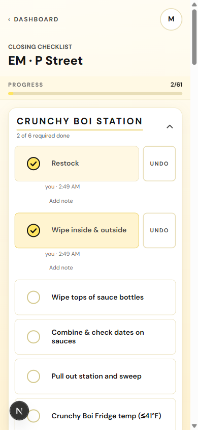

**What to do** — Work the stations in whatever order the floor allows. The station header counts up as you go.

### 4. Add a note to a line you finished

**What you see**

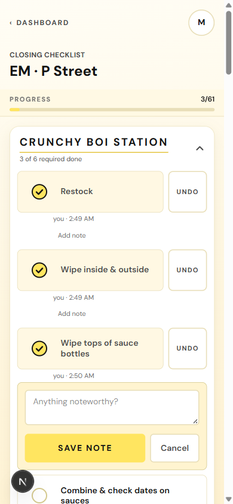

**What to do** — Tick the line first, then tap **Add note** on it and type into the box marked *"Anything noteworthy?"*

**Worth knowing**

- **Add note only appears after an item is complete.** There is no way to attach a note to a line you are leaving open — for that, tell your key holder, who can reopen the item with a reason.
- So a closing note means *"I did this, and here is something you should know about it"* — not *"I skipped this."*

### 5. Save it

**What you see**

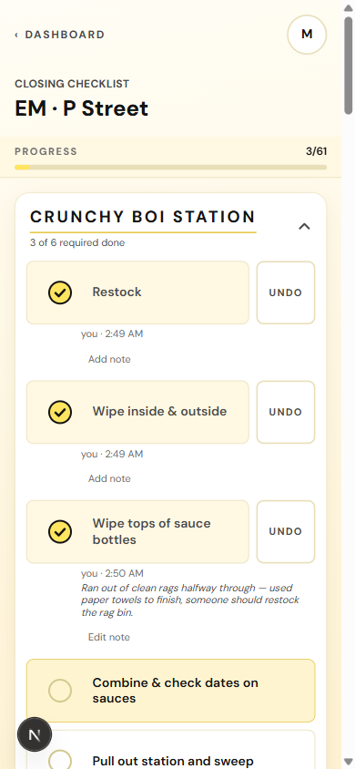

**What to do** — Tap **Save note**. It appears under your name and time, and the button becomes **Edit note**.

**Worth knowing**

- The note is visible to anyone else working tonight's checklist, right there on the row.
- On the saved report afterwards, notes are visible to shift leads and up.
- You can reopen and edit it while the closing is still open. Once a key holder confirms the closing, the whole list — notes included — is locked.

---

## Deep cleaning

Coming soon.

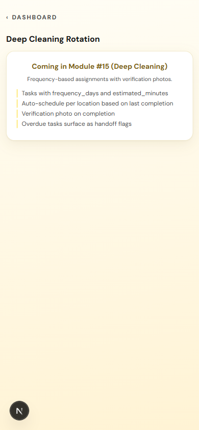

---

## Maintenance log

Use this when a fridge is running warm or a piece of equipment is acting up. Any employee can open it and log a note.

### 1. Open the maintenance log

**What you see**

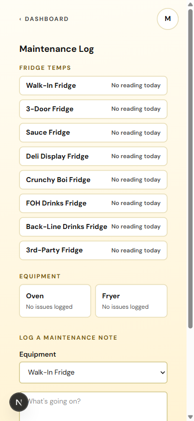

**What to do** — Tap **Maintenance** on the dashboard. Read the boards before you write anything.

**Worth knowing**

- **Fridge temps** lists all eight fridges. Those readings come from the temperature boxes on the opening and closing checklists — nobody types them here. **No reading today** means nobody has entered that fridge's temperature yet today.
- A fridge is flagged when today's reading came in above its safe maximum (41°F unless that fridge is set otherwise). Out-of-range fridges sort to the top of the list.
- **Equipment** lists the fixed kit — Oven and Fryer — with the last note logged against each.

### 2. Pick the equipment

**What you see**

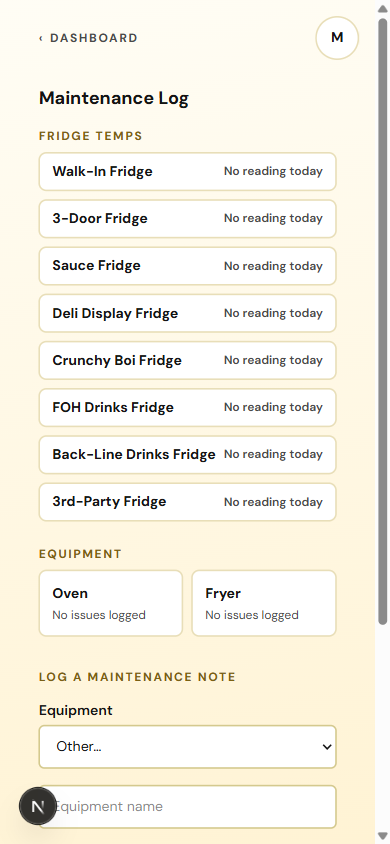

**What to do** — Open the **Equipment** dropdown and pick the thing that is broken. If it is not listed, pick **Other…** and type its name into the **Equipment name** box that appears.

**Worth knowing**

- The dropdown holds the eight fridges plus Oven and Fryer. Anything else — the slicer, a sink, the ice machine — goes under **Other…**.
- Picking a named item from the list is better when you can. A note against a named fridge, the Oven or the Fryer shows up on that item's tile as its latest note, so the next person sees it. A note filed under **Other…** is saved, but there is no tile on this page to go and check it.

### 3. Say what is going on

**What you see**

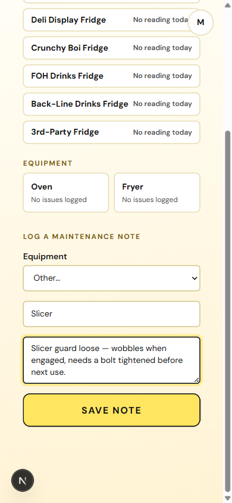

**What to do** — Type what is wrong in **What's going on?**. Be specific — what it does, when it started, whether it is still usable.

**Worth knowing**

- **Save note** stays greyed out until there is text in this box.

### 4. Save it

**What you see**

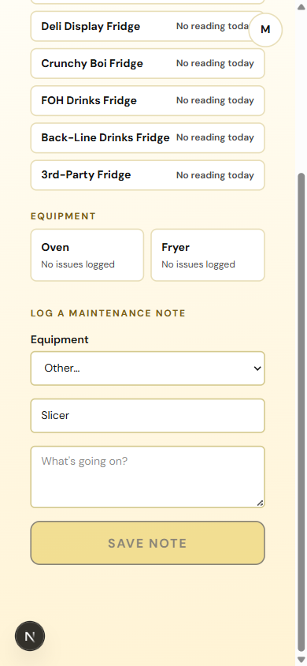

**What to do** — Tap **Save note**. The text box clears itself and the button goes grey again.

**Worth knowing**

- **There is no confirmation message.** The form clearing is the only signal you get that it saved. If something had gone wrong you would get a red error line instead.
- If you picked a named fridge, the Oven or the Fryer, you can check it landed: tap that tile and your note is on it.
- If you filed it under **Other…**, you have no way to check it from this page. **If it matters today — a slicer guard that will hurt someone, a fridge climbing — tell a manager out loud as well as logging it.** The log is a record, not an alarm.

---

## Your performance and feedback

Your own numbers, in one place. Nobody's ratings but yours, and nothing here is a scoreboard against your teammates.

### 1. My Performance

**What you see**

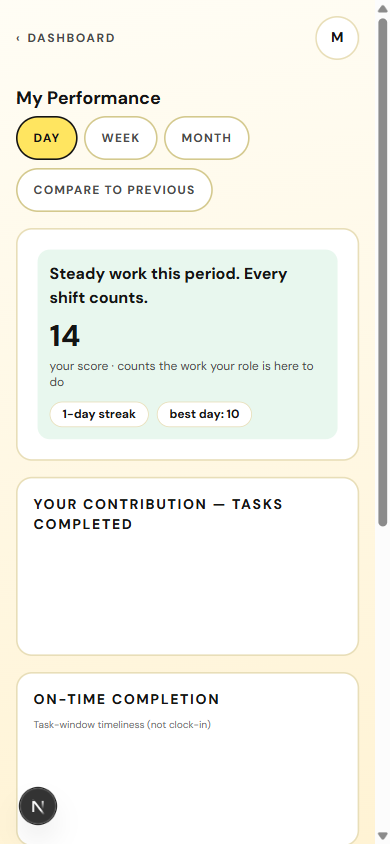

**What to do** — Tap **My Performance** in the Explore list. Switch the range with **Day / Week / Month**, and turn on **Compare to previous** to see the change.

**Worth knowing**

- It only ever shows your own data, for one shop at a time.
- The big number labelled *"your score · counts the work your role is here to do"* is, for an employee, your completed tasks plus the notes you left. Writing a useful note counts.
- **On-time completion** is about task windows, not clock-in. The footnote says as much: early-clock-in streaks are not wired up yet.
- **How managers have rated you** fills in from the manager's end-of-shift report, and only once that report is submitted. You see the ratings, whether you were MVP, and any area to improve — you never see the manager's private note.
- The framing is deliberately positive: no rank, no red flags. A quiet week reads as "steady", not as a problem.

### 2. The Feedback page is not for you

**What you see**

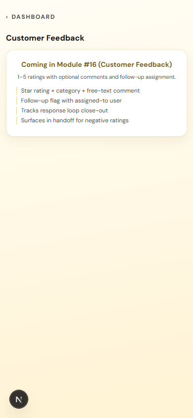

**What to do** — Skip it.

**Worth knowing**

- **Feedback** in the Explore list is *customer* feedback, and it is a placeholder today. It is not a place to submit something about your shift.
- If you want to write something down about a shift, use **Written Reports** in the Explore list.

---

## When to write a note

Three places let you write, and they are not interchangeable. This is the part of the app that turns a checklist into information a manager can act on.

| Where | What it attaches to | When it saves | Who reads it |
|---|---|---|---|
| Opening report — **Add comment** | Any single line, ticked or not | When the opening is submitted | Anyone who opens the report afterwards; shift leads and up on the saved report |
| Closing checklist — **Add note** | Only a line you have already completed | The moment you tap **Save note** | Anyone on tonight's checklist, on the row; shift leads and up on the saved report |
| Maintenance — **What's going on?** | A piece of equipment, not a checklist line | The moment you tap **Save note** | Anyone who opens that equipment's tile — if you picked it from the dropdown |

**Write one when:**

- A fridge reads above 41°F. Type the real number, comment on that line, and tell your key holder before product goes in.
- Something the closer was supposed to leave is not there — the count is short, a container is empty, a station was left dirty. Comment on that line and do **not** verify the station.
- You could not finish a task and someone else needs to pick it up. Say what is left and why.
- Equipment is behaving badly but still limping along — a wobbly slicer guard, an oven that will not hold temperature, a fryer that is slow to recover. Maintenance log, and say it out loud too.
- You ran out of something mid-task and worked around it. *"Ran out of clean rags halfway through — used paper towels to finish, someone should restock the rag bin."* That is a perfect note: what happened, what you did, what the shop needs.
- You did the task, but not the normal way — a different product, a different station, a shortcut a manager should know about.
- Something happened that is not on any list. Waste, a spill, a delivery that arrived wrong, a customer incident. **Written Reports** takes it when no line fits.

**Do not:**

- **Do not leave a line unverified with no comment.** An unverified line with nothing on it just looks like somebody got distracted. Thirty seconds of typing is the difference between a mystery and a fixed fridge.
- **Do not tap a whole station Verified to make the counter move when one bullet is wrong.** One tap ticks all four lines and puts your name on all four.
- Do not tick a closing line before you have done it.
- Do not write "see manager" and nothing else. The person reading it tomorrow morning is not standing next to you.
- Do not put anything in a note you would not say to the person's face — every note carries your name and the time.

---

## Profile, settings, and language

Two pages, and they are not where you would guess. **Profile** is the team directory. Your language switch is in **Settings**.

### 1. Profile is the team directory

**What you see**

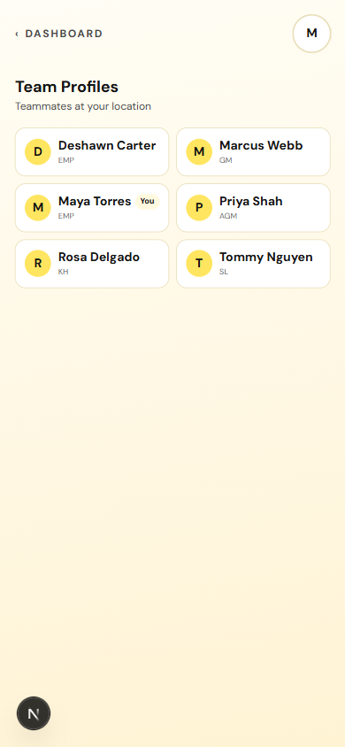

**What to do** — Tap **Profile** in the Explore list. You get **Team Profiles — teammates at your location**, not your own page.

**Worth knowing**

- Only people who work at your shop are listed. Your own row is marked **You**.

### 2. Tap your own row for your highlights

**What you see**

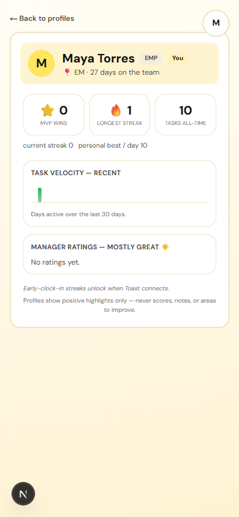

**What to do** — Tap your name to see days on the team, MVP wins, streaks, tasks all-time, and a task-velocity chart.

**Worth knowing**

- Profiles show positive highlights only — never scores, notes, or areas to improve. That is by design, and it is true of everyone's profile, not just yours.
- There are no settings on this page. The "about me" blurb belongs to AGMs and above; as an employee you have nothing to edit here.
- For the fuller picture with a date range, use **My Performance** instead.

### 3. Change your language in Settings

**What you see**

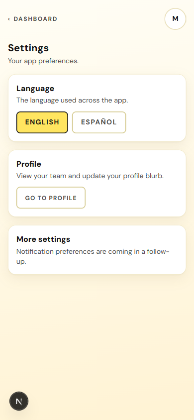

**What to do** — Tap **Settings** in the Explore list, then pick **English** or **Español**.

**Worth knowing**

- The whole app switches straight away — no reload, no signing out.
- The choice is saved to your account, so it follows you to any tablet you sign in on.
- Notification preferences are not built yet. Language is the only setting here today.

---

## Coming soon

These open from the Explore list, but there is nothing to do on them yet.

- **Tip Pool** — Coming soon.

  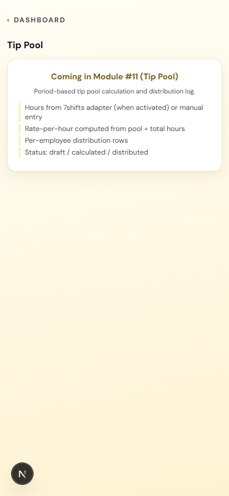

- **Training** — Coming soon.

  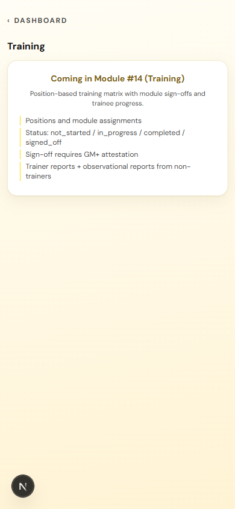

- **Announcements** — Coming soon.

  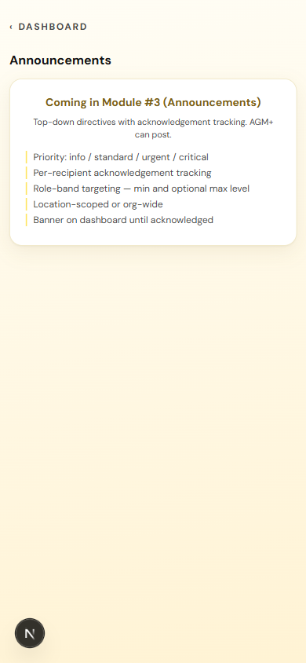

- **Comms** — Coming soon.

  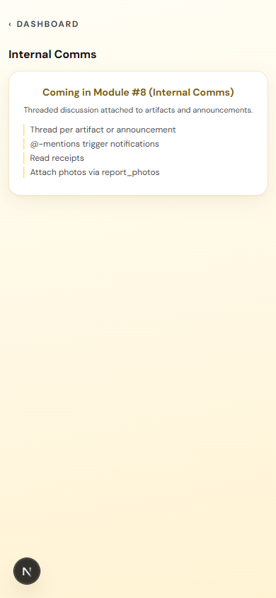

- **Feedback** — Coming soon. (Customer feedback, not staff feedback.)

---

## Logging out

Do this every time you walk away from the tablet.

### 1. Log out

**What you see**

**What to do** — Scroll to the bottom of the dashboard and tap **Log out**. You land back on **Where are you?**, ready for the next person.

**Worth knowing**

- The app signs you out on its own after about ten minutes of no touching, and warns you thirty seconds before. If you are still working, tap **Stay signed in**.
- Log out anyway. Anything tapped while you are signed in is recorded under your name.
- Half-finished work behaves differently depending on where you were. Closing checklist ticks and notes are already saved. **An opening report you have not submitted is not saved** — if you are mid-walk, finish it and hand it to a key holder before you go.
